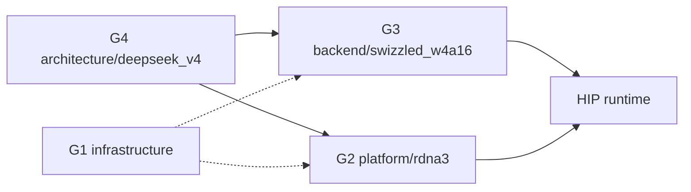

# Concern Grouping and Relocation Analysis

**Date:** 2026-09-28
**Status:** Analysis / proposal. Not an execution plan, not started.
**Scope:** Classify every file under `src/` into one of four concerns, and propose where it belongs so the engine can grow to other models and other AMD GPUs without cascades. Kernel files are covered in depth in §5.

**Provenance.** This document follows the [Monolith Module Split Execution Plan](../../execution/active/MONOLITH_MODULE_SPLIT_EXECUTION_PLAN.md) (tiers A–C complete). That split made the concerns *visible*; this analysis decides what the visible pieces actually are, so a later relocation can be mechanical.

**What this document is not.** It does not change behaviour, does not reorder work, and does not commit to any destination path. Every "Action" cell is a proposal for a decision, not a decision. Nothing moves until the destinations in §6 are agreed.

---

## 1. The four concerns

The engine currently mixes four concerns that change for four different reasons. Naming them is the whole point of this document.

| Group | Name | What it is | What makes it change |
| :--- | :--- | :--- | :--- |
| **G1** | **Engine** | The engine's own strategy: budget allocation, cache and supply policy, prefill strategy, sampling, streams, text loop, routing instrumentation. | A design decision by us. |
| **G2** | **GPU architecture** | How an operation is executed on a *specific* GPU: wave width, lane mapping, tile shape, architecture intrinsics. | A different GPU (RDNA3 → RDNA4 → wave64). |
| **G3** | **Weight format** | How weights are *stored and decoded*: the swizzled W4A16 layout, its views, its dequant. | A different quantization/artifact format. |
| **G4** | **Model architecture** | What the model *computes*: attention sinking, Hyper-Connections, MLA, the router rule, RoPE, the tokenizer. | A different checkpoint / model family. |

**The key insight, and a correction to the original three-group framing.** "Backend" (G3) and "GPU" (G2) are *two* concerns, not one, because they vary independently:

- a new **quant format** (G3) keeps the same GPU;
- a new **GPU** (G2) keeps the same quant format.

Today both live inside `src/backend/swizzled_w4a16/`, which is why the backend "feels" mixed.

**Why G4 is unavoidable, and G1/G2/G3 are not.** An operation's *specification* — what it computes — is the model and cannot be re-expressed away. An operation's *execution* — how a given GPU realises that specification, and in what byte format the weights arrive — can be. So a kernel file is not "the model": it is **the model's specification plus one GPU's execution strategy plus one format's decoding, written inseparably in one text** (§5).

---

## 2. The dependency direction that already holds

Measured from the `#include` graph, not assumed:

- `src/infrastructure/` never includes `src/architecture/` or `src/platform/`.
- `src/platform/` includes nothing above it.
- `src/backend/` never includes `src/architecture/`.
- The only model→backend / model→platform links are in `v4_model_host.hpp` and `v4_expert_executor.hpp`.

Dependencies flow one way. **This is the good news**: relocation is a *path* change, not a dependency inversion, so it is verifiable exactly like the completed split (line-multiset diff + brace balance, no caller semantics touched).

---

## 3. Where the concerns physically sit today

| Concern | Should live in | Lives today in | Verdict |
| :--- | :--- | :--- | :--- |
| G1 Engine | `src/infrastructure/` | mostly `src/architecture/deepseek_v4/core/` | **misplaced** |
| G2 GPU arch | `src/platform/` | smeared into `backend/` and `architecture/**/kernels/` | **no home** |
| G3 Weight format | `src/backend/<format>/` | `src/backend/swizzled_w4a16/` | **correct** |
| G4 Model arch | `src/architecture/deepseek_v4/` | `src/architecture/deepseek_v4/` | **correct** |

So the work is: **move G1 out of the model tree**, and **separate G2 from G3 inside the backend**. G4 is already home.

---

## 4. Relocation table

How to read a row: **Group** is the concern the file *is*; **Action** is the proposal — `STAY` (already home), `MOVE` (relocate to the group root), `SPLIT` (mixed; must be divided first).

### 4.1 `src/architecture/deepseek_v4/core/` — the mixed directory

| File | Lines | Group | Why | Action |
| :--- | ---: | :--- | :--- | :--- |
| `config.hpp` | 230 | MDL | DeepSeek-V4 model configuration | STAY |
| `v4_model_spec.hpp` | 171 | MDL | Layer/attention spec | STAY |
| `v4_model_contract.hpp` | 207 | MDL | Checkpoint tensor validation | STAY |
| `v4_model_resources.hpp` | 181 | MDL | RoPE tables + resident weights | STAY |
| `v4_model_host.hpp` | 1227 | **SPLIT** | Owns *both* model residency *and* engine assembly (streams, pools, registry, staging, supply) | SPLIT → §6 |
| `v4_dense_weight_binding.hpp` | 232 | MDL | V4 tensor-name mapping + dense upload | STAY |
| `v4_layer.hpp` | 495 | MDL | Layer metadata + KV state | STAY |
| `v4_layer_state.hpp` | 180 | MDL | Per-layer state layout | STAY |
| `v4_layer_body.hpp` | 107 | MDL | Layer body umbrella | STAY |
| `v4_layer_body_types.hpp` | 304 | MDL | Body types | STAY |
| `v4_layer_body_attention.hpp` | 614 | MDL | Attention phases | STAY |
| `v4_layer_body_moe.hpp` | 239 | MDL | MoE phases | STAY |
| `v4_layer_body_batch.hpp` | 689 | **MDL** | The model's *chunked* layer body: the per-token batch scratch, the composed row-set, and the chunk driver. Every symbol is bound to `V4Layer`/`V4LayerBody*` and to DSV4 semantics (the SWA-ring composition of trap 39, the D1 layer-wide dispatch), so it is the batched twin of `v4_layer_body.hpp` and not engine strategy. | STAY (re-assessed — see §6) |
| `v4_graph.hpp` | 430 | MDL | Ordered forward pass | STAY |
| `v4_expert_supply.hpp` | 402 | MDL | Six-expert V4 request adapter over the neutral supply | STAY |
| `v4_expert_executor.hpp` | 516 | **MIXED** | Model's MoE execution *and* the tiered-supply mechanics *and* backend dispatch | DECOUPLE → §6 |
| `v4_activation_scratch.hpp` | 345 | MDL | Device scratch sized by V4 kernel shapes | STAY (note: engine-owned buffer, model-shaped size) |
| `v4_attention_trace.hpp` | 77 | MDL | V4 trace record schema | STAY (diagnostic) |
| `v4_engine.hpp` | 517 | ENG | Binds tokenizer + encoder + loop + graph; "a binding, not a pipeline" | MOVE → `infrastructure` |
| `v4_sampler.hpp` | 484 | ENG | "Sampling is **not** a model operation" (its own words) | MOVE → `infrastructure` |
| `v4_device_streams.hpp` | 76 | ENG | Four HIP streams owned by the host, borrowed by everything | MOVE → `infrastructure` |
| `v4_prefill_controller.hpp` | 258 | ENG | Per-window prefill lifecycle | MOVE → `infrastructure` |
| `v4_prefill_sweep.hpp` | 556 | ENG | Swept-prefill driver + allocation-strategy switch | MOVE → `infrastructure` |
| `v4_prefill_lookahead.hpp` | 163 | ENG | Read-ahead / wave-issuance policy | MOVE → `infrastructure` |
| `v4_prefill_workspace.hpp` | 182 | ENG | Prefill working-set buffers (engine-owned, model-sized) | MOVE → `infrastructure` |
| `v4_host_partition.hpp` | 236 | ENG | Warm/staging boundary arithmetic over a pinned region | MOVE → `infrastructure` |
| `aeon_runtime_config.hpp` | 288 | ENG | User-facing knobs, safety margins, allowances; "free of any model-config type" | MOVE → `infrastructure` |
| `memory_budget.hpp` | 21 | ENG | Budget umbrella | MOVE → `infrastructure` |
| `memory_budget_engine.hpp` | 333 | ENG | Device/host query + feasibility (consumes model config as *input*) | MOVE → `infrastructure` |
| `memory_budget_report.hpp` | 193 | ENG | Budget output data | MOVE → `infrastructure` |

### 4.2 `src/architecture/deepseek_v4/kernels/`

See §5 for the full kernel treatment. Summary:

| File | Lines | Group | Action |
| :--- | ---: | :--- | :--- |
| `v4_attention_config.hpp` | 35 | MDL | STAY |
| `v4_attention.hpp` (umbrella) | 38 | MDL | STAY |
| `v4_attention_kernels.hpp` | 452 | MDL | STAY |
| `v4_grouped_wo.hpp` | 60 | MDL | STAY |
| `v4_hc_head_kernel.hpp` | 69 | MDL | STAY |
| `hc_sinkhorn.hpp` | 415 | MDL | STAY |
| `moe_router.hpp` | 191 | MDL | STAY |
| `v4_rope.hpp` | 228 | MDL (mostly) | STAY |
| `v4_norm.hpp` | 95 | **GENERIC-OP** | MOVE candidate → shared op area |
| `v4_gemv.hpp` | 103 | **GENERIC-OP** | MOVE candidate → shared op area |
| `v4_argmax.hpp` | 104 | **GENERIC-OP** | MOVE candidate → shared op area |
| `v4_pipeline_ops.hpp` | 125 | **SPLIT** | Split: casts/accumulate generic, SwiGLU clamp is a model choice |

### 4.3 `src/architecture/deepseek_v4/text/` and `reference/`

| File | Lines | Group | Why | Action |
| :--- | ---: | :--- | :--- | :--- |
| `text/dsv4_tokenizer.hpp` / `.cpp` | 72 / 562 | MDL | DSV4 tokenizer artifact + decode | STAY |
| `text/dsv4_prompt_encoder.hpp` / `.cpp` | 109 / 485 | MDL | Canonical DSV4 prompt encoding | STAY |
| `text/dsv4_prompt_json.hpp` | 441 | MDL | DSV4 prompt JSON | STAY |
| `reference/dsv4_oracle.hpp` | 2754 | MDL (test) | Independent fp64 oracle; not runtime | STAY |

### 4.4 `src/backend/swizzled_w4a16/`

| File | Lines | Group | Why | Action |
| :--- | ---: | :--- | :--- | :--- |
| `core/swizzled_expert_format.hpp` | 31 | FMT | Swizzled layout constants | STAY |
| `core/vram_expert_pool.hpp` | 85 | FMT | Tier-1 pool exposing swizzled views | STAY (note: residency is G1, views are G3) |
| `kernels/aeon_w4a16_swizzle.hpp` | 128 | FMT | Host swizzle transforms | STAY |
| `kernels/aeon_w4a16_swizzled_gemv.hpp` | 231 | FMT + **GPU** | Swizzled decode + `fdot2` gfx11 intrinsic (has portable fallback) | Note: GPU half belongs to G2 |
| `kernels/aeon_moe_fused_w13.hpp` | 143 | FMT + **GPU** + **MDL** | Fused W13 + **clamped SwiGLU** (a model choice inside a format kernel) | Note: contains a stray model semantic |
| `kernels/aeon_moe_fused_w2.hpp` | 258 | FMT + **GPU** | Fused W2 contribution | Note: GPU half belongs to G2 |

### 4.5 `src/infrastructure/` — the engine home

| File | Lines | Group | Why | Action |
| :--- | ---: | :--- | :--- | :--- |
| `backend_registry/expert_backend.hpp` | 77 | ENG | Backend selection | STAY (note: `supports_v4_pipeline` is a model flag → §7) |
| `core/expert_format.hpp` | 61 | ENG | **Opaque** format descriptor; the neutral contract | STAY |
| `core/aeon_artifact.hpp` | 39 | ENG | Artifact file spec | STAY |
| `core/aeon_loader.hpp` | 505 | ENG | Native `.aeon` container access | STAY |
| `core/model_manifest.hpp` | 210 | ENG | Versioned identity sidecar | STAY |
| `core/loaded_tensor.hpp` | 15 | ENG | Tensor view | STAY |
| `core/expert_host_region.hpp` | 141 | ENG | Pinned host region | STAY |
| `core/expert_payload_pool.hpp` | 128 | ENG | Opaque VRAM slot alloc + DMA | STAY |
| `core/expert_registry.hpp` + `_types` + `_validation` | 1084 + 136 + 242 | ENG | Residency/usage tracking + policy | STAY |
| `core/warm_partition.hpp` | 202 | ENG | Movable Warm/staging boundary | STAY |
| `core/prefill_residency.hpp` | 285 | ENG | Prefill streaming + shadows | STAY |
| `core/host_expert_pool.hpp` | 244 | ENG | Tier-2 warm pool | STAY |
| `core/expert_transfer_pipeline.hpp` | 433 | ENG | Read/copy mechanisms | STAY |
| `core/pending_transfer_registry.hpp` | 100 | ENG | In-flight transfer table | STAY |
| `core/prefetch_staging.hpp` | 427 | ENG | Bounded pinned staging + events | STAY |
| `core/tiered_expert_supply.hpp` + `_types` | 795 + 113 | ENG | Architecture-neutral tier lifecycle | STAY |
| `core/supply_telemetry.hpp` + `_recorder` + `_counters` | 463 + 87 + 64 | ENG | Supply telemetry | STAY |
| `core/routing_counter.hpp` | 75 | ENG | Routing observation counters | STAY |
| `core/routing_reuse.hpp` | 275 | ENG | Reuse-distance profiler | STAY |
| `core/routing_profile.hpp` + `_json` | 591 + 331 | ENG | Routing profile store | STAY |
| `core/json.hpp` | 302 | ENG | Generic JSON | STAY |
| `io/aligned_allocator.hpp` | 74 | ENG | 4 KiB-aligned allocation | STAY |
| `io/direct_io_reader.hpp` | 306 | ENG | Batched `io_uring`/`O_DIRECT` reads | STAY |
| `text/text_generation.hpp` / `.cpp` | 61 / 100 | ENG | Generic generation loop | STAY |
| `hip_check.hpp` | 27 | ENG | Error checking | STAY |

### 4.6 `src/platform/`

| File | Lines | Group | Why | Action |
| :--- | ---: | :--- | :--- | :--- |
| `rdna3/device.hpp` | 57 | **GPU (weak)** | Nominally GPU selection; content is generic HIP plus a host-specific PCI-bus workaround | Needs review → §7 |

---

## 5. The kernels in depth

The kernels are where the concerns are most fused, so they get their own treatment.

### 5.1 A kernel has two independent properties

| Axis | Question it answers | Is it a choice? | What it decides |
| :--- | :--- | :--- | :--- |
| **Semantic class** | *What* does it compute? | No — the model's spec | Whether the file belongs to G4 |
| **Binding style** | Are its dimensions arguments/templates, or hardcoded constants? | Yes — a writing choice | Whether the file is shape-generic |

These are **independent**. A kernel can be semantically V4 yet shape-parameterized (`v4_hc_head_kernel.hpp` takes `hidden_dim` and `hc_mult` as arguments), or shape-baked yet generic if one existed. The axes *correlate* in this tree — the V4-semantic kernels also happen to bake their shapes — because a model's dimensions (64 heads, 4 streams, 8 groups) *are* its structure, so the author naturally reached for constants. Correlation is not identity.

**Three reasons a dimension might be baked, in decreasing order of legitimacy:**

1. **Hard constraint.** A statically sized `__shared__` array needs a compile-time size: `__shared__ float lds_scores[DSV4_SLIDING_WINDOW];` cannot take a runtime argument. Not a choice.
2. **Performance.** Template or constant dimensions let the compiler fully unroll loops and fold addressing. Constant-baking is often faster *on purpose*.
3. **Mere style.** Many `DSV4_*` uses are simply arguments that were not passed. This is the only kind that is purely a choice.

The professional way to remove the tradeoff between (2) and (3) is **templating**: pass dimensions as template parameters so the compiler still sees constants while the source stays generic. The backend kernels already do this (`template <int WAVES, int RPW, int LPR, int ITERS>`).

### 5.2 The per-kernel classification

| File | Operation | Semantic class | Binding style | Summary |
| :--- | :--- | :--- | :--- | :--- |
| `v4_norm.hpp` | RMSNorm (weighted + unit) | **reusable** | parameterized (`dim`, `eps`) | Any transformer needs this; V4 supplies the numbers |
| `v4_gemv.hpp` | fp16 GEMV | **reusable** | parameterized (`in_dim`) | Dense mat-vector; nothing V4 in it |
| `v4_argmax.hpp` | max + index | **reusable** | parameterized (`n`) | Only a tie rule is a convention |
| `v4_pipeline_ops.hpp` | casts / MoE accumulate / SwiGLU | **mixed** | parameterized | Casts + fixed-order accumulate are generic-to-MoE; the **SwiGLU clamp limit is a DSV4 choice** |
| `v4_attention_kernels.hpp` | attention (sliding/cached/compressed) + indexer | **V4-semantics** | constant-baked | Sink, 64 heads, window 128, MLA V=K, compressed state, indexer — all V4 |
| `v4_grouped_wo.hpp` | grouped `W_o_a` projection | **V4-semantics** | constant-baked | 8 groups × rank 1024 is V4's structure |
| `v4_hc_head_kernel.hpp` | Hyper-Connections head | **V4-semantics** | **parameterized** (`hidden_dim`, `hc_mult`) | Semantically V4, but shape-parameterized — proof the axes are independent |
| `hc_sinkhorn.hpp` | HC pre/post/comb mixing | **V4-semantics** | parameterized (defaults) | The whole HC scheme is V4 |
| `moe_router.hpp` | top-k routing | **V4-semantics** | **mixed** | Softplus-sqrt, ×1.5, hash layers are V4; kernel takes `top_k` as arg but static arrays are 256/6 |
| `v4_rope.hpp` | RoPE + YaRN | **mostly V4** | parameterized | GPT-J *tail* rotation + two-base YaRN are V4 choices; the rotation op is common |
| `v4_attention_config.hpp` | `DSV4_*` constants | V4 (pure data) | n/a | The model's numbers, as a header |

### 5.3 What the classification decides

- **Reusable subset** (`v4_norm`, `v4_gemv`, `v4_argmax`): *misplaced* — living under `deepseek_v4/kernels/` by accident. Candidates to move to a neutral operation area and be shared by a future model. Only these three, and only after agreeing the destination.
- **V4-semantics subset** (`attention`, `grouped_wo`, `hc_*`, `router`, `rope`): *correctly placed*. They stay, because they genuinely cannot be shared.
- **`v4_pipeline_ops.hpp`**: must be **divided**, not moved — the SwiGLU clamp is a model feature.

### 5.4 Two crossings worth recording (findings, not actions)

1. **A model semantic is inside a format kernel.** `aeon_moe_fused_w13.hpp` (backend) computes a **clamped** SwiGLU — the clamp limit is a DeepSeek choice. A different model on the same format would want a different activation. This is the one place G4 leaks into G3.
2. **A GPU assumption is inside a format kernel.** `aeon_w4a16_swizzled_gemv.hpp` uses `__builtin_amdgcn_fdot2` under `#if defined(__gfx1100__) …` with a portable fallback. The format is G3; the intrinsic is G2. The fallback means it degrades gracefully, but the two concerns share a file.

**Also worth stating positively:** there is **no format coupling in the V4 kernels at all.** They operate on fp16 tensors and fp32 accumulators and never see a packed int4 word, a scale, or a swizzle. The one true instruction-level GPU dependency in the whole codebase is `fdot2`, and it already has a fallback. This is a genuinely clean result.

---

## 6. The files that need splitting, not moving

These are the `MIXED` / `SPLIT` files in §4 whose concerns cannot be relocated as-is because more than one concern lives inside them.

| File | The two (or three) concerns inside | Split shape |
| :--- | :--- | :--- |
| `v4_model_host.hpp` (1227) | **G4** model residency (weights, config, 43 layers) + **G1** engine assembly (streams, pools, registry, staging, supply) | Keep the model-resident half; extract the engine-assembly half to an engine-owned host/assembly type |
| `v4_expert_executor.hpp` (516) | **G4** the model's routed-MoE execution + **G1** tiered-supply mechanics (leases, drains) + **G3/G2** backend kernel dispatch | Re-assessed: **stays.** The MoE shape, the backend dispatch and the scratch are model-specific; only the lease *contract* was generic and is now `ExpertLeaseHolder`. |

`v4_pipeline_ops.hpp` was a fourth split (§5.3): done — generic casts + generic MoE accumulate are now reusable; the clamped SwiGLU stayed a model feature.

**`v4_layer_body_batch.hpp` was re-assessed to STAY** (it was listed as `MIXED` here). Its name suggested an engine chunk-driver, but every symbol is the model's own: the `V4LayerBodyBatchScratch` is written in `DSV4_*` dimensions and hands out `V4LayerBodyRow` views; `compose_local_rows` reads the DSV4 SWA ring and exists to fix trap 39; `run_layer_body_chunk` drives the model's phase functions in the order the model's semantics force (keys to the chunk buffer, then a single layer-wide dispatch). The engine strategy that did look separable — the window/chunk/layer-major progression — is in `v4_graph::forward_window` (model, stays) and the already-moved `prefill_sweep` / `prefill_controller`, which reach the model only through the `LayerBatchSupply` port. There is no model-free fragment to lift, so it stays whole.

---

## 7. Open questions this analysis raises

These are decisions to make before any relocation, not answers.

1. **Destination for G1.** Does the engine get its own `src/engine/` root, or does it live as subfolders under the existing `src/infrastructure/`? `src/README.md` already calls `infrastructure/` the "model-independent runtime services" home, which argues for the latter.
2. **Destination for the reusable kernels.** Where do `v4_norm` / `v4_gemv` / `v4_argmax` go — `src/infrastructure/ops/`, a new `src/kernels/common/`, or elsewhere? And do they get their neutral names (`rmsnorm`, `gemv`, `argmax`) when they move?
3. **The G2 home.** `src/platform/rdna3/device.hpp` is a weak GPU home: its content is generic HIP plus a host-specific PCI workaround, while the real RDNA3 knowledge (wave32 math, `fdot2`) sits in the backend kernels. Does G2 get a real home (`src/platform/{common,rdna3}/`) and do the backend kernels' GPU halves move there?
4. **`supports_v4_pipeline`.** Should a model flag remain in the neutral backend registry, or does the registry describe capability (e.g. "supports MoE fused execution") while the *model* decides whether that is enough?
5. **The `v4_` prefix on G1 files.** When engine files move out of the model tree, do they lose the `v4_` prefix (`v4_device_streams.hpp` → `device_streams.hpp`)? Names are the cheapest documentation and the strongest signal of what a file *is*.
6. **Naming for the swizzled-backend GPU half.** If G2 is separated, what is the interface between "a quant format" and "a GPU's execution of it" — a trait, a template policy, or a dispatch seam?

---

## 8. Non-goals

- No behaviour change, no performance claim, no new abstraction.
- No universal tensor/kernel abstraction before two concrete backends demonstrate a shared operation contract (restating the [Backend Generalization Execution Plan](../../execution/active/BACKEND_GENERALIZATION_EXECUTION_PLAN.md) non-goal).
- No retirement or alteration of the current swizzled artifact.
- No reordering of the existing execution plans; this document only records where things *are* and where they *could* go.
