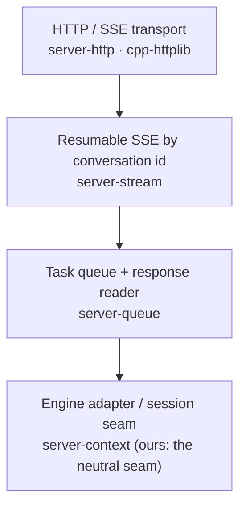

# Server reference analysis — what to adopt for G5

Date `2026-10-03`. Question: the server (G5) is the one product surface with almost nothing to share with the engine's own strategy, so can it be inherited from a reference rather than designed from scratch? Method: read of the two native servers among the references — llama.cpp's C++ server and ds4's C server — for their layering, their transport, and their session/prefix machinery. No Aeon code changed.

**Two references, two halves.** llama.cpp supplies the **C++ transport shell** — the shape G5 should mirror. ds4 supplies the **session and prefix machinery** — the closer relative of our reuse requirements, and the only other native compiled server in the tree. Neither is forked: the transport shell is a blueprint, and the engine adapter is ours.

**Reference checkouts:** `9cf3bf2` at `/home/marcolap/aeon-references/llama.cpp` (shallow, default branch); `/home/marcolap/aeon-references/ds4` (default branch). Re-pull before trusting a specific revision.

**Verdict.** The **transport shell is worth inheriting as a blueprint and reused as a pattern**, not forked. The **engine adapter is ours by definition** — llama.cpp's is built on continuous batching and multi-slot parallelism, both of which our requirements exclude. The session and prefix logic, which llama.cpp does not exercise the way we need, has a direct reference in ds4. This document records only the pieces we *should* reference, and stops where the reusable layer ends.

---

## 1. The layering we should mirror

llama.cpp's server already separates transport from engine, and the split is measurable by counting engine references per file. The shape it converged on is the same one G5 needs — which is independent evidence that the boundary is in the right place.

The reusable layer is everything **above** the adapter. The measurement:

| File | Engine refs | Layer |
| :--- | ---: | :--- |
| `server-queue.cpp/.h` | **0** | queue / result plumbing |
| `server-stream.cpp/.h` | **0** | streaming buffer |
| `server-http.cpp/.h` | 5 (UI assets only) | transport |
| `server-context.cpp/.h` | 147 | **adapter — not reusable** |

Two facts worth carrying into the plan: the queue and stream layers are *already engine-agnostic* (zero references), and the adapter is where every engine reference concentrates. That is exactly the G5/engine seam AGENTS.md now defines, and it tells us the shell can be studied in isolation.

---

## 2. Reference map — what we should reference

Each row names the file, the symbol to read, and what Aeon takes from it. These are the only llama.cpp server files worth citing for this work.

| Concern | File | Symbol | What we take |
| :--- | :--- | :--- | :--- |
| **Streaming response model** | [server-http.h](../../../../aeon-references/llama.cpp/tools/server/server-http.h) | `server_http_res` (`data`, `next`), `is_stream()`, `on_complete()` | A response is either a full body or a `next()` callback yielding chunks. This is the exact streaming seam G5 needs (R8), and it names no engine type. |
| **Transport abstraction** | [server-http.h](../../../../aeon-references/llama.cpp/tools/server/server-http.h) | `server_http_context` (`get`/`post`/`del`, `init`/`start`/`stop`), `handler_t` | Route registration and a server thread, over `cpp-httplib`. The shape to mirror for a single-endpoint server. |
| **Resumable SSE** | [server-stream.h](../../../../aeon-references/llama.cpp/tools/server/server-stream.h) | `stream_session`, `stream_pipe_producer::write`, `server_res_spipe` (tee) | A per-generation ring buffer that survives client disconnect, **keyed by conversation id** — "one conv = one live session", which matches our single-session model (R9/R10) almost exactly. |
| **Conversation-id convention** | [server-stream.h](../../../../aeon-references/llama.cpp/tools/server/server-stream.h) | `server_stream_conv_id_from_headers` (`X-Conversation-Id`) | A neutral, non-engine way to identify the live session across streaming reconnects. |
| **Task queue** | [server-queue.h](../../../../aeon-references/llama.cpp/tools/server/server-queue.h) | `server_queue` (`post`, `defer`, `start_loop`, `on_new_task`, `on_update_slots`) | A producer/consumer queue with deferred tasks — the template for R9's "the second conversation queues". |
| **Response reader + cancellation** | [server-queue.h](../../../../aeon-references/llama.cpp/tools/server/server-queue.h) | `server_response`, `server_response_reader` (`next`, `wait_for_all`, `stop`) | A generator-like consumer with a `should_stop` predicate per poll — the pattern for R10 cancellation. |
| **Adapter seam** | [server-context.h](../../../../aeon-references/llama.cpp/tools/server/server-context.h) | `server_context` (`load_model`, `start_loop`, `terminate`, `get_response_reader`, `get_meta`) | The lifecycle a long-lived engine needs: load once, block in a loop, terminate cleanly. The *interface shape* to copy; the *implementation* is ours. |
| **Launch shape** | [main.cpp](../../../../aeon-references/llama.cpp/tools/server/main.cpp) | `main` (5 lines) | Confirms the executable should be a trivial wrapper: parse args, hand to the app, run. Matches the thin-`main` discipline `aeon_chat` already follows. |
| **Target structure** | [CMakeLists.txt](../../../../aeon-references/llama.cpp/tools/server/CMakeLists.txt) | `server-context` (static lib), `llama-server-impl`, `llama-server` (exe) | The server is a separate target linking the engine, never the reverse — the build-level form of G5's one-way dependency (R13/R14). |
| **HTTP dependency** | [vendor/cpp-httplib](../../../../aeon-references/llama.cpp/vendor/cpp-httplib) | `httplib.h`, `httplib.cpp` | The pure C/C++ HTTP choice that satisfies R13: no runtime dependency, vendorable, no second stack. |
| **OpenAI-compatible surface** | [server-context.h](../../../../aeon-references/llama.cpp/tools/server/server-context.h) | the `server_routes` handler list | The endpoint *names and shapes* to match (`/v1/chat/completions`, `/health`, `/props`) so existing clients work unchanged — AGENTS.md rule 2, standard ecosystem compatibility. |

Two of these deserve emphasis. First, **`server_http_res`'s generator pattern** is the single most reusable idea: it decouples "how a response is produced" from "how it is transported", which is precisely the seam that lets the server stay model-agnostic. Second, **`server-stream`'s conversation-id-keyed buffer** is the closest existing analogue of our design intent, and it is already engine-free — worth reading in full before writing ours.

---

## 3. Where the reusable layer ends

The engine adapter (`server-context.cpp`, ~5,558 lines) is **not** a reference for us, and the reason is structural, not stylistic: it is built to run **many parallel sequences through one batched decode**. It carries `n_parallel` slots, per-slot `seq_id`s, a shared `llama_batch`, and multi-user scheduling. Our requirements exclude continuous batching and multi-session residency (out of scope), so almost all of that file describes a machine we deliberately do not have.

The same boundary excludes llama.cpp's `common/` support library, which the "generic-looking" server files actually depend on (tokenization, sampling chains, the Jinja chat-template engine, grammar). Inheriting those files would mean inheriting llama.cpp's own runtime — the opposite of a self-contained G5.

**Our adapter is small precisely because our scope is small.** Where llama.cpp spends thousands of lines on slot scheduling and feature breadth (embeddings, rerank, infill, multimodal, LoRA, router mode, embedded UI), G5 needs one conversation, one queue, one streaming endpoint. The adapter is ours to write, and it is the part that could never be inherited anyway.

Rule of thumb for the plan: **read the shell for patterns, write the adapter.** Do not fork the directory.

---

## 4. Second reference — ds4, the session and prefix half

`ds4` is the other reference with a **native compiled server**: `ds4_server.c`, ~20.3k lines of C, raw `sys/socket` + `pthreads` with **no HTTP library at all**. It is C rather than C++, so it is not the source for G5's transport code — but it is the **better reference for the session half** of our work, which llama.cpp does not exercise the way we need: llama.cpp reuses by restore-by-identity across many slots, whereas ds4 continues one resident session's own prefix.

Its own header states the design, and it is close to our requirements:

> each client connection is handled by a small blocking thread that parses one request, then queues a job to a **resident session worker**. A model coordinator batches decode-ready sessions and serializes bounded prefill quanta, keeping graph mutations out of client threads while preserving **per-session KV ownership**.

| Concern | File | Symbol | What we take |
| :--- | :--- | :--- | :--- |
| **SSE, hand-rolled** | [ds4_server.c](../../../../aeon-references/ds4/ds4_server.c) | `sse_headers`, `sse_chunk`, `sse_done`, `sse_chat_delta_n` | A complete SSE implementation over a raw socket — the reference for *how little* transport code actually is when a library is not wanted (R8). |
| **OpenAI / Anthropic surface** | [ds4_server.c](../../../../aeon-references/ds4/ds4_server.c) | routes `/v1/chat/completions`, `/v1/completions`, `/v1/messages`, `/v1/models`, `/v1/responses` | Confirms the endpoint set R7 should match, including Anthropic Messages. |
| **Live continuation (our prefix reuse)** | [ds4_server.c](../../../../aeon-references/ds4/ds4_server.c) | `anthropic_prepare_live_continuation`, `anthropic_live_has_call_id` | Detects a tool-result tail and **continues the existing prefix** instead of re-prefilling — R1/R3 in a shipping implementation. |
| **Prefix match, verified** | [ds4_kvstore.h](../../../../aeon-references/ds4/ds4_kvstore.h) | `ds4_kvstore_byte_prefix_match`, `ds4_kvstore_find_text_prefix`, `ds4_kvstore_tokens_copy_prefix`, `ds4_kvstore_build_prompt_from_exact_prefix_and_text_suffix` | The *checked* extension of R3: it matches on the byte/text prefix rather than assuming, exactly the discipline our requirement demands. |
| **Session storage** | [ds4_kvstore.h](../../../../aeon-references/ds4/ds4_kvstore.h) | `ds4_kvstore_open` / `store_live_prefix` / `try_load_text` / `evict`, `DS4_KVSTORE_REASON_{COLD,CONTINUED,EVICT,SHUTDOWN}`, `DS4_KVSTORE_HIT_HALF_LIFE_SECONDS` | A **disk** KV store with sha1-named entries, hit counting, and eviction reasons — the deferred capability, already implemented to disk. |
| **Prompt-prefix helper** | [ds4_agent.c](../../../../aeon-references/ds4/ds4_agent.c) | `#include "ds4_prompt_prefix.h"` | A dedicated prefix abstraction at the agent layer. |

Two things to carry over, one to leave:

- **Carry the `CONTINUED` vs `COLD` distinction.** ds4 separates "this session continued its own prefix" from "this prefix was cold-loaded", which is precisely the reuse-accepted vs reuse-replayed split R12 wants made observable.
- **Carry `byte_prefix_match` as the shape of our R3 check** — verify, never assume — and the kvstore eviction reasons as a ready vocabulary for the deferred session store.
- **Leave the batch coordinator.** It batches decode-ready sessions (continuous batching), which we exclude. Read its transport and its KV/prefix logic; skip its scheduler.

---

## 5. Deferred reference — session storage

Session storage is a capability we **deferred**, not current work. Both references cover it; ds4 is the closer one because it already persists to disk. Recorded here so it is not lost, not so it is started.

| Deferred capability | File | Symbol |
| :--- | :--- | :--- |
| Per-session KV snapshot + restore | [server-task.h](../../../../aeon-references/llama.cpp/tools/server/server-task.h) | `server_prompt_cache` (`alloc`, `load`, `update`), `server_prompt::prompt_save` / `prompt_load` |
| Save/restore endpoints | [server-context.h](../../../../aeon-references/llama.cpp/tools/server/server-context.h) | `handle_slots_save`, `handle_slots_restore`, `handle_slots_erase` |

llama.cpp's "prefix cache" is a **restore-by-identity** mechanism — it snapshots a sequence's KV state and reloads it later — which is our **session storage**, not our near-term in-place prefix reuse. It snapshots to host RAM.

**ds4's kvstore is the closer reference** (§4): it already persists to disk, keys entries by a content hash, tracks hits, and records *why* an entry was evicted — which maps onto our planned `O_DIRECT` cold-tier session store, whose home must be NVMe, not the Warm RAM the experts already over-subscribe.

---

## 6. How this maps to the requirements

| Requirement | Backed by |
| :--- | :--- |
| R1 reuse, R3 verified extension, R4 reuse invalidation | ds4 `anthropic_prepare_live_continuation`, `ds4_kvstore_byte_prefix_match` / `find_text_prefix` |
| R7 conversational endpoint, R8 streaming | `server_http_res` generator pattern; `server_routes` and ds4 route list; ds4 `sse_*` |
| R9 second conversation queues | `server_queue` (`post`/`defer`) |
| R10 cancellation | `server_response_reader::next` + `should_stop`; resumable stream |
| R11 robustness | `server_http_context` handler/response separation |
| R12 reuse accepted vs replayed observable | ds4 `DS4_KVSTORE_REASON_CONTINUED` vs `COLD` |
| R13 one native binary, one command | `cpp-httplib` + the `llama-server` target/exe structure |
| R14 model-agnostic server | the measured llama.cpp seam: queue/stream/http hold zero engine references; only the adapter does |

---

## 7. One-line summary

Two references split the work by half. **llama.cpp** gives the **C++ transport shell** — streaming-response generator, conversation-id-keyed resumable SSE, queue with cancellation, `cpp-httplib`, an OpenAI-shaped surface, and a target structure that encodes the one-way dependency — and confirms by measurement that the engine adapter is a separate layer. **ds4** gives the **session half** — a hand-rolled SSE server, a verified byte/text prefix match, live continuation of a resident session, and a disk KV store with eviction reasons — which is the closer relative of our prefix-reuse requirement and of the deferred session storage. We adopt the patterns, the HTTP dependency, the prefix-match discipline and the reuse vocabulary; we write the **session seam** ourselves, because ours is single-session where both references' schedulers are batching.
