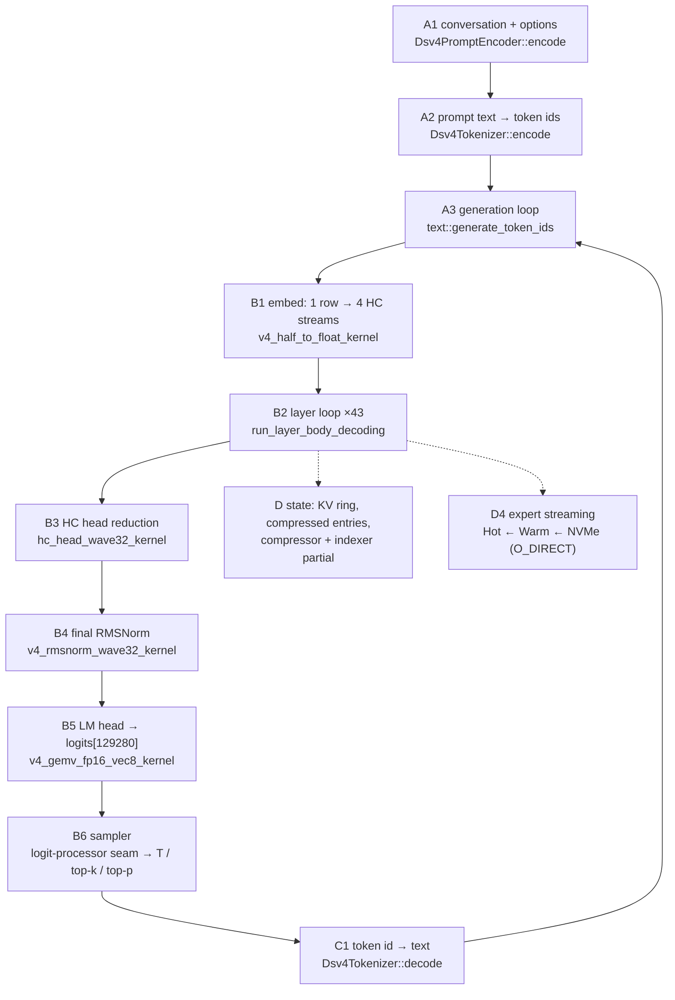
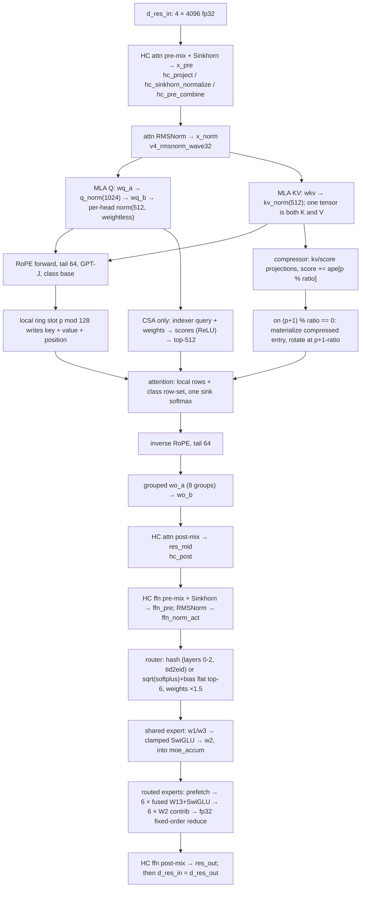

# Graph Composition Plan — one ordered path from text to text

**Status:** 2026-09-17, branch `rewrite/graph-v2`.
**Subject:** the **composition** of DeepSeek-V4-Flash-0731 into one ordered graph — text in,
text out — with every step mapped to the component that implements it and a definitive list of
what does not exist yet.
**Caveat:** this is not a new plan. It is the plan that *consumes* Tiers 0–4 and item 23's first
seam. It re-derives nothing and re-certifies nothing; where a step's correctness is already
established it says so and points at the gate.

> Evidence convention: paths are `src/`-relative and line numbers are from the working tree at the
> revision above. Where a claim is about behaviour rather than a symbol, the source line is cited.
> Where a step is *certified*, the pointer is to the [inference pipeline plan](inference_pipeline_plan.md),
> which owns the gate result. Nothing here is derived from memory.

---

## 1. Acceptance criterion

The graph is **built** when one command takes a conversation and returns text, and each of the
following holds — measured, not asserted:

1. **Coherent output.** A multi-turn prompt produces a reply that is a reply to *that* prompt.
2. **Mathematically correct microsteps.** Every step of §2 is either already certified against an
   independently written fp64 oracle (Tier 1 / Tier 2 / Step 3) or is certified in this plan's
   phases against one. No step is admitted on plausibility.
3. **The engine is the engine.** The routed experts are delivered through Hot VRAM ← Warm DDR ←
   NVMe (`O_DIRECT`, 4 KiB aligned), with the cold read overlapped by the shared-expert pass —
   not from an mmap pointer that happens to be resident.
4. **No duplication.** One layer body, one accumulation, one assembly. Two implementations of any
   step is a defect in the composition, not a convenience.
5. **Nothing runs that is not necessary.** No op is added because it was easy; each is required by
   the model's own architecture (the plan's Part II is the authority on which).

**Not** part of the criterion: throughput, batching, prefix reuse, tool use, MTP. Those are §9.

### 1.1 What is already known about reaching text

The **shell** has already produced coherent text once — through the *pre-rewrite* graph:
`What is the capital of France?` → `The capital of France is **Paris**.`, EOS-reached, 43 layers, on
silicon `[V execution/active/TEXT_IN_TEXT_OUT_IMPLEMENTATION_PLAN.md §1.1]`. That run is **not
evidence about this graph** (the ledger marks pre-rewrite model-path measurements invalid, and the
legacy parity tests are gated off), but it settles three things this plan depends on:

* the front end and back end are real — the tokenizer, the prompt encoder (now at 4/4 golden
  vectors), the detokenizer, the EOS-aware stop loop, and a working argmax all exist and have run;
* coherence is **reachable** by this architecture at this quantization, so criterion 1 is not in
  doubt — what P1–P4 replace is the graph *under* the shell;
* the risk in this plan is therefore not "can it speak", it is "does the rebuilt graph compute what
  the gates say it computes, and does it still speak when it does".

The legacy `V4Pipeline::step` also shows the serial prefill shape P4 needs (`prefill()` loops
`step()` with `RoutingPhase::Prefill`) — order B invariant 4: serial before batched. P6 batches it.

---

## 2. The graph, in order

### 2.1 The token path



`E` is visited 43 times per token; the residual is carried **on the device** across those 43 calls
(see §2.3), and `S` is written as a side effect of each visit.

### 2.2 Step order, with the layer class branch

| # | Step | Where it runs | Certification |
| :-- | :--- | :--- | :--- |
| A1 | Conversation → prompt text (thinking mode, reasoning effort, tool sections, conditional BOS) | host | **Step 0 — 4/4 golden vectors** |
| A2 | Prompt text → token ids | host | `test_dsv4_tokenizer` |
| A3 | Autoregressive loop, stop conditions | host | `test_text_generation` |
| B1 | Token id → embedding row (`embed.weight` F16 [129280,4096]), broadcast to the 4 HC streams, widened fp32; token id uploaded for hash routing | device | plan Step 1 specifies the gate (4 streams byte-identical); **no test exists yet** |
| B2 | The 43-layer loop (§2.3) | device | **Tier 2 items 16–18** on real weights |
| B3 | 4 streams → one 4096 vector, weightless RMS + `hc_head_fn/base/scale`, `hc_eps` after the sigmoid | device | **Step 3 gate — 25 checks, 6/6 mutations** |
| B4 | Final RMSNorm with the learned `norm.weight` | device | **Tier 1 item 5** (weighted form) |
| B5 | `logits = head.weight @ h` → [129280], fp32 accumulate, head is **not** tied to the embedding | device | inventory only — **no standalone gate exists**; certified by P1 below |
| B6 | Logit-processor seam → temperature / top-k / top-p → token | device + 4 B host | **none — does not exist** |
| C1 | Token id → text | host | `test_dsv4_tokenizer` |
| C2 | Stop on EOS / max tokens / context limit | host | `test_text_generation` |

### 2.3 One layer, ×43 (`run_layer_body_decoding`, `core/v4_layer_body.hpp:1080`)

The body is **self-chaining**: the 43-layer driver calls it 43 times and does not touch the residual,
because the body ends by writing `d_res_in` from its own `d_res_out`
(`core/v4_layer_body.hpp:1053-1066`). That is why the driver is thin (§5.3).



Agent class branch, per layer: **ratio 0** (layers 0,1) local rows only, no compressor, no indexer;
**ratio 4** (even 2…42) local + indexer top-512; **ratio 128** (odd 3…41) local + **all** committed
compressed rows, **no indexer** (plan trap 33). The branch is one `V4AttentionKind` on the spec and
lives in exactly one place in the body.

---

## 3. Component inventory

Every component below exists in the tree unless marked **MISSING**. "Certified" points at the gate
that owns the claim, in the inference pipeline plan.

### 3.1 Text front end (host)

| Step | Component | File | State |
| :-- | :--- | :--- | :--- |
| A1 | `Dsv4PromptEncoder::encode` / `encode_tokens` | `text/dsv4_prompt_encoder.hpp:100` | exists, **Step 0 4/4** |
| A1 | `Dsv4PromptOptions` (thinking mode, `reasoning_effort`, BOS) | `text/dsv4_prompt_encoder.hpp:79` | exists |
| A1 | `Dsv4ChatFormatter` (basic skeleton) | `text/dsv4_chat_formatter.hpp:29` | exists, superseded by the encoder for the canonical path |
| A2, C1 | `Dsv4Tokenizer::encode` / `decode` / `added_token_text` | `text/dsv4_tokenizer.hpp:11` | exists, certified |
| A3, C2 | `text::generate_token_ids`, `GenerationOptions`, `GenerationResult`, `StopReason`, `TokenStep` | `infrastructure/text/text_generation.hpp:10-38` | exists, certified standalone — **not yet bound to the new graph** |

### 3.2 Engine substrate (host + device)

| Role | Component | File | State |
| :-- | :--- | :--- | :--- |
| Artifact open | `AeonModelLoader` (`open_model`, `get_tensor`, `get_data_ptr`, `get_expert_location`, `get_expert_data`, `expert_direct_fd`, `experts_per_layer`, `expert_format`) | `infrastructure/core/aeon_loader.hpp:26` | exists |
| Config | `DeepSeekV4Config::load_from_json` | `core/config.hpp` | exists |
| Spec | `V4ModelSpec::resolve_layers` → 43 `V4LayerSpec` (class + ratio) | `core/v4_model_spec.hpp:44,154` | exists |
| Contract | `V4ModelContract::validate` (dtype + shape + byte size per tensor, all 43 layers; table at `:45-102`) | `core/v4_model_contract.hpp:128` | exists, `test_v4_model_contract` |
| Budget | `AeonRuntimeConfig` | `core/memory_budget.hpp:27` | exists |
| Budget | `MemoryBudgetEngine::evaluate` → `MemoryBudgetReport` (`hot_vram_slots`, `warm_host_slots`, `is_feasible`) | `core/memory_budget.hpp:51,140` | exists |
| Budget | `MemoryBudgetEngine::attention_state_memory` (sums all 43 layers) | `core/memory_budget.hpp:~155` | exists — **this is the session-state accounting** |
| State layout | `V4LayerStateLayout::from_spec` / `total_device_bytes` | `core/v4_layer_state.hpp:13,27,162` | exists |
| Per-layer weights + state | `V4Layer`, `init_with_loader`, `record_position`, `reset_generation_state`, `snapshot_state`, `restore_state` | `core/v4_layer.hpp:46,108,291,309,151,228` | exists; R3 certified (item 22) |
| Per-layer weight pointers | `V4DenseWeightBinding` (`d_attn_norm` … `d_gate_weight`, `host_tid2eid`) | `core/v4_dense_weight_binding.hpp:28-66` | exists |
| Model-level tensors | `V4ModelResources` (`host_embed_table`, `d_hc_head_fn/base/scale`, `d_lm_head`, `d_final_norm`, 4 RoPE caches) | `core/v4_model_resources.hpp:17-30` | exists |
| RoPE tables | `kernel::RopeTable` (two instances: plain + YaRN-on-compressed) | `kernels/v4_rope.hpp:41` | exists |
| Scratch | `PipelineScratchBuffers` (residual, HC, MLA, compressor, indexer, MoE, **head** incl. `d_logits`, argmax) | `core/v4_pipeline_scratch.hpp:23` | exists, **not gated** |
| Batched scratch | `PipelineBatchScratchBuffers` | `core/v4_pipeline_scratch.hpp:334` | exists |
| Streams | 4: `compute`, `sdma`, `sdma_cold`, `demotion` | created in `V4Pipeline::initialize_streams` (`core/v4_pipeline.hpp:2261`) | pattern exists; **MISSING as an owned object** |
| Expert payload I/O | `aeon::io::DirectIOReader` (io_uring, `O_DIRECT`, 4 MiB chunks) | `infrastructure/io/direct_io_reader.hpp` | exists |
| VRAM expert pool | `UnifiedVRAMExpertPool` (`get_w1/w2/w3_packed`, `get_*_scale`, `get_slot_base`, `upload_from_host_expert`, `download_to_host_expert`) | `backend/swizzled_w4a16/core/vram_expert_pool.hpp` | exists |
| Host expert pool | `HostExpertPool` (`get_expert_slot_ptr`, `is_slot_pinned`) | `infrastructure/core/host_expert_pool.hpp` | exists |
| Payload pool | `ExpertPayloadPool` | `infrastructure/core/expert_payload_pool.hpp` | exists |
| Staging | `PrefetchStagingArena` (`events[]`, `begin_io`, `complete_io`, `release_after_gpu_transfer`) | `infrastructure/core/prefetch_staging.hpp` | exists |
| Registry | `ExpertRegistry` (lease, LRU, demotion, `invariants_hold`) | `infrastructure/core/expert_registry.hpp` | exists |
| Supply | `TieredExpertSupply` (`dispatch`, `materialize`, `reap_registry_transfers`) | `infrastructure/core/tiered_expert_supply.hpp` | exists |
| Supply facade | `V4ExpertSupplyCoordinator` (`configure`, `dispatch_layer_prefetch`, `materialize_layer_prefetch`, `reap_registry_transfers`) | `core/v4_expert_supply.hpp:19` | exists, **not gated** |
| Diagnostics | `SupplyTelemetry`, `RoutingCounter`, `RoutingProfile*` | `infrastructure/core/supply_telemetry.hpp`, `routing_counter.hpp`, `routing_profile.hpp` | exist, optional |

### 3.3 The certified graph body

| Component | File | State |
| :--- | :--- | :--- |
| `run_layer_body_pre_attention` | `core/v4_layer_body.hpp:392` | **Tier 2 items 16–18 certified on real layers 0/2/3** |
| `run_layer_body_attention_tail` | `core/v4_layer_body.hpp:781` | same |
| `run_layer_body_decoding` (the one body decode and chunk share) | `core/v4_layer_body.hpp:1080` | same |
| `decode_layer_body_row` (row view over `PipelineScratchBuffers`) | `core/v4_layer_body.hpp:303` | same |
| `select_indexer_topk` (**host round-trip — item 19(b) remainder**) | `core/v4_layer_body.hpp:164` | same |
| `committed_entries_for` (the count rule) | `core/v4_layer_body.hpp:205` | same |
| `V4LayerBodyTables` (two RoPE bases by class) | `core/v4_layer_body.hpp:54` | same |
| `V4RoutedExpertExecutor` seam | `core/v4_layer_body.hpp:111` | same |
| `V4LayerBodyObserver` / `V4NullLayerBodyObserver` | `core/v4_layer_body.hpp:77,94` | same |
| Production executor `V4TieredExpertExecutor` | `core/v4_expert_executor.hpp` | **item 23 step 1 — 12 checks, 5/5 mutations** |
| `V4RoutedExpertScratch`, `V4ExpertExecutorStreams` | `core/v4_expert_executor.hpp` | same |
| Chunked path `run_layer_body_chunk` | `core/v4_layer_body_batch.hpp` | **item 19 `chunk ≡ serial`, 0 differing values** |

### 3.4 Kernels, by step

| Step | Kernel | File:line |
| :--- | :--- | :--- |
| B1 | `v4_half_to_float_kernel` | `kernels/v4_pipeline_ops.hpp:120` |
| 2.0 / 2.7 | `hc_project_kernel`, `hc_sinkhorn_normalize_kernel`, `hc_pre_combine_kernel` | `kernels/hc_sinkhorn.hpp:161,378,288` |
| 2.0 / 2.7 post | `hc_post_kernel` | `kernels/hc_sinkhorn.hpp:486` |
| 2.1 / 2.8 / Step 4 | `v4_rmsnorm_wave32_kernel` | `kernels/v4_norm.hpp:33` |
| 2.2 | `v4_rmsnorm_unit_wave32_kernel` (per-head Q norm, weightless) | `kernels/v4_norm.hpp:67` |
| 2.2 / 2.5 / 2.9 shared | `v4_gemv_fp16_kernel`, `v4_gemv_fp16_vec8_kernel` | `kernels/v4_gemv.hpp:34,64` |
| 2.3 | `v4_forward_rope_at_pos_wave32_kernel`, `v4_inverse_rope_at_pos_wave32_kernel` | `kernels/v4_rope.hpp:167,199` |
| 2.4.2 | `v4_save_compressor_state_kernel`, `v4_materialize_compressed_entry_kernel` | `kernels/v4_attention.hpp:360,390` |
| 2.4.3 | `v4_indexer_scores_kernel` | `kernels/v4_attention.hpp:506` |
| 2.4.4 | `v4_cached_sliding_window_attn_wave32_kernel`, `v4_cached_compressed_attention_wave32_kernel` | `kernels/v4_attention.hpp:280,537` |
| 2.5 | `v4_grouped_wo_a_wave32_kernel` | `kernels/v4_attention.hpp:144` |
| 2.9 | `moe_router_kernel` | `kernels/moe_router.hpp:104` |
| 2.10.3 shared | `v4_pipeline_swiglu_clamp_kernel` | `kernels/v4_pipeline_ops.hpp:10` |
| 2.10.3 routed | `dispatch_aeon_moe_fused_w13_swiglu`, `dispatch_aeon_moe_fused_w2_contrib` | `backend/swizzled_w4a16/kernels/aeon_moe_fused_w13.hpp`, `aeon_moe_fused_w2.hpp` |
| 2.10.5 | `v4_moe_accumulate_fixed_order_kernel` (fp32, slot order, one rounding) | `kernels/v4_pipeline_ops.hpp:98` |
| B3 | `hc_head_wave32_kernel` | `kernels/v4_attention.hpp:625` |
| B6 | `v4_argmax_fp16_partial_kernel`, `v4_argmax_partial_reduce_kernel` | `kernels/v4_attention.hpp:193,236` |
| readers | `v4_half_to_float_n_kernel`, `v4_float_to_half_kernel` | `kernels/v4_attention.hpp:179`, `kernels/v4_pipeline_ops.hpp:132` |

### 3.5 The independent oracle (must never share code with a kernel)

| Op | File:line | State |
| :--- | :--- | :--- |
| `rmsnorm`, `rmsnorm_unit` | `reference/dsv4_oracle.hpp:154,168` | exists |
| `rope_table`, `rope_apply_tail`, `rope_inv_freq` | `reference/dsv4_oracle.hpp:281,313,240` | exists |
| `matvec`, `mla_kv_path`, `MlaQPath` | `reference/dsv4_oracle.hpp:380,457,419` | exists |
| `hc_mixes`, `hc_sinkhorn`, `hc_pre_combine`, `hc_post` | `reference/dsv4_oracle.hpp:521,540,606,624` | exists |
| `hc_head_reduce` | `reference/dsv4_oracle.hpp:684` | exists |
| `attention_scores_sink`, `attention_sink_as_zero_value_key` | `reference/dsv4_oracle.hpp:777,819` | exists |
| `compressor_ape_apply`, `compressor_raw`, `compressor_rope_position` | `reference/dsv4_oracle.hpp:899,923,975` | exists |
| `indexer_scores`, `topk_indices` | `reference/dsv4_oracle.hpp:1053,1079` | exists |
| `grouped_wo_a` | `reference/dsv4_oracle.hpp:1131` | exists |
| `router_score`, `router_topk`, `router_hash` | `reference/dsv4_oracle.hpp:1188,1200,1242` | exists |
| `swizzled_*`, `decode_expert_weights`, `expert_ffn`, `dense_ffn` | `reference/dsv4_oracle.hpp:1290-1700` | exists |
| `layer_body` — one layer, all three classes, fp64 | `reference/dsv4_oracle.hpp:2101` | exists, **certified (items 16/17/18)** |
| **`model_body`** — embed → 43 × `layer_body` → `hc_head_reduce` → `rmsnorm` → LM head | — | **MISSING (G9)** |

### 3.6 Gate scaffolding already built (reusable)

`tests/support/v4_layer_body_gate.hpp` — `load_layer_weights`, `committed_entries`,
`GateExpertExecutor`, `make_synthetic_payload`, `upload_and_read`, `report`/`check`, and the
dimension constants. The item-23 executor gate reuses the same fixture style
(`tests/test_v4_expert_executor.cpp`), and `tests/test_v4_expert_tiering.cpp:196-345` is the
reference recipe for standing the whole tiered supply up.

---

## 4. Where the three tiers enter the graph

The engine purpose is single-fluid: **the dense backbone and the working set stay in VRAM; the
routed experts stream.** The graph meets storage at exactly one place — the executor seam — and
this is the whole of it:

| Tier | What lives there | Entered by | File |
| :--- | :--- | :--- | :--- |
| Hot VRAM | dense backbone (43 layers), all 4 state pieces, RoPE caches, model head, `hot_vram_slots` resident experts, staging arena | `UnifiedVRAMExpertPool` | `backend/swizzled_w4a16/core/vram_expert_pool.hpp` |
| Warm DDR | `warm_host_slots` experts, LRU-demoted; also the pinned bounce for a cold promotion | `HostExpertPool` | `infrastructure/core/host_expert_pool.hpp` |
| Cold NVMe | the 145 GB expert container, mmapped for the loader and `O_DIRECT` for the supply | `DirectIOReader` + `TieredExpertSupply` | `infrastructure/io/direct_io_reader.hpp`, `infrastructure/core/tiered_expert_supply.hpp` |

The call order inside one layer is fixed and is what makes the tiering *overlap* rather than
serialize (`core/v4_layer_body.hpp:999,1009-1039`):

1. `executor.on_routing_ready(...)` — the ids are known, so the cold reads are **submitted** here.
2. the shared expert runs on the GPU (three GEMVs + SwiGLU) — this covers the NVMe latency.
3. `executor.accumulate_routed(...)` — `materialize` waits for the I/O, the fused kernels consume
   the six experts, the fixed-order reduce sums them.
4. `executor.on_routed_consumed(...)` — staging slots and leases are retired.

Leases are held for the whole token and released at the token boundary (`release_leases()`), because
a lease grants no ordering whatsoever — see plan **trap 41**.

---

## 5. The engine assembly — the component that does not exist

Everything in §3 is a *part*. What is missing is the thing that **owns** the parts and runs them in
order. Today the only assembly in the tree is `V4Pipeline::initialize` (`core/v4_pipeline.hpp:259`)
plus `V4Pipeline::step` (`:460`), and it is **behind `AEON_ENABLE_LEGACY_V4_GRAPH` (default OFF)**
— so the single end-to-end text-in/text-out CLI, `tools/aeon_chat.cpp`, is a legacy target
(`cmake/AeonLegacyGraph.cmake`). The rewrite has no driver.

### 5.1 The exact assembly recipe, already proven

The sequence below is what `V4Pipeline::initialize` does and what
`tests/test_v4_expert_tiering.cpp:196-345` proves is sufficient and ordered correctly. It is
reproduced here because it is the *specification* of the missing component, and because it is
short — which is the point: it is composition, not invention.

```text
 1. select_compute_device(...); create 4 non-blocking streams
 2. loader.open_model(dir);  backend = ExpertBackendRegistry::resolve(format)
 3. model_cfg = DeepSeekV4Config::load_from_json(dir + "/config.json")
 4. layer_specs = V4ModelSpec::resolve_layers(model_cfg)            // 43 specs
 5. V4ModelContract::validate(model_cfg, loader)
 6. budget = MemoryBudgetEngine::evaluate(runtime_cfg, model_cfg, dense_bytes, format)
      if (!budget.is_feasible) refuse
 7. model_resources.initialize(loader, runtime_cfg.context_size, model_cfg)
 8. scratch.allocate()                                    // incl. d_logits, argmax
 9. for l in 0..42: layers[l].init_with_loader(specs[l], loader, context_size)
10. vram_pool.allocate(budget.hot_vram_slots, format)
11. staging = PrefetchStagingArena(format)
12. registry.init(43, 256, budget.hot_vram_slots, budget.warm_host_slots, preload_warm_host)
13. preload Hot slots, then the Warm pool, with batched O_DIRECT reads   // ~150 lines
14. supply.configure(&loader, &vram_pool, &host_pool, &registry, &staging, &telemetry,
                     &direct_io_reader, &completions, &next_direct_io_id,
                     stream_compute, stream_sdma, stream_sdma_cold, stream_demotion,
                     format.payload_bytes, demotion_queue_capacity)
15. executor = V4TieredExpertExecutor(supply, vram_pool, staging, registry,
                                     routed_scratch, streams, config.swiglu_limit)
```

Step 13 is the only part with real mass, and the tiering gate already drives its exact shape
(batched `read_experts_direct_blocking` into an `AlignedBuffer` set, then
`upload_from_host_expert`).

### 5.2 Decision: one composition, written once, in the rewrite

**Lift the sequence, not the file.** Concretely:

* The four proposed modules below are **new, un-gated** files. The substrate *types* they use
  (`V4Layer`, `V4ModelResources`, `V4ModelSpec`, `V4ModelContract`, `MemoryBudgetEngine`,
  `PipelineScratchBuffers`, `V4ExpertSupplyCoordinator`, `V4LayerBody*`) are **already un-gated**
  and are reused as they stand. Nothing is duplicated.
* `core/v4_pipeline.hpp` is **not** modified. It is scheduled for deletion with the legacy graph
  and touching it would create a second copy of the assembly to keep in sync.
* `tools/aeon_chat.cpp` is moved out of `cmake/AeonLegacyGraph.cmake` and re-bound to the new
  engine, so text-in/text-out stops being a legacy target (§3.1 gap G6).

| New module | Owns | Depends on |
| :--- | :--- | :--- |
| `core/v4_model_host.hpp` | loader, config, spec, contract, budget, resources, 43 layers, scratch, 4 streams, pools, registry, staging, supply, executor. **Steps 1–15 above.** | everything in §3.2 |
| `core/v4_graph.hpp` | the ordered forward: B1 embed → 43 × B2 → B3 → B4 → B5 → logits. Owns nothing but the order; takes the host by reference. | `v4_model_host.hpp`, `v4_layer_body.hpp` |
| `core/v4_sampler.hpp` | the logit-processor seam and the sampler (argmax now; temperature / top-k / top-p on the fp32 logits). | `v4_attention.hpp` argmax pair |
| `core/v4_engine.hpp` | binds text: tokenizer + prompt encoder + `generate_token_ids` + `V4Graph` + detokenizer + the session/state boundary. | the three above, `infrastructure/text/text_generation.hpp` |

`v4_model_host.hpp` and `v4_graph.hpp` are the split that keeps the files small and the concerns
separate: the host is *what is resident*, the graph is *what happens in order*. The streaming
system enters only through the host, which constructs the executor — the graph never learns which
tier answered.

### 5.3 The 43-layer driver, and why it is small

```text
V4Graph::forward_token(token_id, position):
    embed_row_to_four_streams(token_id)                  // 4 × H2D + widen; upload token id
    for l in 0..42:
        run_layer_body_decoding(layers[l], scratch, tables, token_id, position,
                                compute_stream, executor, observer)
    hc_head_wave32_kernel(res_in, hc_head_fn/base/scale -> hc_head_out)
    v4_rmsnorm_wave32_kernel(hc_head_out, final_norm -> head_norm)
    v4_gemv_fp16_vec8_kernel(head_norm, lm_head -> logits[129280])
    executor.release_leases()                            // the token boundary, per trap 41
    return logits
```

No per-layer residual copy appears, because the body chains itself. No layer is special-cased,
because the class branch is inside the body. No expert address appears, because the executor owns
them. That is the entire driver.

---

## 6. The definitive gap list

Numbered, with the owner, the gate that will certify it, and the phase that retires it. **The
classification below is by phase, not by importance, because a first draft of this section split
the list into "blocks coherence" and "after" and put G9 — the oracle P2's gate *is* — in the second
group. That was wrong, and the contradiction was visible in P2's own gate line. Anything retired at
or before P4 is a prerequisite of the first coherent run:**

| Retired in | Gaps | What they are |
| :--- | :--- | :--- |
| **P1–P4 — the first coherent run** | **G1, G2, G3, G5, G9** | the host, the driver, the sampler, the binding, and the oracle the driver's gate needs |
| P5 — diagnostics under tiering | G4, G14 | observer and telemetry wiring; aids, not prerequisites |
| P6 — chunked prefill | G6, G7, G8 | batched embedding, on-device top-k, the chunk driver |
| P7 — session state | G10, G11, G12, G13 | the session aggregate, registry, cold store, and R4 |

| # | Missing | Why it is required | Where it goes | Certified by |
| :-- | :--- | :--- | :--- | :--- |
| **G1** | **The engine assembly / `V4ModelHost`.** Steps 1–15 of §5.1, including the Hot/Warm preload. | Nothing constructs the graph. This is the single largest genuine absence. | `core/v4_model_host.hpp` | assert the assembly's own invariants: contract passes, `registry.invariants_hold()`, `hot_vram_slots` residents, warm slots as budgeted, and one cold miss decrements `cold_nvme_slots` |
| **G2** | **The 43-layer driver + head composition (`V4Graph`).** | `run_layer_body_decoding` is per *layer*; nothing calls it 43 times, and nothing calls `hc_head` → norm → LM head. | `core/v4_graph.hpp` | **P2 gate** vs `reference` `model_body` (see G9) |
| **G3** | **The sampler with a logit-processor seam.** `temperature`, `top_k`, `top_p`, RNG, and a hook that may mask/bias the fp32 logits *before* sampling. | Plan Step 5 + §6.4: structured output and tool-call JSON are logit masks, so the seam is **non-deferrable**; only argmax exists today. | `core/v4_sampler.hpp` | deterministic-seed replay + mask-applied/mask-cleared fork on real logits |
| **G4** | **A real `V4LayerBodyObserver` for the new graph.** | The body takes an observer; the only production one lived inside `V4Pipeline`. The null one runs but leaves no diagnostic path. | `core/v4_graph.hpp` (observer adapter) | none needed; must not perturb the hot path (assert identical output traced vs null) |
| **G5** | **The end-to-end binding + a non-legacy CLI.** `generate_token_ids` bound to `V4Graph`, and `aeon_chat` re-targeted off the legacy graph. | Criterion 1 is *one command, conversation in, text out*. Today that command only exists behind the legacy flag. | `core/v4_engine.hpp`, `tools/aeon_chat.cpp`, `cmake/AeonInfrastructure.cmake` | **P4 gate**: the coherence run, plus a multi-turn context run |
| **G6** | **Batched token embedding (gather + broadcast).** | Decode uses 4 small H2D copies of the row. A prefill chunk needs a gather over the chunk's ids on the device. | `core/v4_graph.hpp` prep | item-19-style `chunk ≡ serial` on the embedding stage |
| **G7** | **On-device indexer top-k.** `select_indexer_topk` does one D2H + sync and one H2D + sync per CSA token. | Part III forbids per-token host sync in a prefill. Changes no value, so no equivalence gate can see it. Target is **zero syncs**. | `kernels/v4_attention.hpp` | a sync counter in the body (countable now, needs no baseline) |
| **G8** | **The chunked-prefill driver over the new host.** `run_layer_body_chunk` is certified; nothing calls it. | Prefill is mandatory for daily use (Part III). | `core/v4_graph.hpp` (`forward_chunk`) | the item-19 equality gate re-run through the new host |
| **G9** | **`model_body` — the model-level fp64 oracle.** embed → 43 × `layer_body` → `hc_head_reduce` → `rmsnorm` → LM head. | The plan's binding rule 6: a graph test must compare against an independently written reference. `layer_body` exists; the composition does not. | `reference/dsv4_oracle.hpp` | it *is* the instrument for G2/G5; pinned by closed-form self-checks |
| **G10** | **Session aggregate + identity.** `current_seq_len` + 43 × `V4LayerStateSnapshot` + the **non-token inputs** (thinking mode, reasoning effort, active tool set, response format). | Item 22a. `restore_state` is certified (R3) but no type carries a whole session, and the non-token inputs exist only as encoder parameters. | `core/v4_session.hpp` | R3 at session granularity: snapshot → reset → restore → continue, bit-identical |
| **G11** | **Session registry + residency seam (VRAM-only first).** | §6.5 R5: a resident session's state stays in VRAM; an inactive session's may leave. Needs a consumer, which is now the engine. | `core/v4_session.hpp` | two sessions alternating: each continues bit-identically and only one is resident |
| **G12** | **Cold-tier session store with a GiB cap.** | §6.3 R5: an inactive session's home is NVMe (sector-aligned, so it reuses the `O_DIRECT` path), never warm RAM, which the experts already over-subscribe. | `infrastructure/io/` | round-trip byte-exactness on the `O_DIRECT` path |
| **G13** | **R4 — declining a reuse boundary older than the local window.** | The local ring is not reconstructible; a matched prefix shorter than the entry must replay the last `C` tokens rather than serve a stale ring. Needed only once matching exists (22b). | `core/v4_session.hpp` | a boundary outside the window is **refused**, not served |
| **G14** | **Expert-timing / telemetry / routing-counter wiring into the new host.** | Diagnostics only; the substrate exists and is unused by the rewrite. | `core/v4_model_host.hpp` | none required |

Two items are **explicitly not gaps**, and are listed here so they are not mistaken for them:
*the routed-expert executor* (built and gated — item 23's first seam, `core/v4_expert_executor.hpp`)
and *the layer body* (Tier 2/3, certified on real weights).

### 6.1 How many of the 14 are actually new work — seven are lifts

The count "14 gaps" reads as "14 subsystems". It is not, and the difference matters enough to write
down, because it is the difference between a lost project and an unfinished one. **Seven of the
fourteen gaps are code that already exists and runs in the pre-rewrite graph** and has to be lifted
into the rewrite, not invented:

| Gap | Status | Evidence it is a lift, not new work |
| :--- | :--- | :--- |
| G1 | **lift** | `V4Pipeline::initialize` (`core/v4_pipeline.hpp:259`) does steps 1–15 today, including the Hot and Warm preload |
| G2 | **lift + compose** | the 43-call loop and the head stage both exist in `V4Pipeline::step` (`:460`, head at `:1257-1292`); what changes is that the loop must call the **new** body |
| G4 | **lift** | `V4Pipeline::begin_attention_trace` / `queue_trace_copy` (`:2121`, `:2114`) implement the observer the body now declares |
| G5 | **rebind** | `tools/aeon_chat.cpp` is complete and works — against `V4Pipeline::generate_until_stop`. Only its engine pointer changes |
| G10 | **lift** | `V4PipelineStateSnapshot` (`:59`) is already `current_seq_len` + a vector of layer snapshots |
| G14 | **lift** | `enable_expert_timing` / `collect_expert_timing` (`:150`, `:2239`) and the supply telemetry wiring all exist |
| G3 | **half-lift** | the GPU argmax pair exists (`kernels/v4_attention.hpp:193,236`); temperature / top-k / top-p and the seam are new |

**Genuinely new work: G6 (batched embedding — small), G7 (on-device indexer top-k — kernel work),
G8 (the chunk driver over the certified chunk body), G9 (the model-level oracle), G11–G13 (session
registry, cold store, R4).** That is a bounded, named list, and none of it is a research question.

### 6.2 Why the gaps were invisible until now — a blind spot in the process, not bad luck

This is worth stating plainly, because the same shape will reappear otherwise.

The inference pipeline plan's Part V is an **earning order for primitives**: certify an op, then a
layer class, then a layer, then a sequence. It has a gate at every step, and every gate passed. But
**no gate in Tiers 1–3 had "the model produces a token" as its subject** — that subject was item 23,
the *last* item of Tier 4. So during the whole of the rewrite's tiers the new code had a fine-grained
signal at the op and layer level and **no end-to-end signal at all**, and 41 of 43 tests green with
zero end-to-end runs is a perfectly consistent state rather than a contradiction.

The consequence is the sentence that has been repeated as "we are ready for item 23": item 23 was
not a step, it was **the whole composition, deferred to one slot at the end**, with the host, the
driver, the sampler, the binding and the oracle all implicit in it. The count of what that slot
contained was never taken until it was asked for, and the answer was 14.

**What changes from here**, and it is one rule, not a process: *every phase in §7 ends in something
that runs.* P1 does not end in a certified kernel, it ends in real logits from real weights. P2 ends
in a token. P4 ends in text. A phase whose gate is another component's gate is not a phase.

---

## 7. Build phases

Each phase is one step, ends in one gate, and does not start while the previous gate is red. This
is the plan's earning order applied to composition: `P0` is already green, so it is spent.

### P0 — the routed-expert executor ✅
`core/v4_expert_executor.hpp`, `tests/test_v4_expert_executor.cpp` — 12 checks, 5/5 mutations.
*Spent. The first end seam is closed.*

### P1 — the head stage
**Build:** `V4Graph::head_stage` — HC head reduction, final RMSNorm, LM head, fp32 logits readback,
plus the minimal host subset it needs (steps 1–9 of §5.1: loader → config → spec → contract → budget →
resources → scratch → streams). **No pools, no registry, no experts** — P1 must not drag in the
tiering, and it does not need to, because the head stage reads only `embed.weight`,
`hc_head_fn/base/scale`, `norm.weight` and `head.weight`.
**Uses:** `hc_head_wave32_kernel`, `v4_rmsnorm_wave32_kernel`, `v4_gemv_fp16_vec8_kernel`,
`V4ModelResources`, `PipelineScratchBuffers`.
**Gate:** against a small independent head oracle (`hc_head_reduce` + `rmsnorm` + `matvec`, composed
explicitly for this gate), on the artifact's real `hc_head_fn/base/scale`, `norm.weight`,
`head.weight` and `embed.weight`, at ≥ 3 token ids including two non-zero positions. Measured
peak-relative, at the ~`3e-3`-of-peak floor the layer gates established. **The embedding is part
of this gate** (plan Step 1: the row is broadcast to 4 HC streams and they must be byte-identical),
which is what makes P1 the first phase that converts a token id into logits rather than into an
intermediate.
**Unblocks:** real logits from real weights, checked end-to-end at the head. *Nothing may depend on
P2 before this is green.*

### P2 — the 43-layer driver
**Build:** `V4Graph::forward_token` = embed + the 43-call loop + P1's head, and the rest of the host
(steps 10–15 of §5.1: 43 layers, pools, registry, staging, supply, executor, Hot/Warm preload).
**Uses:** `run_layer_body_decoding`, `V4ModelHost` (G1) — so **G1 and G2 land together**, since the
loop cannot run without the host and the host is useless without the loop.
**Gate:** **the oracle is the first thing written, not the last** (G9 is a prerequisite of this phase,
not a follow-up to it — §6's classification now says so). Write `model_body` — embed → 43 ×
`layer_body` → `hc_head_reduce` → `rmsnorm` → LM head — and require the device logits to match it on a
short token sequence (≥ 4 tokens so RoPE, the ring wrap and a router near-tie are all reachable;
trap 36). Tolerance: peak-relative on the logits; the *rule* checks (router ids, row-set counts)
asserted separately against the device's own values, per trap 37.
**Unblocks:** numerics. Everything after this is served by a graph that is arithmetically correct,
and for the first time the new code produces a **token**, not an intermediate.

### P3 — the sampler and its seam
**Build:** `core/v4_sampler.hpp`; argmax at `T=1, top_p=1` first (the artifact's own defaults at
which sampling is untruncated), then temperature / top-k / top-p on fp32 logits, with the
logit-processor hook in front.
**Gate:** seeded replay is bit-identical; a mask that sets one logit to `-inf` removes that token
from the support; `T→0` converges to the argmax path; the untruncated defaults reproduce the
argmax token. **The seam is asserted to exist, not merely to be present.**

### P4 — the text-in/text-out run
**Build:** `core/v4_engine.hpp`; `aeon_chat` re-bound; the target moves out of the legacy cmake gate.
**Gate:** the acceptance criterion. One prompt in, text out; then a multi-turn conversation, whose
turn 2 must be coherent with turn 1 (which is what makes the KV/compressed state observable rather
than merely written). Re-run the whole default suite: no legacy binary counts as coverage.

### P5 — tiering on the live path
**Build:** nothing new — the host already routes through the supply. What is added is the
*measurement* and the *pressure*: run with `hot_vram_slots` small enough that every layer misses,
and with a warm tier that is not preloaded.
**Gate:** the item-21 properties re-derived **through the graph** rather than one round at a time:
cold reads counted, staging slots returned, `forced_drains()` recorded, `invariants_hold()` at the
end, and the logits **bit-identical** to a run with all experts resident. This is the gate the plan
lists as item 21's `Stage D.2` remainder — streaming while the graph runs.
**Unblocks:** the engine purpose. Before this, the graph is correct but is not the engine.

### P6 — chunked prefill through the host
**Build:** `V4Graph::forward_chunk` over `run_layer_body_chunk`; the batched embedding (G6).
**Gate:** the item-19 equality gate re-run through the new host (`chunk ≡ serial`, exact), then —
separately — throughput, whose blocker was measured false and whose real work is batched
projections (`G7` and the projection batching are its own phase).

### P7 — session swap
**Build:** G10–G12. G13 only when matching exists.
**Gate:** R3 at session granularity, then two sessions alternating residency.

**Ordering rationale, stated once.** P1 before P2 because a head defect produces plausibly-scaled
logits and therefore fluent-looking garbage — the failure mode that is hardest to attribute after
the fact. P2 before P3 because sampling cannot be validated on logits that are themselves
unvalidated. P4 before P5 because tiering bugs and numerical bugs produce identical symptoms, which
is the plan's own warning — do not stand up the streaming system before the numerics are correct.
P5 before P6 because prefill multiplies expert traffic, not attention traffic.

---

## 8. What the composition must respect

Not restated here — the [inference pipeline plan](inference_pipeline_plan.md) owns them. The ones
that bind *composition* specifically:

| Rule | Where it comes from | What it forbids here |
| :--- | :--- | :--- |
| One body, not two | Part III | a decode loop and a prefill loop that drift; the chunk path must call the same two halves |
| One accumulation | `aeon_moe_fused_w2_contrib` + `v4_moe_accumulate_fixed_order` | selecting the atomic or fp16 path anywhere, because a byte-exact restore cannot rest on an undefined order (trap 38) |
| A lease grants no ordering | trap 41 | releasing leases before the token boundary without an event protocol |
| Never clamp a position | trap 40 | replacing `record_position`'s refusal with a modulo or a `min` |
| Compare against an independent oracle | Part V, rule 6 | certifying a step against our own kernel |
| A gate that prints PASS is not evidence | Part V, mutation rule | shipping P1–P4 gates that no wrong variant has been shown to fail |
| Two classes, one branch | trap 33 | running the indexer on an HCA layer, or reading `attn.indexer.*` on one |
| Sweep positions | trap 36 | a gate whose only token is position 0, where every RoPE is the identity |

---

## 9. Scope boundaries

**In scope for this document:** the base decoder, serially, coherently, through the three tiers.

**Deferred, and named so it is not an implicit "later":**

| Deferred | Why | Revisits when |
| :--- | :--- | :--- |
| MTP / DSpark draft head (`num_nextn_predict_layers=1`) | speculative decoding, not the base forward pass | the base decoder is green |
| Multi-GPU pipeline parallelism | out of scope for this revision | Phase 3 |
| The prefix **matcher** (block table, cache key, radix search, eviction) | its parameters are measurements of an assembled graph; session swap needs no key | P7 is green and a fork workload exists |
| Tool use beyond the prompt encoding it already has | schema formatting, parser, turn orchestration are frontend work | the logit-processor seam (P3) plus a tool workload |
| The fp8/E4M3 KV store vs bf16 | a storage decision whose delta must be measured, not assumed | the KV-precision gates (plan Gates 9/10) |
| Expert-placement policy (routing-aware hotlists) | a scheduling optimization, not a correctness requirement | P5 is green |
| Throughput targets | speed and correctness are two different gates | P6 |

**Known remainders carried in, not re-decided here:** item 19's throughput half (batched
projections — the alleged chunk cap was measured false), the indexer top-k host round-trip (G7,
countable today, target zero), streaming under concurrency (P5), and the KV-precision gates.

---

## 10. One-line summary of the state

Every **layer-level** op is built and certified. The **model-level** composition is what is missing:
the host that owns the parts (G1), the driver that orders them (G2), the **oracle the driver's gate
compares against** (G9), the sampler (G3), and the binding that makes it text-in/text-out (G5) —
those five, and only those five, separate the tree from the first coherent run. The plan's premise
was true at the layer and false at the ends; item 23's first seam closed one end, and P1–P4 close the
rest. Six of the fourteen gaps are lifts of code that already runs in the pre-rewrite graph (§6.1),
so the remaining work is bounded and named rather than open.
