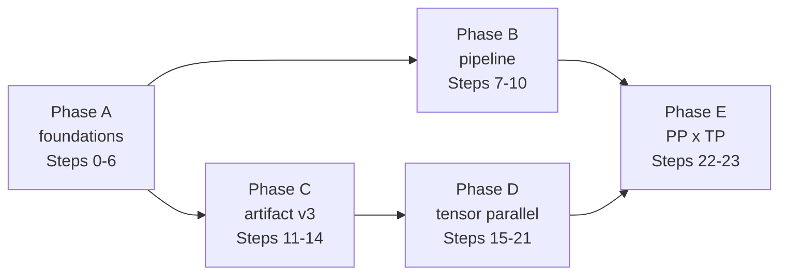

# Multi-GPU Execution Plan

**Date:** 2026-10-05
**Status:** Active — Phase A complete (Steps 0–6), Phase B next.
**Scope:** One model instance across the host's GPUs: explicit device selection, a VRAM utilization fraction, pipeline parallelism, the partition-aware artifact, tensor parallelism, and their composition — single-stream throughout.
**Requirements:** [MULTI_GPU_REQUIREMENTS.md](../../specs-and-requirements/multi-gpu/MULTI_GPU_REQUIREMENTS.md) (R1–R13). **Feasibility evidence:** `tests/test_expert_shard_equivalence.cpp`, `tests/test_w2_shard_equivalence.cpp`, `tests/test_attention_shard_equivalence.cpp`.

The code is the authority. This plan was written against the tree of 2026-10-05 (`f3ce662`) and names symbols, not line numbers. Code comments written while executing it must not cite this plan, its steps or its phases ([AGENTS.md](../../../AGENTS.md) §3 rule 5).

---

## 1. What the code already gives us

| Fact | Where | Consequence |
| :--- | :--- | :--- |
| Device choice is a heuristic that skips PCI bus `0x46` and is called from the host and from three tools | `platform/device.hpp::select_compute_device`; `V4ModelHost::initialize`, `tools/aeon_chat.cpp`, `tools/aeon_serve.cpp`, `tools/aeon_c4_probe.cpp`; ~60 tests | R12 replaces it outright. The tests need their own explicit device source (Step 4). |
| All four streams are one value type, created on the current device | `infrastructure/device_streams.hpp::DeviceStreams::create` | A per-device stream set is `DeviceStreams` created under a device scope. No new stream type is needed. |
| The budget reads `hipMemGetInfo` for the current device and subtracts a fixed `VRAM_HEADROOM_SAFETY_BYTES` (300 MiB) | `memory/memory_budget_engine.hpp`, `memory/runtime_config.hpp` | R13 replaces one constant and one query. The per-device evaluation is the same function called once per device. |
| Pinned host memory is already `hipHostMallocPortable` | `expert_host_region.hpp`, `host_expert_pool.hpp`, `prefetch_staging.hpp` | One Warm tier and one staging corridor can feed every device without reallocation. |
| A whole expert crosses PCIe as one `hipMemcpyAsync` through `ExpertPayloadPool::upload_from_host_expert` / `download_to_host_expert` | `expert/storage/expert_payload_pool.hpp` | That is the single fan-out point for tensor-parallel uploads. The registry never sees bytes. |
| The registry, supply and tier state take only model scalars (`num_layers`, `experts_per_layer`, `experts_per_token`) | `expert/expert_tier_state.hpp::ExpertTierState::Params` | A pipeline stage is a tier over a layer range: the same code, constructed once per stage. |
| The layer body is already split into phases: pre-attention, attention+norm, router, MoE+post | `layer/v4_layer_body.hpp`, `v4_layer_body_attention.hpp`, `v4_layer_body_moe.hpp`, `v4_layer_body_batch.hpp` | The two tensor-parallel reduction points (after `wo_b`, after the MoE sum) are splits *inside* two existing phases, not a new body. |
| Expert payload is six sub-tensors at fixed offsets (W1, W1s, W2, W2s, W3, W3s), swizzled `[row_block][iteration][lane]` | `backend/swizzled_w4a16/core/swizzled_expert_format.hpp`; `scripts/convert_safetensors_to_aeon.py::EXPERT_TENSOR_LAYOUTS` | Because a W1/W3 row block is the outermost axis, contiguous N-shards are byte-identical to the whole. Only W2 changes its iteration stride under a K-shard — the case the feasibility gate proved. |
| Every expert kernel computes its address as `(block * ITERS + iteration) * 32 + lane` | `aeon_moe_fused_w13.hpp`, `aeon_moe_fused_w2.hpp`, `swizzled_w4a16_feed.hpp::grouped_dequant_w4a16_slab` | Shard-aware addressing changes only this index computation. The accumulation order is untouched, so a single device reading a sharded artifact stays bit-identical (§3 D4). |
| Attention kernels and body code use the compile-time `DSV4_NUM_HEADS`, `DSV4_O_GROUPS`, `DSV4_TOTAL_O_LORA_DIM` as **strides** and grid sizes | `kernels/v4_attention_config.hpp`; 21 uses in `layer/` and `kernels/` | A rank-local head block needs these values at runtime (Step 15). The shard test avoided that by using full-layout buffers. |
| Dense tensors are fp16/fp32, uploaded per layer by `hipMemcpy` from the mmapped container. Tensors are packed without per-tensor alignment | `spec/v4_dense_weight_binding.hpp`; converter `convert_dense_tensors` | Dense partitioning needs a dense format revision (per-tensor 4 KiB alignment and a declared partition) plus a rank-block upload. |
| A tier-invariance script already proves that the output does not depend on the supply configuration | `scripts/expert_tier_invariance.sh`, `aeon_chat --dump-logits` | The topology-equivalence gate copies its pattern (Step 1). |

## 2. Findings that shape the design

1. **Most of the dense backbone partitions.** From the contract shapes, each layer has about 240 MiB of fp16 in partitionable tensors (`wq_b`, `wo_a`, `wo_b`, shared `w1/w2/w3`), against tens of MiB replicated (`wq_a`, `wkv`, compressor, indexer, router, HC, norms). The LM head (~1 GiB, once) partitions by vocab row as well. At `TP = 4` that is an estimated ~5 GiB of dense per card instead of 12.7 GiB. This is an estimate from the shapes; Step 17 prints the measured figure.
2. **All DSV4 attention state is latent, so it is replicated** (R8). Only the queries, the per-head outputs, the `attn_sink` and the `wo_a` groups shard. KV memory per card does not shrink under TP.
3. **The indexer stays replicated.** Its score is a sum over 64 heads, so sharding by head would add an all-reduce of per-candidate scores ahead of the top-k on every CSA layer. That saves little memory (about 20 MiB per CSA layer, roughly 0.3 GiB per card at `TP = 4`) and adds a small latency-bound collective per CSA layer per token. It is a cost choice, not a correctness one: D5 gives every rank identical bytes, so ranks would agree either way. Replicating also keeps the top-k identical to the single-device selection, and the indexer compute does not shrink with `tp`.
4. **Ranks must agree on routing exactly.** The router runs on each rank from the reduced hidden state, so the collective must produce **the same bytes on every rank**. A ring or tree all-reduce does not guarantee that. An all-gather followed by a fixed-order local sum does (§3 D5).
5. **Pipeline parallelism adds no arithmetic.** A stage boundary is a copy, so PP output must be **bit-identical** to the single-device output. That makes it the strongest gate available, and the reason PP comes first.
6. **43 layers is prime.** Stages are uneven by construction: contiguous ranges, with the remainder going to the earliest stages (the last stage also carries the head).
7. **The per-stage staging corridor multiplies host RAM.** A swept prefill holds `blocks × E` payloads per stage. Under PP that cost applies per stage, against a `≈ 40 GiB` honest Warm ceiling. The budget must refuse a configuration that does not fit, not shrink it silently (Step 9).
8. **Single-thread round-robin launch multiplies host launch cost by `tp`.** It is simple and deterministic, but decode may become launch-bound. Step 21 measures this. Per-rank host threads and HIP graphs are a deferred optimisation.

## 3. Decisions fixed by this plan

- **D1 — Topology model (R1, R7, R12).** `ParallelTopology{device_ids, tp, pp}`, with `device_ids.size() == tp × pp`, mapped stage-major: `device(stage, rank) = device_ids[stage × tp + rank]`. Users order the ids to put a TP group on one PCIe switch. The degenerate topology is `{[0], 1, 1}`. If `--device-ids` is absent, the default is `0 .. tp·pp−1`.
- **D2 — Pipeline stage = one tier.** Each stage owns one `ExpertTierState` (registry, pools, Warm share, corridor, direct I/O, supply, executor, prefill controller) over its layer range. The registry never learns about devices (R6). Warm budget per stage = `warm_host_bytes × stage_layers / num_layers`.
- **D3 — TP rank = one slice of every slot.** Within a stage there is one registry and `tp` device pools with **identical slot geometry**. Slot `s` on rank `r` holds rank `r`'s slice of the expert. A Cold read fills the host slot once, and the upload fans out into `tp` copies at offset `r × slice_bytes` (R3). An expert becomes Hot only when all `tp` copies have completed (R6). `hot_vram_slots = min` over the stage's ranks.
- **D4 — Expert artifact v3, shard-major.** The expert is laid out as `D` shards of `payload/D` bytes. Each shard holds `[W1ₛ, W1sₛ, W2ₛ, W2sₛ, W3ₛ, W3sₛ]`, and each sub-tensor is swizzled at its shard shape. A rank's slice is `D/tp` consecutive shards, i.e. **one contiguous, 4 KiB-aligned range**, and it uploads as one copy. The kernels gain shard-aware addressing (`SwizzledShardGeometry`) instead of the transport re-laying bytes out. Re-layout would cost `6·D/tp` strided copies per expert on the hot path. Addressing changes no arithmetic order, so `TP = 1` on a `D = 8` artifact is bit-identical to v2. v2 artifacts remain valid and load as `D = 1`.
- **D5 — Collective = all-gather + fixed-order sum, fp32.** Each rank peer-copies its partial into every peer's gather slot `r`. Each rank then sums slots `0..tp−1` in rank order with one kernel. All ranks end up with identical bytes, results are deterministic run to run, and no gate depends on the reduction order (R9). At `tp = 1` it is a no-op with no allocation (R2).
- **D6 — Dense v2 format.** Every tensor is 4 KiB-aligned. A partitioned tensor is stored shard-major, with `partition{axis, shards: D, shard_stride}` in the directory and `shard_stride = align_up(shard_bytes, 4096)`. A rank block uploads as `D/tp` copies: axis 0 uses plain copies, axis 1 uses `hipMemcpy2DAsync` into a row-major `[rows, cols/tp]` buffer. That leaves today's dense kernels, and at `TP = 1` today's device bytes, unchanged.
- **D7 — DSV4 partition table (G4, mirrored in the converter).** Axis 0: `wq_b`, `wo_a` (by group), `attn_sink`, shared `w1`, `w3`, `head` (by vocab row). Axis 1: `wo_b`, shared `w2`. Everything else is replicated: norms, `wq_a`, `wkv`, `kv_norm`, `compressor.*`, `indexer.*`, `hc_*`, `gate.*`, `embed` (host-resident), `mtp.*`. Max decomposition is `D = 8` (8 groups, 64 heads, 2048/256 intermediate, 129280/8 = 16160 vocab rows).
- **D8 — Vocab-sharded head.** Every rank of the last stage runs the HC head and the final norm redundantly (tiny, deterministic, so the bytes are identical), then the LM head over its own `vocab/tp` rows. Each logit is an independent dot product, so the sliced launch reproduces the whole-head logits **bit-for-bit** and needs no reduction. The slices are then peer-copied into rank 0's `d_logits`, so the sampler, `--dump-logits` and every other consumer still see one `[vocab]` fp16 buffer. A distributed argmax is rejected: temperature, top-k, top-p and the logit processor need the full vector. No rank carries more dense weight than another, so D3's `min` has nothing to penalise.
- **D9 — Order: foundations → PP → format → TP → composition.** PP delivers the capacity win with no format change and a bit-exact gate. It also lands the per-device context, budget and stage split that TP builds on.
- **Group placement** ([AGENTS.md](../../../AGENTS.md) §3 rule 6): topology, device context, collective and peer access → G1 `src/infrastructure/parallel/`. The fixed-order sum kernel → G2 `src/platform/ops/`. Shard addressing → G3 `src/backend/swizzled_w4a16/`. Partition table, KV placement, body split, stage host → G4 `src/architecture/deepseek_v4/`. G5 is untouched; `aeon_serve` gains the flags through `EngineCli` only.

---

## 4. Steps

Each step is one commit and ends green on its listed gates. Run only those gates ([AGENTS.md](../../../AGENTS.md) §3 process rule 8). Multi-device tests are registered with `SKIP_RETURN_CODE 77` and skip when fewer devices are visible.

### Phase A — Foundations (single device, behaviour-preserving)

**Complete.** Landed in `df891fa` (Steps 0–5 and 6a) and `f5fe482` (Step 6b), single-device throughout. Gates green: `test_parallel_topology` 37/0, `test_memory_budget_fraction` 14/0, `test_v4_engine` 38/0, `test_v4_prefill_sweep` 15/0, `test_v4_prefix_reuse` 26/0, `test_v4_expert_tiering` 29/0, `test_v4_conversation` 14/14, and `topology_equivalence.sh --exact` bit-identical on both prompts.

#### Step 0 — Status (docs only) — ✅ done
In [PROJECT_STATUS.md](../../status/PROJECT_STATUS.md) §3, move the **Multi-GPU** row from Future to Present and link this plan and the requirements. Pay for it by fusing a Past row, as the maintenance rule requires.

#### Step 1 — The equivalence gate and the R2 baseline — ✅ done
- **Create** `scripts/topology_equivalence.sh`, modelled on `expert_tier_invariance.sh`. It runs `aeon_chat --greedy --max-new-tokens 64 --dump-logits` on (a) a short prompt and (b) `profiling-prompts/prefill-corpus.txt` (swept path), for a given flag set, and compares the result against a stored baseline. It has two modes: `--exact` (byte `cmp` of the logits and token ids) and `--tolerance 1e-3` (max relative logit error via an inline Python comparison; offline only, so R10 holds). It also prints the first divergent token.
- **Capture the baseline** on today's `main`, on the headless device via `HIP_VISIBLE_DEVICES`, into `build/topology-baseline/` (not committed). Record its commit SHA in the script header.
- **Gate:** the script compares the baseline against itself, exactly.

#### Step 2 — Topology type (G1, pure) — ✅ done
- **Create** `src/infrastructure/parallel/parallel_topology.hpp`:
  - `struct ParallelTopologyConfig { std::vector<int> device_ids; uint32_t tensor_parallel{1}; uint32_t pipeline_parallel{1}; }`
  - `struct LayerRange { uint32_t first; uint32_t count; }`
  - `class ParallelTopology` with `static ParallelTopology resolve(const ParallelTopologyConfig&, int visible_devices, uint32_t artifact_max_tp, uint32_t num_layers)`, plus `tp()`, `pp()`, `device(stage, rank)`, `stage_layers(stage)`, `stage_of(layer)`, `is_single_device()`.
  - `std::vector<int> parse_device_ids(std::string_view)` for `"0,1,3"`.
  - Refusals with named reasons: duplicate or out-of-range id, `ids != tp × pp`, `tp ∤ artifact_max_tp`, `pp > num_layers`, a zero degree.
- **Gate:** `tests/test_parallel_topology.cpp` (host-only; register next to `test_prefix_record` in `cmake/AeonInfrastructure.cmake`). It covers every refusal, the stage-major mapping, the 43-layer splits for `pp ∈ {1,2,3,4}` (`22/21`, `15/14/14`, `11/11/11/10`), the empty-ids default, and the parse cases.

#### Step 3 — Configuration and flags — ✅ done
- `memory/runtime_config.hpp::AeonRuntimeConfig`: add `ParallelTopologyConfig parallel;` and `double gpu_memory_utilization{0.95};`.
- `tools/engine_cli.hpp::EngineCli` + `parse_engine_flag`: add `--device-ids`, `--tensor-parallel`, `--pipeline-parallel`, `--gpu-memory-utilization` (range `(0, 0.99]`, named error) and forward them in `to_engine_options`. In `tools/aeon_chat.cpp`, call `parse_engine_flag` for these four before its own chain, so the parsing is not duplicated.
- `V4ModelHost::initialize`: refuse `tp × pp > 1` with "multi-GPU topology not yet supported" until Step 9 (PP) and Step 19 (TP) lift it.
- **Gate:** add parse cases to `test_parallel_topology`, and confirm `aeon_serve --help` lists the flags.

#### Step 4 — Explicit device selection (R12, R10) — ✅ done
- `platform/device.hpp`: **delete** `select_compute_device` and the bus-`0x46` heuristic. **Add** `int select_device(int index, bool verbose)`, which validates the index against `hipGetDeviceCount`, sets the device and prints the name and PCI address. Also add `class DeviceScope` (RAII: `hipGetDevice` → `hipSetDevice(index)` → restore).
- `V4ModelHost::initialize`: resolve the topology (Step 2) and select `device(0, 0)`. Remove the pre-selection from `aeon_chat.cpp` and `aeon_serve.cpp`, and give `aeon_c4_probe.cpp` a `--device-id` flag.
- Tests, as one mechanical commit: **create** `tests/test_device.hpp` with `select_test_device()` (the first id of `AEON_TEST_DEVICE_IDS`, default `0`) and `test_device_ids()`, and replace every `select_compute_device(...)` in `tests/`. In `cmake/AeonOptions.cmake`, add the cache var `AEON_TEST_DEVICE_IDS` (default `0`). In `cmake/AeonHelpers.cmake::aeon_add_test`, export it as `ENVIRONMENT`.
- Scripts: `scripts/*.sh` that run `aeon_chat`/`aeon_serve` pass `--device-ids "${AEON_DEVICE_IDS:-0}"`.
- **Gate:** `test_v4_engine`, `test_w4a16_swizzled_gemv` and `test_v4_expert_tiering` with `AEON_TEST_DEVICE_IDS=<headless>`, plus `topology_equivalence.sh --exact --device-ids <headless>`.

#### Step 5 — VRAM utilization fraction (R13) — ✅ done
- `memory/memory_budget_engine.hpp`: split out a pure `evaluate(cfg, geometry, dense_bytes, format, DeviceMemoryInfo{device, free, total})`. Keep the HIP query as a thin wrapper that runs under `DeviceScope`. Set `allowance = floor(fraction × total)`. Refuse when `allowance > free`, with the message "device N: X GiB free < Y GiB allowance at utilization f — lower `--gpu-memory-utilization` or free the device". Set `usable_vram_bytes = allowance`. **Delete** `VRAM_HEADROOM_SAFETY_BYTES` and the `vram_headroom_bytes` term.
- `memory/memory_budget_report.hpp`: add `device_index` and `gpu_memory_utilization`, and drop the headroom field.
- **Gate:** **create** `tests/test_memory_budget_fraction.cpp` (host-only, injected `DeviceMemoryInfo`). It checks the accept and refuse boundaries, that Hot slots follow the fraction, and that a display-loaded device (`free < allowance`) is refused. Then run `topology_equivalence.sh --exact` with `--max-hot-slots <baseline slots>`: numerics unchanged at equal residency. The slot count at the default fraction changes by design; record it for Step 10.

#### Step 6 — Device context and the stage host (G1 + G4, behaviour-preserving) — ✅ done
Two commits, because a split is its own step.
- **6a.** **Create** `src/infrastructure/parallel/device_context.hpp` with `struct DeviceContext { int device; DeviceStreams streams; static DeviceContext create(int device); void destroy() noexcept; }`. Streams are created under `DeviceScope`. `V4ModelHost` holds a `DeviceContext` instead of a bare `DeviceStreams streams_`; `streams()` returns `context.streams`.
- **6b.** **Create** `src/architecture/deepseek_v4/runtime/v4_stage_host.hpp`: `V4StageHost` owns `{LayerRange, DeviceContext, V4ModelResources, V4ActivationScratch, layers (range), V4PrefillWorkspace, ExpertTierState, V4ExpertSupplyCoordinator, V4RoutedExpertScratch, executor, PrefillController}`. Move `initialize_experts` and the per-stage accessors there unchanged. `V4ModelHost` keeps loader, config, specs, contract and topology, plus `std::vector<V4StageHost> stages_` (size 1). Its existing accessors (`layer(i)`, `scratch()`, `executor()`, `tables()`, `streams()`, prefill hooks, `reset_generation_state`, `drain_expert_streams`) forward to the owning stage, or to all stages for resets and drains. **`V4Graph` and its callers are not edited.**
- **Gate:** `test_v4_engine`, `test_v4_prefill_sweep`, `test_v4_prefix_reuse`, `test_v4_expert_tiering`, `test_v4_conversation`, and `topology_equivalence.sh --exact`.

### Phase B — Pipeline parallelism

#### Step 7 — A tier over a layer range (G1)
- `ExpertTierState::Params`: add `uint32_t first_layer` and pass the stage's `count` as `num_layers`. The registry stays local-indexed.
- `moe/v4_expert_supply.hpp` and `expert_tier_loader.hpp` translate local to global layer at the one place the artifact is addressed (`loader.get_expert_location(first_layer + layer, expert)`). The routing profiler and telemetry record global layers.
- **Gate:** extend `test_v4_expert_tiering` with a tier over `[20, 43)`: preload, Hot/Warm/Cold hits and demotion all address the correct global payloads, and `first_layer = 0` is unchanged.

#### Step 8 — Per-stage geometry and budget (G4 + G1, R13 per device)
- `spec/v4_memory_geometry.hpp::make_v4_memory_geometry(config, LayerRange)` and `V4ModelContract::uploaded_dense_bytes(config, LayerRange, bool has_head)`: dense and KV for the stage's layers, plus RoPE on every stage and the head on the last.
- `MemoryBudgetEngine`: evaluate once per stage on that stage's device. The host region per stage is D2's share. Refuse when a share cannot hold that stage's corridor peak, with the message "stage k: … lower `--staging-blocks` or raise `--warm-gib`".
- `V4ModelHost` holds `std::vector<MemoryBudgetReport>` and prints one line per stage.
- **Gate:** add per-stage cases to `test_memory_budget_fraction`. Check that the stage geometries sum to the whole: the `pp = 1` result is unchanged.

#### Step 9 — Stage handoff (G4 runtime + G1 peer access)
- **Create** `src/infrastructure/parallel/peer_access.hpp` with `enable_peer_access(const std::vector<int>&)`. It calls `hipDeviceEnablePeerAccess` where `hipDeviceCanAccessPeer` allows. There is no refusal: `hipMemcpyPeerAsync` stays correct without peer access, just slower, which keeps the code rig-agnostic (R10).
- `V4ModelHost::initialize`: build `pp` stages, each on its device and layer range, and lift the `pp > 1` refusal.
- `runtime/v4_graph.hpp`:
  - `forward_token`: at a stage boundary, `hipMemcpyPeerAsync` copies the residual pair (`d_res_in`, `d_res_in_half`, `hc_mult × hidden`) from the source stage's scratch to the next stage's on the source compute stream. Record an event; the destination compute stream waits on it.
  - `forward_window`: copy the carry (`prefill_carry`, `prefill_carry_half`, `count × hc_dim`) the same way. Call every stage's `prefill_begin` up front, so a later stage's lookahead reads its first layers while earlier stages compute.
  - `embed_token` and `embed_window` target stage 0. `head_stage` and the logits use the last stage. The sampler's argmax runs on the last stage's stream.
- Telemetry: when `pp > 1`, each stage writes `<path>.stage<k>`.
- **Gate:** `topology_equivalence.sh --exact --pipeline-parallel 2` and `--pipeline-parallel 4`, **bit-identical** to the single-device baseline on both prompts. Run `test_v4_prefix_reuse` and `test_v4_engine` with `AEON_TEST_DEVICE_IDS=a,b` and a PP=2 arm (skip below 2 devices).

#### Step 10 — Measure PP (ledger)
New ledger card for `pp ∈ {1, 2, 4}` on fixed prompts. Record the aggregate Hot slots, the Hot/Warm/Cold hit split, Cold bytes per layer, prefill tok/s, decode tok/s, and the default-fraction slot delta from Step 5 (R11). Update the status row.

### Phase C — The partition-aware artifact

#### Step 11 — Converter emits expert v3 and dense v2 (offline)
`scripts/convert_safetensors_to_aeon.py`:
- `--max-tensor-parallel D` (default 8). Validate `D ∈ {1, 2, 4, 8}` and that it divides `moe_intermediate_size/256`, `o_groups`, `num_attention_heads` and `vocab_size`.
- **Experts:** `EXPERT_TENSOR_LAYOUTS` per shard (`rows`/`K` divided along the intermediate axis), swizzled per shard, written shard-major. Index header v3: `magic, version=3, layers, experts_per_layer, payload_bytes, shard_count, shard_bytes`.
- **Dense:** v2 directory with a 4 KiB-aligned `offset` per tensor, plus `partition{axis, shards, shard_stride}` for the D7 tensors (a Python table that mirrors Step 13's C++ plan).
- **Manifest:** `manifest_version 2`, `max_tensor_parallel D`.
- `verify_conversion`: per-shard unswizzle round-trip is bit-exact, and reassembling the shards (rows or columns) reproduces the source tensor exactly, for experts and dense alike.
- Output to `models/DeepSeek-V4-Flash-0731-INT4-W4A16-Aeon-tp8/` (≈159 GiB; confirm free disk first). Also build a `--max-layers 2` artifact for the tests.
- **Gate:** `--verify` on the 2-layer artifact, and a sampled verify on the full artifact.

#### Step 12 — Loader reads v3/v2 (G1 artifact)
- `expert/storage/expert_format.hpp::ExpertFormatDescriptor`: add `shard_count` and `shard_bytes`. v2 means `{1, payload}`. Validate `shard_count × shard_bytes == payload_bytes` and `shard_bytes % sector_size == 0`.
- `artifact/model_manifest.hpp`: accept versions 1 and 2. `max_tensor_parallel` defaults to 1 when absent.
- `artifact/aeon_loader.hpp`:
  - Parse the v3 index header.
  - Add `ExpertLocation rank_slice(layer, expert, tp, rank)`: `offset + rank × (D/tp) × shard_bytes`, `payload_bytes / tp`.
  - Parse the dense `partition`. `LoadedTensor` gains `partition_axis`, `shards` and `shard_stride`.
  - Add `RankBlock tensor_block(name, tp, rank)`: a list of `D/tp` shard spans plus the rank shape.
  - Refuse `tp > max_tensor_parallel` with a named reason.
- **Gate:** extend `test_aeon_loader` and `test_aeon_swizzled_loader` against the 2-layer v3 artifact. Rank slices are contiguous, 4 KiB-aligned and disjoint, and together cover the payload exactly (R3, R4). v2 still loads as `D = 1`.

#### Step 13 — The DSV4 partition plan (G4)
- **Create** `spec/v4_partition_plan.hpp` with `V4PartitionPlan::expected(tensor_name) → {Replicated, Rows, Cols}` (D7) and `kv_placement(V4AttentionKind, tp) → Replicated` (R8, derived from the architecture rather than hard-coded in the engine).
- `V4ModelContract::validate`: when the artifact declares partitions, every tensor's declared axis must equal the plan's. A v1 dense artifact is accepted for `tp = 1` only.
- **Gate:** add cases to `test_v4_model_contract` (a mislabelled axis is refused).

#### Step 14 — Shard-aware expert addressing (G3; R2, R4)
- `backend/swizzled_w4a16/core/swizzled_expert_format.hpp`: per-shard offsets and sizes, derived from `shard_count`, plus `struct SwizzledShardGeometry { uint32_t shard_stride_bytes; uint16_t w13_blocks_per_shard; uint16_t w2_iters_per_shard; }`. At `D = 1` it describes exactly the v2 layout.
- Kernels: in `aeon_moe_fused_w13.hpp`, `aeon_moe_fused_w2.hpp` and `swizzled_w4a16_feed.hpp::grouped_dequant_w4a16_slab`, the index becomes `shard × stride + ((block mod bps) × ITERS_local + iteration) × 32 + lane` for W13 (shard from `block`) and the equivalent with the shard taken from `iteration` for W2. The loop order is unchanged.
- `core/vram_expert_pool.hpp`: `require_swizzled_layout` accepts v2 and v3 and `payload_bytes == slice_bytes`. The views return shard-0 pointers plus the geometry. `moe/v4_expert_executor.hpp` passes the geometry into `SwizzledW13ExpertPtrs` / `SwizzledW2ExpertPtrs` (a per-launch value, since every slot shares it).
- `reference/dsv4_oracle.hpp`: the routed-expert reader gets a v3 unswizzle written independently, sharing no code with the kernels.
- **Gate:**
  - **Create** `tests/test_swizzled_shard_addressing.cpp`, which packs one expert in v3 at `D = 8` using an in-test packer from the source layout (not the converter). It runs decode W13/W2 and the grouped WMMA pair at full width and requires **bit-identical** output to the v2 layout and agreement with the independent reference within `5e-3`.
  - The existing `test_w4a16_swizzled_gemv`, `test_aeon_moe_fused_w2`, `test_v4_grouped_wmma_oracle` and `test_moe_grouped_batch_parity` must stay green.
  - `topology_equivalence.sh --exact --model-dir …-tp8` must be **bit-identical** to the v2 baseline (one artifact, TP=1 preserved: R2, R4).

### Phase D — Tensor parallelism

#### Step 15 — Runtime head and group counts (G4, behaviour-preserving)
- **Add** `struct V4AttentionPartition { uint32_t heads; uint32_t head_base; uint32_t groups; uint32_t shared_inter; }` to `V4Layer`. The whole model is `{64, 0, 8, 2048}`.
- Replace the compile-time strides and grids in `v4_attention_kernels.hpp` (sliding, cached-sliding and cached-compressed attention), `v4_grouped_wo.hpp`, `v4_attention_tile.hpp`, `v4_layer_body_attention.hpp`, `v4_layer_body_batch.hpp`, the platform head-group/tiled attention call sites and `V4ActivationScratch`/batch-scratch sizing with the runtime values. `attn_sink` is indexed locally. The indexer constants are untouched (Finding 3).
- **Gate:** `test_v4_layer_body_oracle`, `_chunk_oracle`, `_compressed_oracle`, `test_v4_attention_sink_oracle`, `test_v4_grouped_wo_oracle`, `test_v4_mla_oracle`, `test_v4_shared_expert_oracle` and `topology_equivalence.sh --exact`. Rewrite `test_attention_shard_equivalence` to use rank-local buffers through the runtime partition; it must stay bit-identical.

#### Step 16 — The collective (G1 + G2; R9)
- **Create** `src/platform/ops/sum_partials.hpp` with `sum_partials_fixed_order(const float* const* partials, int count, float* out, size_t n, hipStream_t)`, which adds left to right in rank order.
- **Create** `src/infrastructure/parallel/tp_collective.hpp` with `class TensorParallelGroup { void init(std::span<DeviceContext*> ranks, size_t max_elems); void all_reduce_sum(std::span<float* const> per_rank, size_t n); void gather_concat(std::span<const std::byte* const> per_rank_slice, std::byte* dst_on_rank0, size_t slice_bytes); }`. Gather slots are allocated per rank (`tp × max_elems` fp32). Copies use `hipMemcpyPeerAsync` on each source compute stream, with cross-device `hipStreamWaitEvent`. `gather_concat` places rank `r`'s slice at `r × slice_bytes` of rank 0's buffer with no arithmetic (the vocab-sharded head's logits). `tp = 1` returns immediately and allocates nothing.
- **Gate:** **create** `tests/test_tp_collective.cpp` (≥ 2 devices). It checks for identical bytes on every rank, an exact match with a host fixed-order sum, bit-identity across 100 repeats, a `gather_concat` that equals the host concatenation, and `tp ∈ {2, 4}` as visible.

#### Step 17 — Ranked payload pool and TP budget (G1; R3, R6, R13)
- `expert/storage/expert_payload_pool.hpp`: the pool holds `tp` rank allocations of `num_slots × slice_bytes`, each allocated under its `DeviceScope`. `upload_from_host_expert(slot, host, std::span<const hipStream_t> rank_streams)` issues one copy per rank (`host + r × slice_bytes`). `download_to_host_expert` is the mirror. `get_slot_base(slot, rank)`.
- `transport/pending_transfer_registry.hpp` and `expert_transfer_pipeline.hpp`: `h2d_event` and `demotion_event` become per-rank arrays. The registry marks a transfer ready only when every rank's event has completed. Rank `r`'s compute stream waits on its own event only.
- `ExpertTierState` and `V4StageHost` pass rank stream spans. Staging and the Warm tier are unchanged (host-side, whole experts), so the Cold read stays once per expert.
- Budget: per rank, `dense = replicated + partitioned/tp` (from Step 13's plan and the contract, the head included in the partitioned part), full KV (R8), scratch, and `slice_bytes`. Stage `hot_vram_slots = min` over its ranks, which are symmetric by construction. The report lists every rank.
- **Gate:** **create** `tests/test_ranked_payload_pool.cpp` (≥ 2 devices): upload/download round-trips each slice, a slot is never reported ready with one rank pending, and NVMe bytes per expert equal `payload_bytes` regardless of `tp`. `test_dynamic_expert_pool` and `test_v4_expert_tiering` must stay unchanged at `tp = 1`.

#### Step 18 — Rank-sharded dense binding and per-rank layers (G4)
- `spec/v4_dense_weight_binding.hpp::bind_dense_weights(spec, loader, TensorRank{tp, rank})`: partitioned tensors upload via `tensor_block` (axis 0: `D/tp` copies; axis 1: `hipMemcpy2DAsync` into `[rows, cols/tp]`). Replicated tensors upload whole. Every rank re-uses the same mmapped host bytes, so the read is once.
- `V4StageHost`: per rank, keep a `DeviceContext`, `V4Layer`s (dense + replicated attention state per `kv_placement`), `V4ActivationScratch`, batch scratch and the routed-expert scratch. `V4ModelResources` (RoPE) is per rank. On the last stage, each rank also holds its `d_lm_head` row block (`vocab/tp` rows, via `tensor_block`) and the HC-head and final-norm tensors; `d_logits` is full size on rank 0 only and slice-sized on the other ranks (D8). At `tp = 1` the head is the whole matrix with no gather and no extra allocation.
- **Gate:** **create** `tests/test_v4_rank_binding.cpp` against the 2-layer v3 artifact. Rank blocks read back and reassembled on the host equal the whole tensor for `tp ∈ {1, 2, 4, 8}` (needs 1 device: allocate ranks on one device), the head included. At `tp = 1` the device bytes are identical to the v1 binding.

#### Step 19 — The TP layer body (G4)
- Split at the reduction points, using the same functions for decode and chunk:
  - `run_layer_body_attention_and_norm` becomes `…_attention_core` (through the `wo_b` partial, emitted in fp32) and `…_attention_post` (HC post, residual, ffn norm).
  - `run_layer_body_moe_and_post` becomes `…_moe_partial` (routed + shared partial on the rank) and `…_moe_post`.
  - The phase functions in `v4_layer_body_batch.hpp` split the same way.
- **Create** `layer/v4_tp_layer_body.hpp`. Per layer:
  1. Run pre-attention and core on every rank.
  2. `all_reduce_sum`.
  3. Run post and router on every rank.
  4. Call `on_routing_ready` once, from rank 0's readback.
  5. Run the MoE partial on every rank.
  6. `all_reduce_sum`.
  7. Run the MoE post on every rank.

  With `tp = 1` it calls the same functions in today's order with no collective.
- `moe/v4_expert_executor.hpp`: one supply call per layer, then a dispatch per rank on its slice pointers and its scratch. The shared expert runs on its `shared_inter/tp` slice.
- `runtime/v4_graph.hpp::head_stage`: after the final MoE all-reduce, every rank of the last stage runs the HC head and final norm, then the LM head over its row slice (same kernel, row-slice pointer, `grid = vocab/tp`). `gather_concat` assembles the slices into rank 0's `d_logits`. The sampler is not edited.
- `V4Graph` drives `V4TensorParallelBody`. Lift the `tp > 1` refusal.
- **Gate:**
  - `topology_equivalence.sh --tolerance 1e-3 --tensor-parallel 2` and `--tensor-parallel 4` against the baseline (R9), with greedy tokens identical over the 64-token window. Report the first divergence if any.
  - Two runs at the same `tp` must be bit-identical.
  - At `tp = 1`, `--exact` must still hold.
  - Add a test-only observer to `test_v4_layer_body_oracle` (`tp = 2` arm) that asserts identical routing across ranks.
  - Extend `test_v4_graph_head` with a vocab-sharded arm: on the same head-norm input, the gathered logits are **bit-identical** to the whole-head logits for `tp ∈ {2, 4, 8}` (rank slices may share one device).

#### Step 20 — TP swept prefill
- `prefill/prefill_sweep.hpp` and `prefill_lookahead.hpp`: the swept `dispatch_layer_stream` uploads each staged expert through the ranked pool, one copy per rank link from the same staging block. The pump drains every rank's events.
- **Gate:** `test_v4_prefill_sweep` with a `tp = 2` arm, and `topology_equivalence.sh --tolerance 1e-3 --tensor-parallel 2` on the corpus prompt (the swept path).

#### Step 21 — Measure TP (ledger)
Ledger card for `tp ∈ {1, 2, 4}`, with the same metrics as Step 10 plus collective time per token and host launch time per token (Finding 8). Update the status row.

### Phase E — Composition

#### Step 22 — PP × TP (R7)
- `V4ModelHost`: `pp` stages × `tp` ranks. At a stage boundary, rank `r` of stage `s` peer-copies the replicated residual to rank `r` of stage `s+1`.
- **Gate:** `topology_equivalence.sh` for `--pipeline-parallel 2 --tensor-parallel 2`. It must be **exact** against `pp = 1, tp = 2` (PP adds no arithmetic) and within `1e-3` of the single-device baseline.

#### Step 23 — Close-out
- Ledger comparison card across `{1, PP2, PP4, TP2, TP4, PP2×TP2}`.
- [CODEBASE_MAP.md](../../status/CODEBASE_MAP.md): add `infrastructure/parallel/`, `V4StageHost`, the v3/v2 formats, the new tests and the flags.
- Status row to Past, and move this plan to `completed/`.

---

## 5. Requirement → gate

| Req | Proven by |
| :--- | :--- |
| R1 runtime topology | Step 2 `test_parallel_topology`; Steps 9/19/22 run every topology through the same binary and flags |
| R2 single device exact | `topology_equivalence.sh --exact` at Steps 4, 6, 14, 15, 19 (`tp = 1`) |
| R3 no read amplification | Step 12 slice coverage; Step 17 NVMe bytes per expert independent of `tp` |
| R4 one artifact | Step 14: v3 `D = 8` artifact at `tp = 1` is exact; Steps 19/22 run `tp ∈ {2, 4}` from the same directory |
| R5 declared max | Step 2/12 refusal of `tp ∤ D` and `tp > D` |
| R6 one logical expert | Step 17 "never ready with a rank pending"; registry untouched |
| R7 composable axes | Step 22 exact PP×TP vs TP |
| R8 KV by class | Step 13 `kv_placement`; Step 18 replicated state; Step 15 rank-local attention test |
| R9 collective tolerance | Step 16 determinism; Step 19 `1e-3` and run-to-run identity |
| R10 no compiled rig | Step 4 deletes the `0x46` heuristic; Step 9 peer access is optional |
| R11 single-stream benefit | Ledger cards at Steps 10, 21, 23 |
| R12 device ids | Steps 3, 4 |
| R13 utilization fraction | Step 5 `test_memory_budget_fraction`; Steps 8/17 per-device refusals |

## 6. Risks and how each is handled

| Risk | Handling |
| :--- | :--- |
| Host launch cost × `tp` makes decode launch-bound | Measured at Step 21. Per-rank host threads or HIP graphs are deferred until it is shown to dominate. |
| Per-stage corridors exceed host RAM under PP | Budget refusal at Step 8. A shared corridor across stages is deferred. |
| The display-driving GPU is in the device set | Refused by the fraction check (Step 5) with a named reason; the user excludes it by id. |
| Cross-device `hipStreamWaitEvent` semantics on ROCm | Proven by `test_tp_collective` before any graph code uses it. |
| Disk space for the v3 artifact | Checked before Step 11. Deleting the v2 artifact after Step 14 needs explicit user confirmation. |
| The default fraction changes today's Hot slot count | Sanctioned by R13. Recorded at Step 10. R2 gates pin `--max-hot-slots`, so equality is like-for-like. |

## 7. Out of scope

As in the requirements §4 and §6: concurrency and serving, multi-node, NVLink-class assumptions, multi-NVMe striping, expert-parallel placement, overlapping collectives with supply, KV precision, and choosing a deployment topology.
