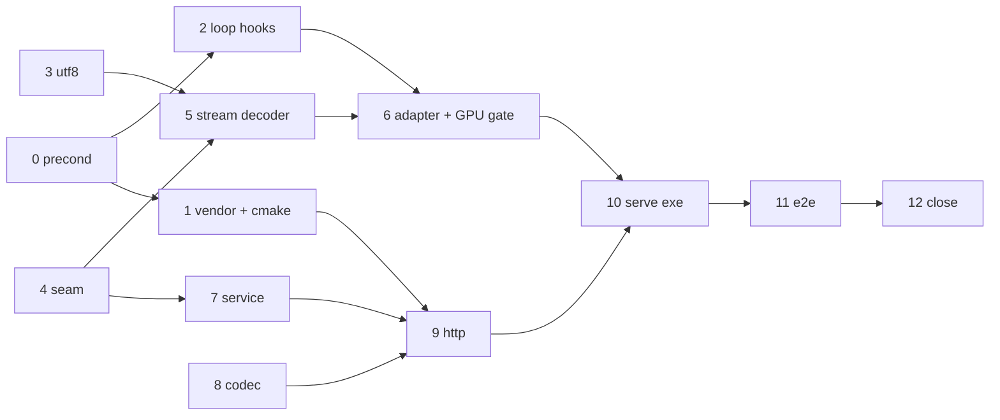

# Server Execution Plan

**Date:** 2026-10-04
**Status:** Open; nothing implemented
**Scope:** The G5 server: one conversation over HTTP, streamed out, queued when busy, cancellable, shipped as one native binary.
**Requirements:** [SERVER_REQUIREMENTS.md](../../specs-and-requirements/server/SERVER_REQUIREMENTS.md) (R1–R8). **Reference:** [SERVER_REFERENCE_ANALYSIS.md](../../analysis/current/SERVER_REFERENCE_ANALYSIS.md). **Depends on:** [PREFIX_REUSE_EXECUTION_PLAN.md](../completed/PREFIX_REUSE_EXECUTION_PLAN.md) Steps 1–5 and 9 (the token-level `V4Engine::generate`, the session record, and the exact-token history seam — all implemented).

The code is the authority; this plan was written against the tree of 2026-10-04 and names symbols, not line numbers.

---

## 1. What the code already gives us, and what it lacks

| Fact | Where | Consequence |
| :--- | :--- | :--- |
| `V4Engine::generate(prompt_ids, GenerationOptions, SamplerConfig, reuse_prefix, key)` is the token-level entry and `chat` is render + `generate` | `runtime/v4_engine.hpp` | The adapter calls `generate`; the engine's generation logic is not touched. |
| The loop returns only after the **whole** generation: no per-token callback, no cancel, no `Cancelled` stop | `infrastructure/text/text_generation.{hpp,cpp}` | Streaming (R2) and cancellation (R4) need a hook in the loop. Smallest change in the plan, and the only one that reaches the engine. |
| `V4Reply.text` is decoded once at the end; `Dsv4Tokenizer::decode` is byte-level BPE, so one token can end mid-UTF-8-sequence | `dsv4_tokenizer.cpp` | A streamed delta needs a UTF-8 holdback or it emits invalid JSON. |
| DSV4 thinking: the prompt ends in `<think>` (thinking) or `</think>` (chat); the reply carries a `</think>` token between reasoning and answer | `dsv4_prompt_encoder.cpp` | `reasoning_content` vs `content` is model knowledge → the G4 adapter splits it; G5 only sees two channels. |
| The encoder takes tools as `function_json` and re-serializes through `PromptJson::to_python_json` | `dsv4_prompt_encoder.cpp` | G5 must hand tools over as **raw JSON text**: `infrastructure/json.hpp` sorts object keys and would reorder a tool schema before the encoder sees it. |
| `hipSetDevice` is per-thread (`platform/device.hpp: select_compute_device`) | `platform/device.hpp` | The engine is built **and** driven on one thread. HTTP threads never touch it. |
| `generate` refuses `prompt.size() >= capacity` before mutating anything | `V4Engine::generate` | Overflow (R5) is already an up-front refusal; the adapter only has to name it. |
| No HTTP library is in the repo; `cpp-httplib` 0.54.1 (MIT, `httplib.h` + `httplib.cpp`, no OpenSSL/zlib unless defined) sits at `/home/marcolap/aeon-references/llama.cpp/vendor/cpp-httplib` (llama.cpp `9cf3bf2`) | references | Vendor it; it adds no second dependency stack (R7). |

**Working-tree note (2026-10-04):** prefix-reuse Steps 1–9 are implemented and their gates green; `V4Engine::advance` feeds the session record (`session_.feed(position, token_id)`). An earlier observation of a `/*mutant*/` in `advance` was a transient state of the prefix-reuse gate's mutation pass and is resolved.

## 2. Design findings that shape the plan

1. **Process shape.** The engine thread is the process's main thread; `cpp-httplib` runs on its own thread pool; the only thing crossing the two is a `ConversationService` (queue + per-job event stream). HTTP handlers block on a job's stream; the worker pushes events. Nothing in `server/` can name a HIP or model type.
2. **The "live conversation" is the engine's resident record, not a server object.** The server keeps no conversation id. Every request carries the full history (OpenAI shape); the engine's all-or-nothing prefix check decides reuse. A queued *different* conversation that runs in between replaces the record; the first one replays when it returns — correct (R3: nothing interleaved, nothing corrupted), just not free. Stated, not hidden.
3. **Cancellation is at token granularity after prefill, and at window granularity during it.** The loop's last sampled token is never fed (prefix-reuse finding 1), so a cancel between steps leaves record and state consistent by construction. A cancel *inside* one prefill window cannot be honoured; the worst case is one window.
4. **A queued request must detect its client leaving**, and a queued streaming request writes nothing — so it sends an SSE comment (`: queued position=N`) about once a second, which doubles as the disconnect probe. Non-streaming requests poll `Request::is_connection_closed`.
5. **Thread-pool starvation.** Each queued request holds one `cpp-httplib` thread. The pool is sized `max_queue + 8` so `/health`, `/status` and new requests (which get a defined 503) are never stuck behind the queue.
6. **Unsupported inputs are rejected, not ignored**, when ignoring changes the output (`stop`, `n > 1`, `logit_bias`, non-zero penalties, `logprobs`). Harmless ones (`user`, `metadata`, `model`) are ignored.
7. **Tool-call *responses* are out of this plan.** Requests may declare tools and carry tool results (prompt encoding exists); the model's own DSML tool-call block is returned verbatim in `content`. Parsing it into OpenAI `tool_calls` is named in Step 12 as deferred.

## 3. Decisions fixed by this plan

- **Group placement** ([AGENTS.md](../../../AGENTS.md) §3 rule 6):
  - neutral seam types and the UTF-8 holdback → **G1** (`src/infrastructure/session/`, `src/infrastructure/text/`);
  - stream decoder (thinking split) and the engine adapter → **G4** (`src/architecture/deepseek_v4/text/`, `.../runtime/`);
  - queue, codec, HTTP → **G5**, new top-level `server/`, which may include only `infrastructure/session/**`, `infrastructure/text/text_generation.hpp`, `infrastructure/json.hpp`, and `third_party/`.
- **Composition root is `tools/aeon_serve.cpp`**, a thin `main` like `aeon_chat`, because wiring the engine necessarily names `V4Engine` and `server/` must not. It is the only place the two meet.
- **Single seam, one definition of "conversation"**: `session::ConversationEngine` (Step 4). The CLI and tests can use it too.
- **Defaults:** bind `127.0.0.1` (no auth is in scope, so no network exposure by default); queue cap 16 → overflow is a defined `503` + `Retry-After` (a bound is robustness, R5; it is not a refusal policy for R3); request body cap is a fixed 8 MiB constant, not a flag (a valid prompt is bounded by the context, so a larger body is never legitimate).
- **Endpoints:** `POST /v1/chat/completions` (stream and non-stream), `GET /v1/models`, `GET /health`, `GET /status` (R6).
- **Out:** auth, TLS, multi-model, embeddings, completions endpoint, stop strings, response-side tool-call parsing, session storage.

---

## 4. Steps

Each step is one commit and runs only its listed gates ([AGENTS.md](../../../AGENTS.md) §3 process rule 8). Host-only tests (no GPU) are marked **[host]**; they link no `amdhip64`, which is itself the build-level proof of R8 for G5.

### Step 0 — Preconditions and docs

- Prefix-reuse Steps 1–5 and 9 are already green; nothing here needs to touch the engine's generation logic. Gate: `test_prefix_record`, `test_v4_prefix_reuse` (its mutation pass must still fail the mutants).
- [SERVER_REQUIREMENTS.md](../../specs-and-requirements/server/SERVER_REQUIREMENTS.md) R3: add one sentence — the live conversation is the engine's resident session; a different conversation served in between makes the first one replay.
- [PROJECT_STATUS.md](../../status/PROJECT_STATUS.md) §3 Server row: "execution plan not written" → link this plan.

### Step 1 — Vendor the HTTP library and add the server build skeleton

- **Create** `third_party/cpp-httplib/{httplib.h,httplib.cpp,LICENSE}` copied from the reference checkout, plus `third_party/cpp-httplib/VERSION.md` (one line: version `0.54.1`, source llama.cpp `9cf3bf2`).
- **Create** `cmake/AeonServer.cmake`; add `include(AeonServer)` after `include(AeonInfrastructure)` in [CMakeLists.txt](../../../CMakeLists.txt); add `option(AEON_BUILD_SERVER "Build the server." ON)` to [cmake/AeonOptions.cmake](../../../cmake/AeonOptions.cmake).
- In `AeonServer.cmake` (guarded by `AEON_BUILD_SERVER`):
  - `add_library(aeon_httplib STATIC third_party/cpp-httplib/httplib.cpp)`; `target_compile_options(... PRIVATE -w)`; `target_compile_definitions(... PRIVATE CPPHTTPLIB_TCP_NODELAY=1)` (without it SSE chunks wait on Nagle); `target_link_libraries(... PRIVATE Threads::Threads)`; include dir `third_party/cpp-httplib` as `PUBLIC`.
  - helper `aeon_add_host_test(<name> SOURCES … [TIMEOUT s])` = `add_executable` + `add_test` + `WORKING_DIRECTORY ${CMAKE_SOURCE_DIR}`, linking **not** `amdhip64`.
- **Gate:** `cmake --build build --target aeon_httplib` and a clean full configure; no `find_package(OpenSSL|ZLIB)` anywhere.

### Step 2 — Streaming and cancellation hooks in the loop (G1)

Edit [src/infrastructure/text/text_generation.hpp](../../../src/infrastructure/text/text_generation.hpp) / `.cpp`:
- `StopReason::Cancelled` (add to `stop_reason_name` → `"cancelled"`; no other switch over `StopReason` exists — checked).
- `GenerationOptions`: `std::function<void(uint32_t)> on_token;` (called for **every** sampled token, EOS included, right after it is appended) and `std::function<bool()> cancelled;` (polled before each decode step and once after the first token).
- `struct GenerationCancelled {};` (thrown by a prefill step that honours `cancelled` between windows; Step 6 uses it).
- Loop: after the prefill token and after each decode token call `on_token`; at the top of each decode iteration, `if (cancelled && cancelled()) → result.stop_reason = Cancelled; return`. EOS is checked before cancellation so a finished generation is never reported cancelled. Comment (one line): the last sampled token is deliberately unfed, which keeps a cancelled state reusable.
- Both hooks default empty → every existing caller and the per-token overload are unchanged.

**Gate:** extend `tests/test_text_generation.cpp`: `on_token` sees ids in order including EOS; cancel after the first token stops with `Cancelled` and exactly one id; cancel set only after EOS still reports `Eos`; empty hooks reproduce the old results. Mutations (drop the poll, poll after the step, skip `on_token` for the first token) must fail. Also run `test_v4_engine` once (compile + behaviour unchanged).

### Step 3 — UTF-8 holdback (G1, pure)

**Create** `src/infrastructure/text/utf8_chunker.hpp` (header-only):

```cpp
class Utf8Chunker {
public:
    std::string push(std::string_view bytes);  // longest prefix of complete code points; an incomplete tail (<=3 bytes) is held
    std::string flush();                       // the held tail; incomplete bytes become U+FFFD
};
```

Invalid bytes (stray continuation, overlong, surrogate, > U+10FFFF) are emitted as U+FFFD at the point they are recognised, so everything returned is valid UTF-8 and therefore valid inside a JSON string.

**Gate [host]:** `tests/test_utf8_chunker.cpp` registered next to `test_text_generation`: a 1/2/3/4-byte character split at every byte boundary across pushes; emoji split in 4 pushes; lone continuation; truncated tail at `flush`; invalid lead; concatenation of all outputs equals the input for valid input at every split; every output is valid UTF-8. Mutations (emit the tail early, drop `flush`, accept overlong) must fail.

### Step 4 — The neutral conversation seam (G1)

**Create** `src/infrastructure/session/conversation.hpp` (header-only, std only, includes `text_generation.hpp` and `prefix_record.hpp` for `StopReason` / `ReuseVerdict`):

```cpp
namespace aeon::session {
enum class Role { System, Developer, User, Assistant, Tool };
struct ToolCall { std::string id, name, arguments_json; };
struct Message {
    Role role{Role::User};
    std::string content, reasoning_content, tool_call_id;
    std::vector<ToolCall> tool_calls;
};
struct Sampling { std::optional<float> temperature, top_p; std::optional<uint64_t> seed; };  // unset = the artifact's own
struct ConversationRequest {
    std::vector<Message> messages;
    std::string tools_json;            // raw JSON array exactly as sent; "" = none
    std::string response_format_json;  // raw; "" = none
    bool thinking{false};
    std::string reasoning_effort;      // "" = engine default
    std::optional<uint32_t> max_new_tokens;  // unset = until EOS or context
    Sampling sampling;
};
enum class Channel { Content, Reasoning };
struct TextDelta { Channel channel; std::string text; };
using DeltaSink = std::function<void(const TextDelta&)>;
struct ConversationResult {
    text::StopReason stop{text::StopReason::Error};
    uint32_t prompt_tokens{0}, completion_tokens{0}, reused_tokens{0}, prefilled_tokens{0};
    ReuseVerdict verdict{ReuseVerdict::Cold};
    double ttft_ms{0}, decode_tokens_per_second{0};
};
enum class ErrorKind { InvalidRequest, ContextOverflow, Internal };
struct ConversationError : std::runtime_error { ErrorKind kind; /* ctor(kind, msg) */ };
struct ConversationInfo {
    std::string model_id;
    uint32_t context_capacity{0}, resident_tokens{0};
    bool invariants_ok{true};  // registry invariants hold, no leaked expert leases or staging slots
};
class ConversationEngine {
public:
    virtual ~ConversationEngine() = default;
    virtual ConversationInfo info() const = 0;
    virtual ConversationResult run(const ConversationRequest&, const DeltaSink&,
                                   const std::function<bool()>& cancelled) = 0;  // throws ConversationError
    virtual void reset() noexcept = 0;  // forget the resident session after a failure
};
}
```

No test of its own; Steps 5–9 exercise it. Add a `session::verdict_name(ReuseVerdict)` only if `prefix_record.hpp` does not already export one.

### Step 5 — DSV4 stream decoder (G4, CPU)

**Create** `src/architecture/deepseek_v4/text/dsv4_stream_decoder.hpp`:

```cpp
class Dsv4StreamDecoder {
public:
    Dsv4StreamDecoder(const Dsv4Tokenizer&, bool thinking);  // thinking → starts in Reasoning
    void push(uint32_t token_id, std::vector<session::TextDelta>& out);
    void finish(std::vector<session::TextDelta>& out);       // flush the UTF-8 holdback
};
```

Per token: EOS → ignored; `thinking_end_token_id()` → switch Reasoning→Content, emit nothing; otherwise `tokenizer.decode({id})` (special tokens kept) → one `Utf8Chunker` **per channel**, flushed on a channel switch. Empty results emit no delta.

**Gate [host]:** `tests/test_dsv4_stream_decoder.cpp` (needs the real `tokenizer.aeon`; register with the same sources as `test_dsv4_tokenizer`). Oracle is the batch path: for fixed token sequences (ASCII, CJK, emoji split across byte-level tokens, a `</think>` in the middle, trailing EOS, no EOS, thinking off) require `concat(Reasoning) + marker + concat(Content)` == `tokenizer.decode(ids)` minus EOS, and `concat(Content)` == `V4Engine::strip_thinking(...)`; repeat with the sequence cut into every possible push order — pushes are per-token so cut the **ids** at random points. Mutations (emit the marker, drop `finish`, one shared chunker) must fail.

### Step 6 — The DSV4 conversation adapter (G4) and engine cancel point

**Create** `src/architecture/deepseek_v4/runtime/v4_conversation.hpp` — `class V4Conversation : public session::ConversationEngine`, holding `V4Engine&` and the model id string.

`run(request, sink, cancelled)`:
1. **Map** `Message` → `text::Dsv4PromptMessage` (`Tool` role keeps `tool_call_id`; assistant `tool_calls` → `Dsv4ToolCall`; `reasoning_content` carried). **Tools:** `PromptJson::parse(tools_json)`; for each array element take its `function` member → `to_python_json()` → `Dsv4ToolDefinition::function_json`; carry them on a **new empty leading System message** (what vLLM's DSV4 `apply_chat_template` does, even when the client also sent a system message). `response_format_json` goes on the same message. Check against the tool fixtures of `test_dsv4_prompt_encoding_oracle` and the artifact's own `encoding_dsv4.py`; if they disagree, the artifact wins.
   **Exact-token history (prefix-reuse Step 9).** A live conversation must not round-trip the model's replies through text: re-encoding a decoded reply is not the generated ids, so the token prefix breaks at the reply boundary and reuse replays. `V4Conversation` therefore keeps, per turn it produced, the assistant body ids (the `on_token` stream minus the trailing EOS) and sets `Dsv4PromptMessage::preencoded_ids` on those assistant messages when mapping the next request. Chat mode and thinking mode with `drop_thinking = false`; a tool-call body is carried whole in the ids. When the ids are unavailable (a re-sent history from a prior process), the message is left unset and the turn replays — correct, just not reused.
2. **Options:** `thinking` → `Dsv4ThinkingMode`; `reasoning_effort` non-empty → `Dsv4PromptOptions::reasoning_effort` (validate `low|high|max`, else `ConversationError{InvalidRequest}`); `drop_thinking = false` for a reuse session (a stripped/rewritten earlier body would conflict with a verbatim id body) — the choice owned by prefix-reuse Step 9 lives here as one constant.
3. **Encode** with `encoder().encode_tokens`; `if (prompt.size() >= host().context_capacity())` → `ConversationError{ContextOverflow, "N tokens, context M"}` **before** any engine call.
4. **Sampling:** start from `policy().to_sampler_config(seed)` (the artifact's own `generation_config.json` unless the request overrides a field); **validate** `temperature` finite and ≥ 0, `top_p` in (0, 1] here (the engine's `set_config` would throw after the state was already reset). `max_new_tokens = min(requested or capacity, capacity - prompt.size())` — the model ships no generation cap, so an absent `max_tokens` means "until EOS or the context ends".
5. **Generate:** `engine.generate(prompt, opts, sampling, /*reuse_prefix=*/true, dsv4_computation_key(messages, options))`, with `opts.on_token = [&](id){ decoder.push(id, deltas); for (d : deltas) sink(d); deltas.clear(); }` and `opts.cancelled = cancelled`; `decoder.finish` after the loop. `prompt` is built by `encoder().encode_tokens(messages, options)` with prior assistant turns carrying `preencoded_ids` (point 1), so the prefix is the exact token sequence the session was fed and reuse holds. Record the reply's body ids (`reply.token_ids` minus a trailing EOS) for the next request.
6. **Failure:** any `std::exception` other than `ConversationError` → `engine.end_session()` then throw `ConversationError{Internal}`. The next request resets the device state (`start == 0` path), so the engine stays coherent.
7. **Result:** map `V4Reply` → `ConversationResult`; `info()` returns capacity, `resident_tokens`, and `invariants_ok` = the three checks `aeon_chat::print_invariants` prints (`registry().invariants_hold()`, `outstanding_expert_leases() == 0`, `staging_in_use_slots() == 0`). `reset()` = `end_session()`.

Small edits in [v4_engine.hpp](../../../src/architecture/deepseek_v4/runtime/v4_engine.hpp):
- `uint32_t resident_tokens() const noexcept { return session_.size(); }`.
- **Prefill cancel point:** in the window loop, before each `forward_window`, `if (generation.cancelled && generation.cancelled()) throw text::GenerationCancelled{};` placed so the existing `catch (...) { session_.clear(); throw; }` does **not** clear it (add `catch (const text::GenerationCancelled&) { throw; }` ahead of it — windows already fed stay recorded and the state matches). `generate` catches `GenerationCancelled` around `generate_token_ids` and returns a reply with `stop_reason = Cancelled`, empty `token_ids`, counters as planned.

**Gate (GPU):** `tests/test_v4_conversation.cpp`, registered like `test_v4_prefix_reuse` (same sources, `TIMEOUT 1800`), context 256, greedy:

| Section | Statement |
| :--- | :--- |
| A — stream equals batch | concat of deltas == `chat()` text (chat mode: `Content` only; thinking mode: `Reasoning` + `Content` split at the marker), including a prompt that makes multi-byte output |
| B — cancel mid-decode | cancel after k tokens → `Cancelled`, exactly k tokens delivered; the **next** request on the same conversation reports `Reused` and its ids equal a cold run |
| C — cancel in prefill | with a window smaller than the prompt, cancel before window 2 → `Cancelled`, no tokens; re-sending the same prompt prefills only the remainder and equals a cold run |
| D — errors | overflow → `ContextOverflow` and the session still `Reused` afterwards; bad `reasoning_effort`/`top_p`/`temperature` → `InvalidRequest` with no state change; an injected engine failure → `Internal`, then the next request equals a cold run |
| E — hygiene | `info().invariants_ok` after every turn, including the cancelled ones |

Mutations that must fail: forward EOS as text, skip `decoder.finish`, clear the record on cancel (B's `Reused` assertion), validate sampling after the generate call.

### Step 7 — The service: queue, worker, events (G5, host)

**Create** `server/conversation_service.{hpp,cpp}` and `server/job_stream.hpp`.

- `JobStream`: mutex + condvar deque of events `{Delta, Finished{result}, Failed{kind,msg}}`; `pop(timeout)`, `push`, `close`.
- `struct Job { uint64_t id; session::ConversationRequest request; std::shared_ptr<JobStream> stream; std::atomic<bool> cancel; steady_clock enqueued; }`.
- `ConversationService`:
  - `submit(request)` → `shared_ptr<Job>`; throws `QueueFull` (cap `max_queue`) or `NotReady` (state `Loading`/`Stopping`).
  - `cancel(job)`; `position(job)` (0 = live, n = n-th waiting).
  - `run_worker(session::ConversationEngine&)`: marks `Ready` (publishing `info()`), then loops FIFO: pop; if `job->cancel` already set → `Finished{Cancelled}` without touching the engine; else `engine.run(request, sink → push Delta, [&]{ return job->cancel.load(); })`. `ConversationError`/`std::exception` → `Failed` + `engine.reset()`. After every job: publish `info()` and `last` (result + queue-wait + total ms). Exactly one terminal event per job.
  - `shutdown()`: refuse new work, cancel the live job, fail queued ones with `Cancelled`, unblock `run_worker`.
  - `snapshot()` → `{state, queue_depth, live{job id, phase queued|prefilling|decoding, tokens_so_far, elapsed_ms}?, info, last?}` — a copy under a mutex, readable from any thread without waiting on the engine.

**Gate [host]:** `tests/test_server_service.cpp` with a fake `ConversationEngine` (scripted deltas, a latch, a re-entrancy counter, a recorded `reset()` count): never more than one `run` at once; FIFO order; a second job queues and is served, not refused; `QueueFull` at the cap; a cancelled queued job never reaches the engine; cancelling the live job sets the flag the fake sees and the next job runs clean; a throwing engine → `Failed` + `reset()` + next job fine; `shutdown()` with a live and queued jobs terminates every stream; `snapshot()` is callable while the fake is blocked. Mutations (run two at once, drop `reset()`, skip the cancelled-before-start check, a second terminal event) must fail. Optional one-off: build this test with `-fsanitize=thread`.

### Step 8 — The OpenAI codec (G5, host)

**Create** `server/json_span.hpp`, `server/json_write.hpp`, `server/openai_codec.{hpp,cpp}`.

- `json_span.hpp`: `std::optional<std::string_view> raw_member(std::string_view body, std::string_view key)` — top-level object only; scans strings and escapes and tracks `{[`/`]}` depth, so a nested `"tools"` or a brace inside a string never matches; returns the exact source text (the order-preserving path for `tools` and `response_format`).
- `json_write.hpp`: `json_escape` (`"`, `\`, control chars → `\u00XX`; valid UTF-8 passes through) and tiny object/array builders. Responses are written, not built from `JsonValue`.
- `parse_chat_request(body) → ParsedRequest{ConversationRequest, bool stream, bool include_usage}` or `CodecError{http_status, code, message}`; everything else uses `infrastructure/json.hpp`.

| Field | Rule |
| :--- | :--- |
| `messages` | required, non-empty; roles `system|developer|user|assistant|tool`, else 400 |
| `content` | string, `null` (assistant with `tool_calls`), or array of `{type:"text",text}` parts (concatenated); any other part type → 400 |
| assistant | `reasoning_content`, `tool_calls[].{id, function.{name, arguments}}` (arguments is already a JSON string) |
| `tool` | `tool_call_id` required |
| `tools`, `response_format` | raw spans, passed through |
| thinking on/off | `chat_template_kwargs.thinking` or `chat_template_kwargs.enable_thinking` (bool) — the spellings vLLM's DSV4 tokenizer reads. DeepSeek's own API field `thinking: {"type":"enabled"}` is also accepted, but it is **not** in the local references; drop it if it cannot be confirmed. **Default when absent: off** (chat), unlike vLLM, which defaults to on |
| `reasoning_effort` | `low|high|max`; also vLLM's mapping: `none` → thinking off, `minimal|medium` → `low` |
| `max_tokens` / `max_completion_tokens` | positive integer; absent = no cap besides EOS and the context |
| `temperature`, `top_p`, `seed` | pass through to `Sampling` (engine adapter validates). **Absent `seed` → the codec draws a fresh one per request** (a fixed default would make two identical sampled requests return identical replies); the seed used is echoed in `timings` |
| `stream`, `stream_options.include_usage` | bool |
| `n` | must be 1 |
| `stop`, `logit_bias`, `logprobs`, non-zero penalties | 400 `unsupported_parameter`; `null`/empty/zero accepted |
| `model`, `user`, `metadata`, others | ignored |

Writers: `chat.completion.chunk` (role delta first, then `content` / `reasoning_content` deltas, final chunk with `finish_reason`, optional `usage`), `chat.completion`, and the OpenAI error object. `finish_reason`: `Eos → "stop"`, `MaxNewTokens|ContextLimit → "length"`, `Cancelled → null`. A non-standard `timings` object carries `ttft_ms`, `decode_tokens_per_second`, `reused_tokens`, `prefilled_tokens`, `reuse_verdict`.

**Gate [host]:** `tests/test_server_codec.cpp`: a table of valid/invalid bodies → expected request or `{status, code}` (every row above, plus malformed JSON, wrong types, empty messages, a `tools` schema with nested `"tools"` keys, braces and escaped quotes inside strings, non-ASCII keys, a body that is not an object); every writer's output re-parses with `infrastructure/json.hpp` and round-trips control characters and multi-byte text; key order of the `tools` span is preserved byte-for-byte. Mutations (use `JsonValue` for `tools`, ignore depth, skip escaping) must fail.

### Step 9 — The HTTP layer (G5, host)

**Create** `server/http_server.{hpp,cpp}`: `HttpServer(ConversationService&, HttpOptions{host, port, max_queue})`; `start()` binds (`bind_to_any_port` when port 0) and listens on its own thread; `port()`; `stop()`. Server setup: `set_payload_max_length`, read/write timeouts, `new_task_queue` returning a pool of `max_queue + 8` threads, `set_exception_handler` and `set_error_handler` producing the JSON error object — no path may let an exception escape or answer with a non-JSON body (R5).

Routes:
- **`POST /v1/chat/completions`** — parse (`CodecError` → its status) → `submit` (`QueueFull`/`NotReady` → `503` + `Retry-After: 5`).
  - *stream:* `Content-Type: text/event-stream`, `Cache-Control: no-cache`, `X-Accel-Buffering: no`, `set_chunked_content_provider`. The provider loops `stream->pop(100 ms)`: `Delta` → one `data:` chunk (the role chunk first); `Finished` → final chunk, optional usage chunk, `data: [DONE]`, `sink.done()`; `Failed` → one `data: {"error":…}` event, `sink.done()`; no event and still queued → at most once per second write `: queued position=N`. Any failed `sink.write` or `!sink.is_writable()` → `service.cancel(job)` and return `false`; `on_complete(false)` also cancels.
  - *non-stream:* wait on the stream polling `req.is_connection_closed()` every 100 ms (closed → cancel); on `Finished` return one `chat.completion`; on `Failed` map `InvalidRequest → 400`, `ContextOverflow → 400` with code `context_length_exceeded`, `Internal → 500`.
- **`GET /health`** → `200 {"status":"ok"}` when `Ready`, else `503 {"status":"loading"}`.
- **`GET /v1/models`** → one entry (the model id).
- **`GET /status`** (R6) → `snapshot()` as JSON: `state`, `queue_depth`, `live` (phase, tokens so far, elapsed), `conversation` (`resident_tokens`, `context_capacity`, `invariants_ok`), `last` (stop, token counts, `reused_tokens`, `prefilled_tokens`, verdict, `ttft_ms`, decode tok/s, queue-wait ms, total ms).

**Gate [host]:** `tests/test_server_http.cpp` on loopback (`port 0`), `httplib::Client`, fake engine:

| Case | Statement |
| :--- | :--- |
| R2 | The fake emits delta 1, then **blocks on a latch** released only when the client's content receiver sees chunk 1; a server that buffers deadlocks and fails (ordering, no wall-clock assertion). Streamed deltas concatenate to the full text; the stream ends with `[DONE]`. |
| R1/R8 | Non-stream response equals the concatenated deltas; `reasoning_content` and `content` land in the right fields; the request the fake received matches the posted body (messages, raw `tools` bytes). |
| R3 | A second request sent while the first is blocked returns no body until the first finishes; the stream receives `: queued position=1`; then it is served; the fake never ran two at once. |
| R4 | Closing the client socket mid-stream sets the fake's cancel flag; the next request is served normally. Same for a disconnect while still queued: it never reaches the engine. |
| R5 | Malformed JSON, wrong types, oversize body, unknown route, wrong method, overflow (fake throws `ContextOverflow`), engine failure → defined JSON errors with the right statuses; the server answers the next request; queue-full → 503 + `Retry-After`; mid-stream failure ends with an error event, not a hang. |
| R6 | `/health` is 503 until `run_worker` publishes `Ready`; `/status` answers while the fake is blocked inside `run`. |

Mutations (buffer until done, drop cancel-on-write-failure, skip queue keep-alive, let the exception handler rethrow) must fail.

### Step 10 — Shared CLI flags, then the composition root

**10a — behaviour-preserving extraction (optional; `aeon_chat` stays).** `aeon_chat` remains the developer harness with every flag and output it has today. The only change is that the engine-setup flags the server exposes (`--model-dir`, `--context-size`, `--warm-gib`, `--staging-blocks`, `--no-warm-preload`, `--prefill-window`, `--prefill-chunk`, `--prefill-sweep-min-tokens`, `--verbose`) are parsed by a shared header instead of by code inside `aeon_chat`, so `aeon_serve` does not carry a second copy of them. The development-only flags (`--max-hot-slots`, `--demotion-queue`, `--no-warm-refill`, `--validate-registry`, `--supply-telemetry`, `--run-id`, `--dump-logits`, `--profile-routing`, `--phase-profile`, `--diagnostic`, `--tokenizer`, `--deterministic-experts`, and the prompt/sampling flags) stay in `aeon_chat` only; `aeon_serve` rejects them as unknown options. Skip this step and copy the parsing into `aeon_serve` if you would rather not touch `aeon_chat` at all. The engine-related option struct, parsing and `V4EngineOptions` construction go from [tools/aeon_chat.cpp](../../../tools/aeon_chat.cpp) into **`tools/engine_cli.hpp`** (`EngineCli{ model_dir, context_size, warm_gib, preload_warm, prefill_window, prefill_chunk, prefill_sweep_min_tokens, staging_blocks, verbose }`, `bool parse_engine_flag(argc, argv, index)`, `print_engine_usage()`, `V4EngineOptions to_engine_options() const`). `aeon_chat` parses its dev-only flags itself and calls the shared parser for the rest. No other edit.
**Gate:** `aeon_chat --help` output identical to before (diff), and one short `aeon_chat --greedy --prompt "What is 2+2?" --max-new-tokens 8` run.

**10b — `aeon_serve`.** **Create** `tools/aeon_serve.cpp` (thin) and register in `AeonServer.cmake` with `aeon_add_executable(aeon_serve SOURCES tools/aeon_serve.cpp server/*.cpp <same text sources as aeon_chat>)` linking `aeon_httplib`.
- Flags: the shared engine flags + `--host` (default `127.0.0.1`), `--port` (default `8080`), `--max-queue` (16), `--model-name`, `--help`. `--warm-gib` defaults to 0 as in `aeon_chat`. Sampling, thinking, system prompt and token cap are per-request fields, never startup flags.
- Flow, on the **main thread**: parse → `select_compute_device` → start `HttpServer` (so `/health` answers `loading` during the multi-second load) → `V4Engine::initialize` → `V4Conversation` → `service.run_worker(conversation)` (blocks). `SIGINT`/`SIGTERM` set a flag a small watcher thread turns into `service.shutdown()` + `http.stop()`; `main` returns 0 after a clean drain. A load failure prints the error, stops HTTP and exits non-zero.
- Print one startup line: bound address, model id, context capacity, queue cap.
- **Install (R7):** `install(TARGETS aeon_serve aeon_chat aeon_info RUNTIME DESTINATION bin)` in `AeonServer.cmake`.
- **Layering gate:** `scripts/check_server_layering.sh` — greps `server/**` for any `#include` outside the allowed list of §3 and for `hip|amdhip`; registered with `add_test` so a violation fails `ctest -R server`.

**Gate:** build; `aeon_serve --help`; `check_server_layering.sh` passes and is shown to fail when a forbidden include is injected; `test_server_*` and the new GPU test still green.

### Step 11 — Real-model end to end

**Create** `scripts/server_smoke.sh` (model on `scripts/prefill_ab.sh`), `curl` only, against the real checkpoint at the real context (≥ 4096), `--no-warm-preload` unless stated:
1. `/health` is `503` then `200`.
2. Non-stream and stream request for the same prompt (greedy) → identical text; time to first chunk vs total printed.
3. Two concurrent requests: the second streams `: queued`, is served after the first; `/status` shows `queue_depth` and `live` mid-run.
4. Kill `curl` mid-stream → `/status` returns to idle within a token or two; the next request works.
5. A 3-turn conversation re-sent in full each turn → `/status.last.reuse_verdict` and `reused_tokens` per turn (the wire view of prefix-reuse Step 9's exact-token history); every continuation turn reports `reused`.
6. Overflow body → `400 context_length_exceeded`; malformed JSON → `400`; `/status.conversation.invariants_ok == true` after all of it.
7. `SIGINT` → clean exit code 0.

### Step 12 — Close out

- **Ledger:** one entry in [PERFORMANCE_LEDGER.md](../../status/PERFORMANCE_LEDGER.md): server TTFT vs `aeon_chat` for the same prompt (the HTTP overhead), decode tok/s over SSE vs CLI, cancel latency in tokens, per-turn verdicts from Step 11.5.
- **PROJECT_STATUS.md:** move the Server row to Past (fuse per its §5).
- **[CODEBASE_MAP.md](../../status/CODEBASE_MAP.md):** add `server/`, `third_party/`, `tools/aeon_serve.cpp`, `tools/engine_cli.hpp` and the new G1/G4 files.
- **Move this plan** to `plans-and-docs/execution/completed/`.
- Record as deferred in the requirements §6: response-side DSML → `tool_calls` parsing, stop strings, a second transport/auth.

---

## 5. Order and dependencies



Steps 1, 2, 3 and 4 are independent. Steps 7–9 need no GPU and no model; Steps 6 and 11 are the only ones that do. Nothing before Step 10 changes `aeon_chat`'s behaviour.

## 6. Files touched

| Action | File | Group |
| :--- | :--- | :--- |
| create | `third_party/cpp-httplib/**` | vendor |
| create | `cmake/AeonServer.cmake`; edit `CMakeLists.txt`, `cmake/AeonOptions.cmake` | build |
| edit | `src/infrastructure/text/text_generation.{hpp,cpp}` | G1 |
| create | `src/infrastructure/text/utf8_chunker.hpp` | G1 |
| create | `src/infrastructure/session/conversation.hpp` | G1 |
| create | `src/architecture/deepseek_v4/text/dsv4_stream_decoder.hpp` | G4 |
| create | `src/architecture/deepseek_v4/runtime/v4_conversation.hpp` | G4 |
| edit | `src/architecture/deepseek_v4/runtime/v4_engine.hpp` (`advance` feed, `resident_tokens`, prefill cancel point) | G4 |
| create | `server/{job_stream.hpp, conversation_service.*, json_span.hpp, json_write.hpp, openai_codec.*, http_server.*}` | G5 |
| create | `tools/aeon_serve.cpp`, `tools/engine_cli.hpp`; edit `tools/aeon_chat.cpp` | composition |
| create | `tests/test_{utf8_chunker, dsv4_stream_decoder, v4_conversation, server_service, server_codec, server_http}.cpp`; edit `tests/test_text_generation.cpp` | tests |
| create | `scripts/server_smoke.sh`, `scripts/check_server_layering.sh` | scripts |
| edit | requirements, `PROJECT_STATUS.md`, `PERFORMANCE_LEDGER.md`, `CODEBASE_MAP.md` | docs |

**Not touched:** `V4Graph`, `V4Layer`, kernels, the expert tiers, `Dsv4Tokenizer`, the prompt encoder, the memory budget, `prefix_record.hpp`.

## 7. Risks

| Risk | Mitigation |
| :--- | :--- |
| A second HTTP thread reaches the engine (HIP device is per-thread) | one engine thread; `server/` cannot name an engine type (layering gate) and its tests link no HIP |
| A buffering regression silently kills streaming | Step 9 latch test: deadlocks if the server buffers |
| Queued clients that vanish pin the queue | keep-alive probe + `is_connection_closed` poll; cancelled-before-start jobs skip the engine |
| Pool exhaustion makes `/health` unreachable under load | pool = `max_queue + 8`; overflow is a defined 503 |
| Invalid UTF-8 from a split token breaks JSON/SSE for the client | holdback per channel, flush on switch and at the end; Step 3 and 5 gates |
| Tool schema bytes change before the encoder sees them | raw span passthrough; Step 8 byte-for-byte test |
| Thinking-mode replies defeat reuse over the wire | fixed by prefix-reuse Step 9 (implemented): the adapter sets `preencoded_ids` from the ids it generated, and `drop_thinking = false` for a reuse session; Step 11.5 measures the wire verdicts |
| Cancel during one long prefill window is not instant | stated limit (one window); Step 6 section C pins the window-boundary behaviour |
| A HIP failure mid-request leaves the device undefined | Step 6 section D covers recoverable exceptions; an unrecoverable HIP error is process-fatal by `hip_check` and surfaces as a non-zero exit, not a corrupt answer |

## 8. Decisions

Low stakes, taken as written: composition root in `tools/aeon_serve.cpp`; queue cap 16 with a defined 503 beyond it; the thinking-mode field spellings (Step 8 table).

Worth a deliberate answer:

1. **Tool calls.** The engine can *send* tools to the model (the prompt encoder renders tool definitions, earlier tool calls and tool results, and is checked against the artifact's golden vectors). Nothing reads the model's *answer* back into structured form: when the model wants a tool it writes a `<｜DSML｜tool_calls>` text block, and today that is just text. This plan returns that block verbatim in `content`. Plain chat works; an agent client that waits for an OpenAI `tool_calls` field will not see one. Parsing the block is a separate follow-up, harder when streaming. Decide whether agent clients are needed for the first release.
2. **Thinking default and history.** Two separate things. *(a)* Per request: if the client does not ask for thinking, the server answers in chat mode (unlike vLLM, which defaults to thinking on). *(b)* Whether earlier turns' reasoning stays in the history is the encoder's `drop_thinking` option: the model's own encoder defaults to dropping it, except when tools are declared. Dropping rewrites the previous turn's tail, which conflicts with a verbatim id body, so a reuse session runs with `drop_thinking = false`. The adapter owns this one constant plus the exact-token history of point 1 (prefix-reuse Step 9); the engine's reuse then holds.
