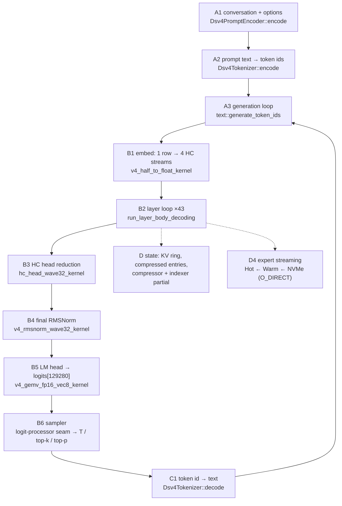
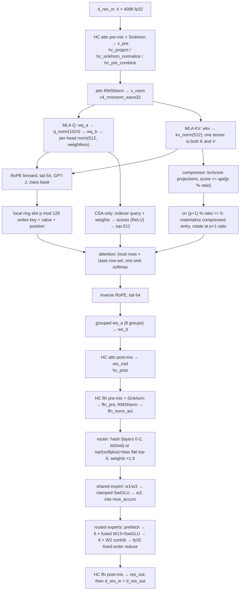

# DSV4 Graph Composition Plan — one ordered path from text to text

**Status:** 2026-09-17, branch `rewrite/graph-v2`.
**Subject:** the **composition** of DeepSeek-V4-Flash-0731 into one ordered graph — text in,
text out — with every step mapped to the component that implements it and a definitive list of
what does not exist yet.
**Caveat:** this is not a new plan. It is the plan that *consumes* Tiers 0–4 and item 23's first
seam. It re-derives nothing and re-certifies nothing; where a step's correctness is already
established it says so and points at the gate.

> Evidence convention: paths are `src/`-relative and line numbers are from the working tree at the
> revision above. Where a claim is about behaviour rather than a symbol, the source line is cited.
> Where a step is *certified*, the pointer is to the [DSV4 inference pipeline plan](DSV4_INFERENCE_PIPELINE_PLAN.md),
> which owns the gate result. Nothing here is derived from memory.

---

## 1. Acceptance criterion

The graph is **built** when one command takes a conversation and returns text, and each of the
following holds — measured, not asserted:

1. **Coherent output.** A multi-turn prompt produces a reply that is a reply to *that* prompt.
2. **Mathematically correct microsteps.** Every step of §2 is either already certified against an
   independently written fp64 oracle (Tier 1 / Tier 2 / Step 3) or is certified in this plan's
   phases against one. No step is admitted on plausibility.
3. **The engine is the engine.** The routed experts are delivered through Hot VRAM ← Warm DDR ←
   NVMe (`O_DIRECT`, 4 KiB aligned), with the cold read overlapped by the shared-expert pass —
   not from an mmap pointer that happens to be resident.
4. **No duplication.** One layer body, one accumulation, one assembly. Two implementations of any
   step is a defect in the composition, not a convenience.
5. **Nothing runs that is not necessary.** No op is added because it was easy; each is required by
   the model's own architecture (the plan's Part II is the authority on which).

**Not** part of the criterion: throughput, batching, prefix reuse, tool use, MTP. Those are §9.

> **Status at P4 (2026-09-17).** Clause 1 is met and measured: `aeon_chat` in the **default** build
> takes `What is the capital of France?` and returns `The capital of France is **Paris**.`, EOS-reached,
> through the rebuilt graph on the artifact's real weights. Clauses 2–5 are what the Tier 1–3 gates and
> P1–P4 measure between them. Clause 1's *second* half — "a reply that is a reply to *that* prompt" — is
> the part no gate may assert, so `tests/test_v4_engine.cpp` prints the text rather than judging it and
> asserts the machine-checkable stand-in (the history changes the model's own distribution; §7 P4).
> Throughput is not claimed and is not part of the criterion.

### 1.1 What is already known about reaching text

The **shell** has already produced coherent text once — through the *pre-rewrite* graph:
`What is the capital of France?` → `The capital of France is **Paris**.`, EOS-reached, 43 layers, on
silicon `[V execution/completed/TEXT_IN_TEXT_OUT_IMPLEMENTATION_PLAN.md §1.1]`. That run is **not
evidence about this graph** (the ledger marks pre-rewrite model-path measurements invalid, and the
legacy parity tests are gated off), but it settles three things this plan depends on:

* the front end and back end are real — the tokenizer, the prompt encoder (now at 4/4 golden
  vectors), the detokenizer, the EOS-aware stop loop, and a working argmax all exist and have run;
* coherence is **reachable** by this architecture at this quantization, so criterion 1 is not in
  doubt — what P1–P4 replace is the graph *under* the shell;
* the risk in this plan is therefore not "can it speak", it is "does the rebuilt graph compute what
  the gates say it computes, and does it still speak when it does".

The legacy `V4Pipeline::step` also showed the serial prefill shape P4 needs (`prefill()` loops
`step()` with `RoutingPhase::Prefill`) — order B invariant 4: serial before batched. Batching it is
not this plan's (§7, "Beyond P4").

---

## 2. The graph, in order

### 2.1 The token path



`E` is visited 43 times per token; the residual is carried **on the device** across those 43 calls
(see §2.3), and `S` is written as a side effect of each visit.

### 2.2 Step order, with the layer class branch

| # | Step | Where it runs | Certification |
| :-- | :--- | :--- | :--- |
| A1 | Conversation → prompt text (thinking mode, reasoning effort, tool sections, conditional BOS) | host | **Step 0 — 4/4 golden vectors** |
| A2 | Prompt text → token ids | host | `test_dsv4_tokenizer`; **bound by P4** |
| A3 | Autoregressive loop, stop conditions | host | `test_text_generation`; **bound to the graph by P4** |
| B1 | Token id → embedding row (`embed.weight` F16 [129280,4096]), broadcast to the 4 HC streams, widened fp32; token id uploaded for hash routing | device | plan Step 1 specifies the gate (4 streams byte-identical); **no test exists yet** |
| B2 | The 43-layer loop (§2.3) | device | **Tier 2 items 16–18** per layer; **P2** as a 43-call chain on real weights |
| B3 | 4 streams → one 4096 vector, weightless RMS + `hc_head_fn/base/scale`, `hc_eps` after the sigmoid | device | **Step 3 gate — 25 checks, 6/6 mutations** |
| B4 | Final RMSNorm with the learned `norm.weight` | device | **Tier 1 item 5** (weighted form) |
| B5 | `logits = head.weight @ h` → [129280], fp32 accumulate, head is **not** tied to the embedding | device | inventory only — **no standalone gate exists**; certified by P1 and P2 |
| B6 | Logit-processor seam → temperature / top-k / top-p → token | device + 4 B host | **P3 gate — 57 checks, 0 failures, 6/6 mutations; `core/v4_sampler.hpp`** |
| C1 | Token id → text | host | `test_dsv4_tokenizer`; **bound by P4** |
| C2 | Stop on EOS / max tokens / context limit | host | `test_text_generation`; **bound to the graph by P4** |

### 2.3 One layer, ×43 (`run_layer_body_decoding`, `core/v4_layer_body.hpp:1080`)

The body is **self-chaining**: the 43-layer driver calls it 43 times and does not touch the residual,
because the body ends by writing `d_res_in` from its own `d_res_out`
(`core/v4_layer_body.hpp:1053-1066`). That is why the driver is thin (§5.3).



Agent class branch, per layer: **ratio 0** (layers 0,1) local rows only, no compressor, no indexer;
**ratio 4** (even 2…42) local + indexer top-512; **ratio 128** (odd 3…41) local + **all** committed
compressed rows, **no indexer** (plan trap 33). The branch is one `V4AttentionKind` on the spec and
lives in exactly one place in the body.

---

## 3. Component inventory

Every component below exists in the tree unless marked **MISSING**. "Certified" points at the gate
that owns the claim, in the inference pipeline plan.

### 3.1 Text front end (host)

| Step | Component | File | State |
| :-- | :--- | :--- | :--- |
| A1 | `Dsv4PromptEncoder::encode` / `encode_tokens` | `text/dsv4_prompt_encoder.hpp:100` | exists, **Step 0 4/4** |
| A1 | `Dsv4PromptOptions` (thinking mode, `reasoning_effort`, BOS) | `text/dsv4_prompt_encoder.hpp:79` | exists |
| A1 | `Dsv4ChatFormatter` (basic skeleton) | `text/dsv4_chat_formatter.hpp:29` | exists, superseded by the encoder for the canonical path |
| A2, C1 | `Dsv4Tokenizer::encode` / `decode` / `added_token_text` | `text/dsv4_tokenizer.hpp:11` | exists, certified |
| A3, C2 | `text::generate_token_ids`, `GenerationOptions`, `GenerationResult`, `StopReason`, `TokenStep` | `infrastructure/text/text_generation.hpp:10-38` | exists, certified standalone — **bound to the new graph by P4** (`core/v4_engine.hpp`) |

### 3.2 Engine substrate (host + device)

| Role | Component | File | State |
| :-- | :--- | :--- | :--- |
| Artifact open | `AeonModelLoader` (`open_model`, `get_tensor`, `get_data_ptr`, `get_expert_location`, `get_expert_data`, `expert_direct_fd`, `experts_per_layer`, `expert_format`) | `infrastructure/core/aeon_loader.hpp:26` | exists |
| Config | `DeepSeekV4Config::load_from_json` | `core/config.hpp` | exists |
| Spec | `V4ModelSpec::resolve_layers` → 43 `V4LayerSpec` (class + ratio) | `core/v4_model_spec.hpp:44,154` | exists |
| Contract | `V4ModelContract::validate` (dtype + shape + byte size per tensor, all 43 layers; table at `:45-102`) | `core/v4_model_contract.hpp:128` | exists, `test_v4_model_contract` |
| Budget | `AeonRuntimeConfig` | `core/memory_budget.hpp:27` | exists |
| Budget | `MemoryBudgetEngine::evaluate` → `MemoryBudgetReport` (`hot_vram_slots`, `warm_host_slots`, `is_feasible`) | `core/memory_budget.hpp:51,140` | exists |
| Budget | `MemoryBudgetEngine::attention_state_memory` (sums all 43 layers) | `core/memory_budget.hpp:~155` | exists — **this is the session-state accounting** |
| State layout | `V4LayerStateLayout::from_spec` / `total_device_bytes` | `core/v4_layer_state.hpp:13,27,162` | exists |
| Per-layer weights + state | `V4Layer`, `init_with_loader`, `record_position`, `reset_generation_state`, `snapshot_state`, `restore_state` | `core/v4_layer.hpp:46,108,291,309,151,228` | exists; R3 certified (item 22) |
| Per-layer weight pointers | `V4DenseWeightBinding` (`d_attn_norm` … `d_gate_weight`, `host_tid2eid`) | `core/v4_dense_weight_binding.hpp:28-66` | exists |
| Model-level tensors | `V4ModelResources` (`host_embed_table`, `d_hc_head_fn/base/scale`, `d_lm_head`, `d_final_norm`, 4 RoPE caches) | `core/v4_model_resources.hpp:17-30` | exists |
| RoPE tables | `kernel::RopeTable` (two instances: plain + YaRN-on-compressed) | `kernels/v4_rope.hpp:41` | exists |
| Scratch | `PipelineScratchBuffers` (residual, HC, MLA, compressor, indexer, MoE, **head** incl. `d_logits`, argmax) | `core/v4_pipeline_scratch.hpp:23` | exists, **not gated** |
| Batched scratch | ~~`PipelineBatchScratchBuffers`~~ | `core/v4_pipeline_scratch.hpp:334` | **deleted 2026-09-18** — pipeline-only dead code; the chunk path has its own `V4LayerBodyBatchScratch` |
| Streams | 4: `compute`, `sdma`, `sdma_cold`, `demotion` | `core/v4_device_streams.hpp` (the type; created by `V4ModelHost`) | exists, owned by the host; the executor borrows it, so its capacity fallback drains exactly the set that carries expert traffic |
| Expert payload I/O | `aeon::io::DirectIOReader` (io_uring, `O_DIRECT`, 4 MiB chunks) | `infrastructure/io/direct_io_reader.hpp` | exists |
| VRAM expert pool | `UnifiedVRAMExpertPool` (`get_w1/w2/w3_packed`, `get_*_scale`, `get_slot_base`, `upload_from_host_expert`, `download_to_host_expert`) | `backend/swizzled_w4a16/core/vram_expert_pool.hpp` | exists |
| Host expert pool | `HostExpertPool` (`get_expert_slot_ptr`, `is_slot_pinned`) | `infrastructure/core/host_expert_pool.hpp` | exists |
| Payload pool | `ExpertPayloadPool` | `infrastructure/core/expert_payload_pool.hpp` | exists |
| Staging | `PrefetchStagingArena` (`events[]`, `begin_io`, `complete_io`, `release_after_gpu_transfer`) | `infrastructure/core/prefetch_staging.hpp` | exists |
| Registry | `ExpertRegistry` (lease, LRU, demotion, `invariants_hold`) | `infrastructure/core/expert_registry.hpp` | exists |
| Supply | `TieredExpertSupply` (`dispatch`, `materialize`, `reap_registry_transfers`) | `infrastructure/core/tiered_expert_supply.hpp` | exists |
| Supply facade | `V4ExpertSupplyCoordinator` (`configure`, `dispatch_layer_prefetch`, `materialize_layer_prefetch`, `reap_registry_transfers`) | `core/v4_expert_supply.hpp:19` | exists, **not gated** |
| Diagnostics | `SupplyTelemetry`, `RoutingCounter`, `RoutingProfile*` | `infrastructure/core/supply_telemetry.hpp`, `routing_counter.hpp`, `routing_profile.hpp` | exist, optional |

### 3.3 The certified graph body

| Component | File | State |
| :--- | :--- | :--- |
| `run_layer_body_pre_attention` | `core/v4_layer_body.hpp:392` | **Tier 2 items 16–18 certified on real layers 0/2/3** |
| `run_layer_body_attention_tail` | `core/v4_layer_body.hpp:781` | same |
| `run_layer_body_decoding` (the one body decode and chunk share) | `core/v4_layer_body.hpp:1080` | same |
| `decode_layer_body_row` (row view over `PipelineScratchBuffers`) | `core/v4_layer_body.hpp:303` | same |
| `select_indexer_topk` (**host round-trip — item 19(b) remainder**) | `core/v4_layer_body.hpp:164` | same |
| `committed_entries_for` (the count rule) | `core/v4_layer_body.hpp:205` | same |
| `V4LayerBodyTables` (two RoPE bases by class) | `core/v4_layer_body.hpp:54` | same |
| `V4RoutedExpertExecutor` seam | `core/v4_layer_body.hpp:111` | same |
| `V4LayerBodyObserver` / `V4NullLayerBodyObserver` | `core/v4_layer_body.hpp:77,94` | same |
| Production executor `V4TieredExpertExecutor` | `core/v4_expert_executor.hpp` | **item 23 step 1 — 12 checks, 5/5 mutations** |
| `V4RoutedExpertScratch`, `V4ExpertExecutorStreams` | `core/v4_expert_executor.hpp` | same |
| Chunked path `run_layer_body_chunk` | `core/v4_layer_body_batch.hpp` | **item 19 `chunk ≡ serial`, 0 differing values** |

### 3.4 Kernels, by step

| Step | Kernel | File:line |
| :--- | :--- | :--- |
| B1 | `v4_half_to_float_kernel` | `kernels/v4_pipeline_ops.hpp:120` |
| 2.0 / 2.7 | `hc_project_kernel`, `hc_sinkhorn_normalize_kernel`, `hc_pre_combine_kernel` | `kernels/hc_sinkhorn.hpp:161,378,288` |
| 2.0 / 2.7 post | `hc_post_kernel` | `kernels/hc_sinkhorn.hpp:486` |
| 2.1 / 2.8 / Step 4 | `v4_rmsnorm_wave32_kernel` | `kernels/v4_norm.hpp:33` |
| 2.2 | `v4_rmsnorm_unit_wave32_kernel` (per-head Q norm, weightless) | `kernels/v4_norm.hpp:67` |
| 2.2 / 2.5 / 2.9 shared | `v4_gemv_fp16_kernel`, `v4_gemv_fp16_vec8_kernel` | `kernels/v4_gemv.hpp:34,64` |
| 2.3 | `v4_forward_rope_at_pos_wave32_kernel`, `v4_inverse_rope_at_pos_wave32_kernel` | `kernels/v4_rope.hpp:167,199` |
| 2.4.2 | `v4_save_compressor_state_kernel`, `v4_materialize_compressed_entry_kernel` | `kernels/v4_attention.hpp:360,390` |
| 2.4.3 | `v4_indexer_scores_kernel` | `kernels/v4_attention.hpp:506` |
| 2.4.4 | `v4_cached_sliding_window_attn_wave32_kernel`, `v4_cached_compressed_attention_wave32_kernel` | `kernels/v4_attention.hpp:280,537` |
| 2.5 | `v4_grouped_wo_a_wave32_kernel` | `kernels/v4_attention.hpp:144` |
| 2.9 | `moe_router_kernel` | `kernels/moe_router.hpp:104` |
| 2.10.3 shared | `v4_pipeline_swiglu_clamp_kernel` | `kernels/v4_pipeline_ops.hpp:10` |
| 2.10.3 routed | `dispatch_aeon_moe_fused_w13_swiglu`, `dispatch_aeon_moe_fused_w2_contrib` | `backend/swizzled_w4a16/kernels/aeon_moe_fused_w13.hpp`, `aeon_moe_fused_w2.hpp` |
| 2.10.5 | `v4_moe_accumulate_fixed_order_kernel` (fp32, slot order, one rounding) | `kernels/v4_pipeline_ops.hpp:98` |
| B3 | `hc_head_wave32_kernel` | `kernels/v4_attention.hpp:625` |
| B6 | `v4_argmax_fp16_partial_kernel`, `v4_argmax_partial_reduce_kernel` | `kernels/v4_attention.hpp:193,236` |
| readers | `v4_half_to_float_n_kernel`, `v4_float_to_half_kernel` | `kernels/v4_attention.hpp:179`, `kernels/v4_pipeline_ops.hpp:132` |

### 3.5 The independent oracle (must never share code with a kernel)

| Op | File:line | State |
| :--- | :--- | :--- |
| `rmsnorm`, `rmsnorm_unit` | `reference/dsv4_oracle.hpp:154,168` | exists |
| `rope_table`, `rope_apply_tail`, `rope_inv_freq` | `reference/dsv4_oracle.hpp:281,313,240` | exists |
| `matvec`, `mla_kv_path`, `MlaQPath` | `reference/dsv4_oracle.hpp:380,457,419` | exists |
| `hc_mixes`, `hc_sinkhorn`, `hc_pre_combine`, `hc_post` | `reference/dsv4_oracle.hpp:521,540,606,624` | exists |
| `hc_head_reduce` | `reference/dsv4_oracle.hpp:684` | exists |
| `attention_scores_sink`, `attention_sink_as_zero_value_key` | `reference/dsv4_oracle.hpp:777,819` | exists |
| `compressor_ape_apply`, `compressor_raw`, `compressor_rope_position` | `reference/dsv4_oracle.hpp:899,923,975` | exists |
| `indexer_scores`, `topk_indices` | `reference/dsv4_oracle.hpp:1053,1079` | exists |
| `grouped_wo_a` | `reference/dsv4_oracle.hpp:1131` | exists |
| `router_score`, `router_topk`, `router_hash` | `reference/dsv4_oracle.hpp:1188,1200,1242` | exists |
| `swizzled_*`, `decode_expert_weights`, `expert_ffn`, `dense_ffn` | `reference/dsv4_oracle.hpp:1290-1700` | exists |
| `layer_body` — one layer, all three classes, fp64 | `reference/dsv4_oracle.hpp:2101` | exists, **certified (items 16/17/18)** |
| `model_body`, `model_embed`, `model_head` — embed → 43 × `layer_body` → `hc_head_reduce` → `rmsnorm` → LM head | `reference/dsv4_oracle.hpp` | **built (P2/G9)** — it *is* the P2 gate's instrument |

### 3.6 Gate scaffolding already built (reusable)

`tests/support/v4_layer_body_gate.hpp` — `load_layer_weights`, `committed_entries`,
`GateExpertExecutor`, `make_synthetic_payload`, `upload_and_read`, `report`/`check`, and the
dimension constants. The item-23 executor gate reuses the same fixture style
(`tests/test_v4_expert_executor.cpp`), and `tests/test_v4_expert_tiering.cpp:196-345` is the
reference recipe for standing the whole tiered supply up.

### 3.7 The rewrite's own modules (built by P1–P4)

These did not exist when this plan was written; they are the composition itself, and each is
inventoried here so §5.2's "one composition, written once" claim can be checked against the tree:

| Module | What it owns | Gate |
| :--- | :--- | :--- |
| `core/v4_model_host.hpp` | **what is resident** — all 15 steps of §5.1 | P1 (steps 1–9), P2 (10–15) |
| `core/v4_graph.hpp` | **what happens in order** — `embed_token` → 43 × `run_layer` → head | P1 (head), P2 (loop) |
| `core/v4_sampler.hpp` | the decision — the seam and the sampler | P3 |
| `core/v4_engine.hpp` | the text binding — render, drive, detokenize | P4 |

---

## 4. Where the three tiers enter the graph

The engine purpose is single-fluid: **the dense backbone and the working set stay in VRAM; the
routed experts stream.** The graph meets storage at exactly one place — the executor seam — and
this is the whole of it:

| Tier | What lives there | Entered by | File |
| :--- | :--- | :--- | :--- |
| Hot VRAM | dense backbone (43 layers), all 4 state pieces, RoPE caches, model head, `hot_vram_slots` resident experts, staging arena | `UnifiedVRAMExpertPool` | `backend/swizzled_w4a16/core/vram_expert_pool.hpp` |
| Warm DDR | `warm_host_slots` experts, LRU-demoted; also the pinned bounce for a cold promotion | `HostExpertPool` | `infrastructure/core/host_expert_pool.hpp` |
| Cold NVMe | the 145 GB expert container, mmapped for the loader and `O_DIRECT` for the supply | `DirectIOReader` + `TieredExpertSupply` | `infrastructure/io/direct_io_reader.hpp`, `infrastructure/core/tiered_expert_supply.hpp` |

The call order inside one layer is fixed and is what makes the tiering *overlap* rather than
serialize (`core/v4_layer_body.hpp:999,1009-1039`):

1. `executor.on_routing_ready(...)` — the ids are known, so the cold reads are **submitted** here.
2. the shared expert runs on the GPU (three GEMVs + SwiGLU) — this covers the NVMe latency.
3. `executor.accumulate_routed(...)` — `materialize` waits for the I/O, the fused kernels consume
   the six experts, the fixed-order reduce sums them.
4. `executor.on_routed_consumed(...)` — staging slots and leases are retired.

Leases are held for the whole token and released at the token boundary (`release_leases()`), because
a lease grants no ordering whatsoever — see plan **trap 41**.

---

## 5. The engine assembly — the component that does not exist

> **Historical (written before P1). Superseded by P1–P4 and by the 2026-09-18 cleanup.** The
> assembly now exists: `core/v4_model_host.hpp` (steps 1–15 of §5.1) plus `core/v4_graph.hpp`,
> `core/v4_sampler.hpp` and `core/v4_engine.hpp`; `tools/aeon_chat.cpp` is in the default build.
> The pre-rewrite graph **was deleted on 2026-09-18** — `core/v4_pipeline.hpp`,
> `AEON_ENABLE_LEGACY_V4_GRAPH` and `cmake/AeonLegacyGraph.cmake` no longer exist. What follows
> is retained as the record of how the assembly was specified and lifted.

Everything in §3 is a *part*. What was missing is the thing that **owns** the parts and runs them in
order. At the time of writing the only assembly in the tree was `V4Pipeline::initialize`
(`core/v4_pipeline.hpp:259`) plus `V4Pipeline::step` (`:460`), and it was **behind
`AEON_ENABLE_LEGACY_V4_GRAPH` (default OFF)** — so the single end-to-end text-in/text-out CLI,
`tools/aeon_chat.cpp`, was a legacy target (`cmake/AeonLegacyGraph.cmake`). The rewrite had no
driver. (Rebuilt by P1–P4; the legacy path is gone.)

### 5.1 The exact assembly recipe, already proven

The sequence below is what `V4Pipeline::initialize` does and what
`tests/test_v4_expert_tiering.cpp:196-345` proves is sufficient and ordered correctly. It is
reproduced here because it is the *specification* of the missing component, and because it is
short — which is the point: it is composition, not invention.

```text
 1. select_compute_device(...); create 4 non-blocking streams
 2. loader.open_model(dir);  backend = ExpertBackendRegistry::resolve(format)
 3. model_cfg = DeepSeekV4Config::load_from_json(dir + "/config.json")
 4. layer_specs = V4ModelSpec::resolve_layers(model_cfg)            // 43 specs
 5. V4ModelContract::validate(model_cfg, loader)
 6. budget = MemoryBudgetEngine::evaluate(runtime_cfg, model_cfg, dense_bytes, format)
      if (!budget.is_feasible) refuse
 7. model_resources.initialize(loader, runtime_cfg.context_size, model_cfg)
 8. scratch.allocate()                                    // incl. d_logits, argmax
 9. for l in 0..42: layers[l].init_with_loader(specs[l], loader, context_size)
10. vram_pool.allocate(budget.hot_vram_slots, format)
11. staging = PrefetchStagingArena(format)
12. registry.init(43, 256, budget.hot_vram_slots, budget.warm_host_slots, preload_warm_host)
13. preload Hot slots, then the Warm pool, with batched O_DIRECT reads   // ~150 lines
14. supply.configure(&loader, &vram_pool, &host_pool, &registry, &staging, &telemetry,
                     &direct_io_reader, &completions, &next_direct_io_id,
                     stream_compute, stream_sdma, stream_sdma_cold, stream_demotion,
                     format.payload_bytes, demotion_queue_capacity)
15. executor = V4TieredExpertExecutor(supply, vram_pool, staging, registry,
                                     routed_scratch, streams, config.swiglu_limit)
```

Step 13 is the only part with real mass, and the tiering gate already drives its exact shape
(batched `read_experts_direct_blocking` into an `AlignedBuffer` set, then
`upload_from_host_expert`).

### 5.2 Decision: one composition, written once, in the rewrite

**Lift the sequence, not the file.** Concretely:

* The four proposed modules below are **new, un-gated** files. The substrate *types* they use
  (`V4Layer`, `V4ModelResources`, `V4ModelSpec`, `V4ModelContract`, `MemoryBudgetEngine`,
  `PipelineScratchBuffers`, `V4ExpertSupplyCoordinator`, `V4LayerBody*`) are **already un-gated**
  and are reused as they stand. Nothing is duplicated.
* `core/v4_pipeline.hpp` was **left untouched** during the rewrite and has since been **deleted
  (2026-09-18)** with the rest of the legacy graph; touching it would have created a second copy of
  the assembly to keep in sync.
* `tools/aeon_chat.cpp` is moved out of `cmake/AeonLegacyGraph.cmake` and re-bound to the new
  engine, so text-in/text-out stops being a legacy target (gap G5).

| New module | Owns | Depends on |
| :--- | :--- | :--- |
| `core/v4_model_host.hpp` | loader, config, spec, contract, budget, resources, 43 layers, scratch, 4 streams, pools, registry, staging, supply, executor. **Steps 1–15 above.** | everything in §3.2 |
| `core/v4_graph.hpp` | the ordered forward: B1 embed → 43 × B2 → B3 → B4 → B5 → logits. Owns nothing but the order; takes the host by reference. | `v4_model_host.hpp`, `v4_layer_body.hpp` |
| `core/v4_sampler.hpp` | the logit-processor seam and the sampler (argmax now; temperature / top-k / top-p on the fp32 logits). | `v4_attention.hpp` argmax pair |
| `core/v4_engine.hpp` | binds text: tokenizer + prompt encoder + `generate_token_ids` + `V4Graph` + detokenizer + the session/state boundary. | the three above, `infrastructure/text/text_generation.hpp` |

**Built as of P4:** `core/v4_model_host.hpp` (all 15 steps of §5.1), `core/v4_graph.hpp` (the head
stage and the 43-layer loop), `core/v4_sampler.hpp` (the seam, the transforms, the generator and
the device argmax path) and `core/v4_engine.hpp` (the text binding). The pools, the registry, the
staging arena, the supply and the executor went into `v4_model_host.hpp` rather than into new files,
and the loop went into `v4_graph.hpp`'s `run_layer` / `forward_token` — which is why the split was
drawn where it was: the host is *what is resident*, the graph is *what happens in order*, and P2
needed both ends of that division to be the same two files. P3 then went where the plan said: a
**separate** file, because sampling is not a model operation — the graph ends at logits and never
learns how a token was chosen. P4 is the last of the four and the smallest: it owns no arithmetic at
all, only the order in which the four existing components are handed to each other.

`v4_model_host.hpp` and `v4_graph.hpp` are the split that keeps the files small and the concerns
separate: the host is *what is resident*, the graph is *what happens in order*. The streaming
system enters only through the host, which constructs the executor — the graph never learns which
tier answered.

### 5.3 The 43-layer driver, and why it is small

```text
V4Graph::forward_token(token_id, position):
    embed_row_to_four_streams(token_id)                  // 4 × H2D + widen; upload token id
    for l in 0..42:
        run_layer_body_decoding(layers[l], scratch, tables, token_id, position,
                                compute_stream, executor, observer)
    hc_head_wave32_kernel(res_in, hc_head_fn/base/scale -> hc_head_out)
    v4_rmsnorm_wave32_kernel(hc_head_out, final_norm -> head_norm)
    v4_gemv_fp16_vec8_kernel(head_norm, lm_head -> logits[129280])
    executor.release_leases()                            // the token boundary, per trap 41
    return logits
```

No per-layer residual copy appears, because the body chains itself. No layer is special-cased,
because the class branch is inside the body. No expert address appears, because the executor owns
them. That is the entire driver.

---

## 6. The definitive gap list

Numbered, with the owner, the gate that will certify it, and the phase that retires it. **The
classification below is by phase, not by importance, because a first draft of this section split
the list into "blocks coherence" and "after" and put G9 — the oracle P2's gate *is* — in the second
group. That was wrong, and the contradiction was visible in P2's own gate line. Anything retired at
or before P4 is a prerequisite of the first coherent run:**

| Retired in | Gaps | What they are |
| :--- | :--- | :--- |
| **P1 — done** | G1 *(steps 1–9 of 15)*, half of G2 *(the head stage)* | `core/v4_model_host.hpp`, `core/v4_graph.hpp`; 34 checks, 5/5 mutations |
| **P2 — done** | the rest of G1 and G2, and G9 | the pools/supply/executor, the 43-layer loop, and `reference::model_body`; 34 checks, 5/5 mutations |
| **P3 — done** | G3 | the sampler and the logit-processor seam, `core/v4_sampler.hpp`; 57 checks, 6/6 mutations |
| **P4 — done** | G5 | the text binding (`core/v4_engine.hpp`) and `aeon_chat` off the legacy graph; 28 checks, 7/7 mutations |

The remaining gaps were extracted on 2026-09-18: the tiering and prefill work (the observer, the
telemetry wiring, the batched embedding, the on-device indexer top-k, the chunk driver) into
[EXPERT_STREAMING_AND_CHUNKED_PREFILL_ANALYSIS.md](../../analysis/current/EXPERT_STREAMING_AND_CHUNKED_PREFILL_ANALYSIS.md),
and the session state work into
[SESSION_STATE_AND_SWAP_ANALYSIS.md](../../analysis/current/SESSION_STATE_AND_SWAP_ANALYSIS.md).
Neither is listed here.

| # | Missing | Why it is required | Where it goes | Certified by |
| :-- | :--- | :--- | :--- | :--- |
| **G1** | **The engine assembly / `V4ModelHost`.** Steps 1–15 of §5.1, including the Hot/Warm preload. | Nothing constructs the graph. This is the single largest genuine absence. **Done (P1 + P2)** — steps 1–9 in P1, 10–15 (pools, registry, staging, supply, executor, preload) in P2. | `core/v4_model_host.hpp` | assert the assembly's own invariants: contract passes, `registry.invariants_hold()`, `hot_vram_slots` residents, warm slots as budgeted, and one cold miss decrements `cold_nvme_slots` |
| **G2** | **The 43-layer driver + head composition (`V4Graph`).** | `run_layer_body_decoding` is per *layer*; nothing calls it 43 times, and nothing calls `hc_head` → norm → LM head. **Done (P1 + P2)** — the head stage in P1, the 43-call loop in P2 (`run_layer` / `forward_token`). | `core/v4_graph.hpp` | **P2 gate** vs `reference` `model_body` (see G9) |
| **G3** | **The sampler with a logit-processor seam.** `temperature`, `top_k`, `top_p`, RNG, and a hook that may mask/bias the fp32 logits *before* sampling. | Plan Step 5 + §6.4: structured output and tool-call JSON are logit masks, so the seam is **non-deferrable**; only argmax exists today. **Done (P3)** — `core/v4_sampler.hpp`, `V4Sampler` + the pure `sampler_ops`, with `V4SplitMix64`. | `core/v4_sampler.hpp` | **P3 gate**: seeded replay + mask + `T→0` + the untruncated default, and the **ordering** of the seam asserted by what the processor sees |
| **G5** | **The end-to-end binding + a non-legacy CLI.** `generate_token_ids` bound to `V4Graph`, and `aeon_chat` re-targeted off the legacy graph. | Criterion 1 is *one command, conversation in, text out*. Today that command only exists behind the legacy flag. **Done (P4)** — `core/v4_engine.hpp`, and `aeon_chat` moved into the default build. | `core/v4_engine.hpp`, `tools/aeon_chat.cpp`, `cmake/AeonInfrastructure.cmake` | **P4 gate**: the acceptance run, plus the binding identity, the stop conditions and the history-matters check |
| **G9** | **`model_body` — the model-level fp64 oracle.** embed → 43 × `layer_body` → `hc_head_reduce` → `rmsnorm` → LM head. | The plan's binding rule 6: a graph test must compare against an independently written reference. `layer_body` exists; the composition does not. **Done (P2)**, with `model_embed` and `model_head`. | `reference/dsv4_oracle.hpp` | it *is* the instrument for G2/G5; pinned by closed-form self-checks |

Two items are **explicitly not gaps**, and are listed here so they are not mistaken for them:
*the routed-expert executor* (built and gated — item 23's first seam, `core/v4_expert_executor.hpp`)
and *the layer body* (Tier 2/3, certified on real weights).

### 6.1 How many of the gaps are actually new work — five were lifts

The original count "14 gaps" read as "14 subsystems". It was not, and the difference mattered
enough to write down, because it is the difference between a lost project and an unfinished one.
**Seven of those fourteen were code that already exists and runs in the pre-rewrite graph** and had
to be lifted into the rewrite, not invented. Two of them — the observer and the telemetry wiring —
later moved out with the rest of the tiering scope, leaving five here:

| Gap | Status | Evidence it is a lift, not new work |
| :--- | :--- | :--- |
| G1 | **lift** | `V4Pipeline::initialize` (`core/v4_pipeline.hpp:259`) does steps 1–15 today, including the Hot and Warm preload |
| G2 | **lift + compose** | the 43-call loop and the head stage both exist in `V4Pipeline::step` (`:460`, head at `:1257-1292`); what changes is that the loop must call the **new** body |
| G5 | **rebind** | `tools/aeon_chat.cpp` was complete and works — against `V4Pipeline::generate_until_stop`. Only its engine pointer changed — **done in P4**, and it now points at `V4Engine` |
| G3 | **half-lift** | the GPU argmax pair exists (`kernels/v4_attention.hpp:193,236`); temperature / top-k / top-p and the seam were new — **done in P3** |

**Genuinely new work in this document: G9 (the model-level oracle)** — and it is the P2 gate's own
instrument. The session-aggregate lift (G10) and the new session work (registry, cold store, R4) went
with [SESSION_STATE_AND_SWAP_ANALYSIS.md](../../analysis/current/SESSION_STATE_AND_SWAP_ANALYSIS.md);
the prefill work items went with
[EXPERT_STREAMING_AND_CHUNKED_PREFILL_ANALYSIS.md](../../analysis/current/EXPERT_STREAMING_AND_CHUNKED_PREFILL_ANALYSIS.md).
None of it is a research question.

Of the four lifts listed, **G1, G2, G3 and G5 are spent** (P1–P4), and G9 was built by P2. Every gap
this document opened is closed.

### 6.2 Why the gaps were invisible until now — a blind spot in the process, not bad luck

This is worth stating plainly, because the same shape will reappear otherwise.

The inference pipeline plan's Part V is an **earning order for primitives**: certify an op, then a
layer class, then a layer, then a sequence. It has a gate at every step, and every gate passed. But
**no gate in Tiers 1–3 had "the model produces a token" as its subject** — that subject was item 23,
the *last* item of Tier 4. So during the whole of the rewrite's tiers the new code had a fine-grained
signal at the op and layer level and **no end-to-end signal at all**, and 41 of 43 tests green with
zero end-to-end runs is a perfectly consistent state rather than a contradiction.

The consequence is the sentence that has been repeated as "we are ready for item 23": item 23 was
not a step, it was **the whole composition, deferred to one slot at the end**, with the host, the
driver, the sampler, the binding and the oracle all implicit in it. The count of what that slot
contained was never taken until it was asked for, and the answer was 14.

**What changes from here**, and it is one rule, not a process: *every phase in §7 ends in something
that runs.* P1 does not end in a certified kernel, it ends in real logits from real weights. P2 ends
in a token. P4 ends in text. A phase whose gate is another component's gate is not a phase.

---

## 7. Build phases

Each phase is one step, ends in one gate, and does not start while the previous gate is red. This
is the plan's earning order applied to composition: `P0` and `P1` are green, so they are spent.

### P0 — the routed-expert executor ✅
`core/v4_expert_executor.hpp`, `tests/test_v4_expert_executor.cpp` — 12 checks, 5/5 mutations.
*Spent. The first end seam is closed.*

### P1 — the head stage ✅
**Built:** `core/v4_model_host.hpp` (the assembly's steps 1–9), `core/v4_graph.hpp` (`embed_token` +
`head_stage` + `forward_head`), `tests/test_v4_graph_head.cpp`, `scripts/mutate_graph_head.py`.
Also `core/v4_device_streams.hpp` and `infrastructure/hip_check.hpp`: the four-stream type and the
`CHECK_HIP` macro had each reached multiple near-identical definitions, and P1 needed both, so they
got one canonical home instead of an eighth copy. The executor now borrows the host's streams —
the one place where two definitions of "the streams" would have been a correctness hazard, since
its capacity fallback must drain exactly the set that carries expert traffic.

**Gate: 34 checks, 0 failures, 12.5 s; 5 of 5 mutations killed**, each by a different line.
Measured on the artifact's own weights: `hc_head_out` `2.3e-4 … 4.3e-4` of peak, `head_norm`
`3.8e-4 … 4.6e-4`, the chained logits `3.3e-4 … 4.0e-4`, and the device within **0.102×** of the
theoretical fp32 accumulation bound on the LM head. All four probe tokens give the oracle's argmax
and top-8 values.

**The coverage is consumed, not duplicated.** It does not re-certify `hc_head_wave32_kernel` —
the Step-3 gate owns it with its own 6-of-6 sweep — and it needed no new oracle, because
`hc_head_reduce` + `rmsnorm` + `matvec` compose into exactly the instrument this stage needs.
The isolate-then-chain structure is what made that work: B3 feeds the oracle the kernel's own
`hc_head_out` and B4 its own `head_norm`, so the skip-the-norm mutation fails B3 alone and the
head-reads-pre-norm mutation fails B4 alone. Two mutations, two different lines, no bisection.

**One finding, recorded as trap 42 because it cost two gate runs.** The gate's first instrument for
the logits was elementwise against the fp16 rounding of the true value, assuming a ~0.2% floor; it
measured **42.9%** on a correct stage. A dot product's error scales with the magnitude of its
*terms*, not of its *result*, so for a cancelling row the error far exceeds the result's own fp16
quantum — no wording of that check can work. The replacements are quantitative and tighter: the
error within `γ_K · Σ|terms|` (measured `0.102×` the bound), and the disagreement with the fp64
oracle required to equal what the fp32 accumulation *predicts* (`39.453%` vs `39.453%`).

`[V]` **Not covered, named so it is not mistaken for coverage:** the 43 layers (P2 — the residual
here is an embedding, not a layer trajectory), the sampler, and any tiering. The gate also does not
re-derive Step 3's `hc_head` properties; it consumes them.

### P2 — the 43-layer driver ✅
**Built:** `V4Graph::run_layer` (one layer, one token — the loop body) and `V4Graph::forward_token`
(embed → 43 × `run_layer` → head), plus the rest of the host in `core/v4_model_host.hpp`: steps 10–15
of §5.1 — the Hot VRAM pool, the staging arena, the registry with its Hot/Warm preload, the tiered
supply, the routed-expert scratch and the production `V4TieredExpertExecutor`. And **G9 first**, as
this phase demanded: `reference::model_body` (+ `model_embed` / `model_head`) — embed → 43 × `layer_body`
→ `hc_head_reduce` → `rmsnorm` → LM head — written before the driver and pinned by two closed-form
self-checks.

**Gate: 34 checks, 0 failures, ~180 s; 5 of 5 mutations killed.** Two independent statements, because
they are different defects:

* **the composition is arithmetically right** — every one of the 172 layer-steps' `res_out`, and the
  head's three checkpoints, against the fp64 reference. Measured `7.4e-4 … 1.3e-3` of peak per layer,
  `1.2e-4 … 2.4e-4` at `hc_head_out`, and `3.8e-4 … 4.2e-4` on the chained logits — i.e. the same floor
  the single-layer gates established, now held across 43 layers. The device argmax equals the
  reference's at all four tokens, and **160 of 160 biased-layer router steps reproduce the model's own
  top-6 rule** applied to the device's own logits (trap 37).
* **the driver is the loop it claims to be** — `forward_token` produced **0 differing of 517 120** fp16
  logits against the gate's own 43 calls to `run_layer` plus the head. A driver that skipped a layer,
  repeated one, ordered them wrongly or dropped the embedding cannot pass both statements.

**Real routed experts, through the production executor.** 1032 expert requests went through
Hot/Warm/Cold, leases, staging and `O_DIRECT`; **767 were distinct (layer, expert) pairs**. That
number is a measurement, not an assumption, and it is what settles whether the reference's decode cost
could be amortised — it cannot (see the trap below).

**Not covered, named so it is not mistaken for coverage:** the local ring wrap (needs more than
`sliding_window = 128` tokens, which at 43 layers is tens of thousands of expert fetches — the
real-scale state gate and the serial-decode gate own the ring), HCA compression (its first entry is at
position 127; CSA *is* exercised — it commits at position 3), and the sampler, the text binding, the
observer and tiering under pressure (P3/P4; the observer and the tiering gate were extracted — see
§7, "Beyond P4").

**One finding, and it is a cost trap rather than a correctness one.** The gate's first run took 5
minutes, all of it the *reference*, not the device: the device pass costs 1.6 s for the same 172
layer-steps. The reference decodes each real expert's three matrices into `double` — 600 MB per expert —
so it is **memory-bound, and the per-element swizzle address arithmetic that looks expensive is not**.
Hoisting the address and the shared fp16 scale out of the inner loop (against a per-element form kept in
the file and asserted bit-identical over 201 M values) bought only `1.4x`; the decode remains ~0.1 s per
expert. The lesson is the same shape as trap 42's: **the instrument's cost was attributed by
measurement, and the obvious suspect was wrong.**

### P3 — the sampler and its seam ✅
**Built:** `core/v4_sampler.hpp` — `V4Sampler` (the seam, the configuration, the generator, and the
device workspace for the certified argmax pair) over a set of pure host functions
(`sampler_ops`: `apply_temperature`, `apply_top_k`, `apply_top_p`, `softmax_in_place`, `argmax_of`,
`sample_from_probs`) plus `V4SplitMix64`, and `scripts/mutate_sampler.py`. The decision itself is
one routine, `V4Sampler::decide`, on host fp32 logits: **seam → temperature → top-k → top-p →
softmax → decide**. `select` is the device-bound entry point and widens only when the host has work
to do.

**Gate: 57 checks, 0 failures, 8.1 s; 6 of 6 mutations killed, plus one named equivalent.** The
plan's four clauses, each measured rather than asserted:

* **seeded replay is bit-identical** — the same seed over 64 draws gives the same token sequence,
  `reseed` restores it, a different seed differs, and an *untruncated `T=1` draw is not a disguised
  argmax* (that last one is what stops every determinism check above from being vacuous);
* **a mask removes a token from the support** — its probability is exactly `0`, not merely small,
  because the mask writes `-inf`; it is never drawn in 200 draws; the remaining mass stays at 1; a
  single survivor is decided under all 64 seeds; and an empty support (or an *infinite* promotion,
  which has no probability either) is **refused**, not answered with index 0;
* **`T→0` converges to the argmax path** — 64 of 64 draws at `T = 1e-6` equal the argmax, which is
  also what the greedy branch returns, so the switch is the limit rather than a special case beside
  the sampler;
* **the untruncated defaults reproduce the argmax token** — see the reading recorded in the gate
  header; the default configuration is the deterministic one, its decision is the **certified device
  argmax**, and at `top_k=0, top_p=1` the support is the whole vocabulary.

**The seam is asserted to exist, not merely to be present** — and the *ordering* is asserted by what
the processor **sees**, because that is the only thing that discriminates it: with `top_k = 3` and
`T = 0.5` installed, a first-running seam still sees all eight finite logits at their raw values. The
gate's first attempt at this check was "a promoted token survives `top_k = 1`", which passes on
**both** orderings and therefore proves nothing — see **trap 44**.

**Cost, and it is the opposite of P2's.** The whole gate is 8.1 s and 7.8 s of that is the one section
that builds the model host: the pure sections — the generator, the transforms against an
independently written fp64 reference for the softmax and the nucleus, the seam, determinism — run in
**0.00 s** on hand-built vectors and need no model at all. That is the plan's "a sampler gate should
be cheap" taken literally, and it is what a gate for a *transform* looks like as opposed to P2's gate
for a *composition*.

**Not covered, named so it is not mistaken for coverage:** the text binding (P4 — the gate never
encodes or decodes a token), the artifact's own sampling *policy* (a `config.json` fact the engine
reads and passes in), and throughput. The host-side fp32 softmax over 129280 logits is the plan's
accepted first implementation; what is asserted is that the *greedy* and *untruncated* paths allocate
nothing, sort nothing, and read back four bytes — and that the fast path is **observable**, because
an implementation that always widened would be correct and 259 KB slower per token with no other
symptom.

### P4 — the text-in/text-out run ✅
**Built:** `core/v4_engine.hpp` — `V4Engine`, which is a **binding and not a pipeline**: it owns the
host, the graph, the sampler, the tokenizer and the encoder, renders with the encoder, drives
`text::generate_token_ids`, and the step it hands that loop is exactly `V4Graph::forward_token` →
`V4Sampler::select`. Also `V4GenerationPolicy` (`generation_config.json` read, not assumed) and the
pure `strip_thinking`. `tools/aeon_chat.cpp` is re-bound to the engine and **moved out of
`cmake/AeonLegacyGraph.cmake` into the default build** — text-in/text-out cannot be a legacy-only
target when it *is* the acceptance criterion. And `scripts/mutate_engine.py`.

**Gate: 28 checks, 0 failures, ~110 s.** The plan's criterion, split into what a gate may assert and
what it must only print:

* **the engine is the binding** — `chat`'s token sequence equals a loop written **in the gate** that
  drives `graph.forward_token` and `sampler.select` directly and computes every position itself
  (section A). A binding that skipped the reset, mis-positioned a token, fed the wrong prompt or
  reseeded wrongly cannot pass it.
* **the reply is text** — non-empty, valid UTF-8, and equal to `tokenizer.decode(ids minus EOS)`
  recomputed independently (section B).
* **it is deterministic** — the same call twice gives the same ids and the same text; at `T=5` a
  different seed differs; and the **greedy path ignores the seed entirely**, 3 of 3 (section C). That
  last one is the control that makes the others statements about *sampling* rather than about the
  generator being called.
* **the history is in the context** — the same user turn after a prior exchange changes the model's
  own distribution: **129251 of 129280** logits differ (section D). The gate compares *logits* rather
  than the drawn token on purpose, and says so in its own output: at `T=1` both contexts drew `671`,
  so a token comparison would have been the weaker instrument that happened to pass.
* **stop conditions** — `max_new_tokens` of 1 and of 6 honoured, the stop reason consistent with the
  sequence, a context-filling prompt **refused**, and a position at capacity **thrown** rather than
  wrapped (trap 40, through the graph this time).
* **the artifact's policy is read** — `do_sample=true, T=1.0, top_p=1.0`, its EOS is the tokenizer's,
  and `do_sample=false` maps to the sampler's greedy path (section F).
* **`strip_thinking` is a pure function** of the decoded string, pinned on hand-built text with a
  double marker (section G).

**And the criterion itself, which the gate prints because it must not pretend to judge it:**

```text
  prompt   : What is the capital of France?
  reply    : The capital of France is **Paris**.
  tokens   : 9, stop: eos, TTFT 4487 ms, 2.7 tok/s
  context  : 256 tokens, prompt 11
```

EOS-reached, coherent, and it is the **same sentence the pre-rewrite graph produced** — which §1.1
recorded as evidence that coherence is reachable by this architecture at this quantization, and which
is now produced by the rebuilt graph instead. The gate's green line means exactly what sections A–G
say and no more; the human judgement is the one above.

**Cost, and it is the third distinct shape of the three graph gates.** ~110 s: 7.3 s of assembly
(paid **once**, not per section), ~12 s for section A's generation *plus its independent replay*, and
the rest in the seven further generations plus the 24-token acceptance run at 2.7 tok/s. P2's gate was
180 s of *reference*; P3's was 8 s of *transform*; this one is a minute and a half of **device**, and
it is irreducible without changing what is being measured — a text-in/text-out run has to run the
model, and the model costs what it costs. The honest note is that 2.7 tok/s at 43 layers is a
*correctness* number from a single-token decode path with no batching and no warm tier; throughput is
the extracted plan's and the ledger's, explicitly not this gate's.

**Not covered, named so it is not mistaken for coverage:** throughput and tiering under pressure
(both extracted — see §7, "Beyond P4"), prefix reuse and session swap (extracted the same way, and
the engine here re-prefills from position 0 on every turn), and any claim
about *quality* beyond the one prompt printed above. Multi-turn coherence is measured as "the history
changes the distribution", which is the strongest machine-checkable form; whether the prose is good is
not a gate.

### Beyond P4 — not this plan

The remaining work was **extracted on 2026-09-18**: tiering under miss pressure, chunked prefill and
the diagnostics wiring they need — with the two rules those work items bind — into
[EXPERT_STREAMING_AND_CHUNKED_PREFILL_ANALYSIS.md](../../analysis/current/EXPERT_STREAMING_AND_CHUNKED_PREFILL_ANALYSIS.md);
and the session state work (aggregate, registry, residency, cold store, R4) into
[SESSION_STATE_AND_SWAP_ANALYSIS.md](../../analysis/current/SESSION_STATE_AND_SWAP_ANALYSIS.md).
Those documents own it; nothing about it is decided or restated here.

**Ordering rationale, stated once.** P1 before P2 because a head defect produces plausibly-scaled
logits and therefore fluent-looking garbage — the failure mode that is hardest to attribute after
the fact. P2 before P3 because sampling cannot be validated on logits that are themselves
unvalidated. P4 before tiering under pressure because tiering bugs and numerical bugs produce
identical symptoms, which is the plan's own warning — do not stand up the streaming system before
the numerics are correct. The ordering *within* the extracted work is argued in those documents, not
here.

---

## 8. What the composition must respect

Not restated here — the [DSV4 inference pipeline plan](DSV4_INFERENCE_PIPELINE_PLAN.md) owns them. The ones
that bind *composition* specifically:

| Rule | Where it comes from | What it forbids here |
| :--- | :--- | :--- |
| One body, not two | Part III | a decode loop and a prefill loop that drift; the chunk path must call the same two halves |
| One accumulation | `aeon_moe_fused_w2_contrib` + `v4_moe_accumulate_fixed_order` | selecting the atomic or fp16 path anywhere, because a byte-exact restore cannot rest on an undefined order (trap 38) |
| A lease grants no ordering | trap 41 | releasing leases before the token boundary without an event protocol |
| Never clamp a position | trap 40 | replacing `record_position`'s refusal with a modulo or a `min` |
| Compare against an independent oracle | Part V, rule 6 | certifying a step against our own kernel |
| A gate that prints PASS is not evidence | Part V, mutation rule | shipping P1–P4 gates that no wrong variant has been shown to fail |
| Two classes, one branch | trap 33 | running the indexer on an HCA layer, or reading `attn.indexer.*` on one |
| Sweep positions | trap 36 | a gate whose only token is position 0, where every RoPE is the identity |

---

## 9. Scope boundaries

**In scope for this document:** the base decoder, serially, coherently, through the three tiers.

**Reached at P4, 2026-09-17:** the acceptance criterion's first and third clauses are met — one
command takes a conversation and returns text, through the rebuilt graph, with the routed experts
delivered by the tiered supply. Clause 2 (mathematically correct microsteps) is what the Tier 1–3
gates and P1–P4 measure; clause 4 (no duplication) is §5.2's one composition; clause 5 (nothing
unnecessary) is the kernel inventory. **Throughput is explicitly not part of the criterion and is
not claimed**: the acceptance run measures 2.7 tok/s, which is a correctness number from an
unbatched single-token decode with the warm tier unallocated.

**Deferred, and named so it is not an implicit "later":**

| Deferred | Why | Revisits when |
| :--- | :--- | :--- |
| MTP / DSpark draft head (`num_nextn_predict_layers=1`) | speculative decoding, not the base forward pass | the base decoder is green |
| Multi-GPU pipeline parallelism | out of scope for this revision | Phase 3 |
| The prefix **matcher** (block table, cache key, radix search, eviction) | its parameters are measurements of an assembled graph; session swap needs no key | session swap is green and a fork workload exists (see [SESSION_STATE_AND_SWAP_ANALYSIS.md](../../analysis/current/SESSION_STATE_AND_SWAP_ANALYSIS.md)) |
| Tool use beyond the prompt encoding it already has | schema formatting, parser, turn orchestration are frontend work | the logit-processor seam (P3) plus a tool workload |
| The fp8/E4M3 KV store vs bf16 | a storage decision whose delta must be measured, not assumed | the KV-precision gates (plan Gates 9/10) |
| Expert-placement policy (routing-aware hotlists) | a scheduling optimization, not a correctness requirement | the tiering gate is green (see [EXPERT_STREAMING_AND_CHUNKED_PREFILL_ANALYSIS.md](../../analysis/current/EXPERT_STREAMING_AND_CHUNKED_PREFILL_ANALYSIS.md)) |
| Throughput targets | speed and correctness are two different gates | the chunked-prefill work (same document) |

**Known remainders carried in, not re-decided here:** the KV-precision gates (the inference plan's
Gates 9/10). The prefill-throughput remainders — item 19's batched projections, the indexer top-k
host round-trip, streaming under concurrency — went with the extracted plan.

---

## 10. One-line summary of the state

As of **P4 the graph speaks**: `core/v4_model_host.hpp` builds the whole assembly (all 15 steps of
§5.1, including the pools, the registry, the tiered supply and the production executor),
`core/v4_graph.hpp` runs `embed_token` → 43 × `run_layer_body_decoding` → `hc_head` → final norm →
LM head, `core/v4_sampler.hpp` turns those logits into a token behind a **logit-processor seam**, and
`core/v4_engine.hpp` binds the tokenizer, the prompt encoder and the generation loop to them — so
`aeon_chat` now takes a conversation and returns text **in the default build**.

| Phase | Gate |
| :--- | :--- |
| P1 — the head end | 34 checks, 5/5 mutations |
| P2 — the 43-layer driver | 34 checks, 5/5 mutations; 0 differing of 517 120 fp16 logits |
| P3 — the sampler and its seam | 57 checks, 6/6 mutations + one named equivalent |
| P4 — the text-in/text-out run | 28 checks, 7/7 mutations |

`What is the capital of France?` → `The capital of France is **Paris**.`, EOS-reached, 43 layers, on
the artifact's real weights — **the same sentence the pre-rewrite graph produced** (§1.1), now
produced by the rebuilt graph.

Every gate was mutation-tested before it was trusted, and two of them found the *gate* defective
rather than the code: P2's first logits instrument assumed a scale it should not have (trap 42), and
P3's first ordering assertion passed on both the correct and the wrong ordering (trap 44). Of the
fourteen gaps, seven were lifts of code that already ran in the pre-rewrite graph (§6.1) and all
seven are spent, so **every gap this plan opened is closed**. The work that remained when it closed —
tiering under pressure and chunked prefill, then session state — was extracted on 2026-09-18 into
[EXPERT_STREAMING_AND_CHUNKED_PREFILL_ANALYSIS.md](../../analysis/current/EXPERT_STREAMING_AND_CHUNKED_PREFILL_ANALYSIS.md)
and [SESSION_STATE_AND_SWAP_ANALYSIS.md](../../analysis/current/SESSION_STATE_AND_SWAP_ANALYSIS.md).
