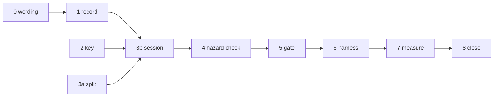

# Prefix Reuse Execution Plan

**Date:** 2026-10-03
**Status:** Completed 2026-10-04. The engine session seam is built and gated, and the exact-token history seam (Step 9) makes the text path reuse deterministically. Ledger M49.
**Scope:** The engine-side session seam: one live conversation keeps its model state resident and each turn prefills only what it added.
**Requirements:** [PREFIX_REUSE_REQUIREMENTS.md](../../specs-and-requirements/prefix-reuse/PREFIX_REUSE_REQUIREMENTS.md) (R1–R6). **Reference:** [PREFIX_REUSE_REFERENCE_ANALYSIS.md](../../analysis/current/PREFIX_REUSE_REFERENCE_ANALYSIS.md).

The code is the authority; this plan was written against the tree of 2026-10-03 and names symbols, not line numbers.

---

## 1. What the code already gives us

| Fact | Where | Consequence |
| :--- | :--- | :--- |
| `V4Graph::forward_window(ids, start_position, count, chunk, stream)` already takes an absolute start, and `V4Engine::chat` already calls it with `offset > 0` for the 2nd..⌈N/W⌉th window | `runtime/v4_graph.hpp`, `runtime/v4_engine.hpp` | A tail prefill is the same call with a larger start. **The graph, layers and kernels are not touched.** |
| A chunk run mid-ratio-window and across a wrapped ring is bit-identical to token-at-a-time | `test_v4_layer_body_chunk_oracle`, `test_v4_state_restore` | Continuing a state that decode wrote is a certified state contract, not a new one. |
| `text::generate_token_ids` computes decode positions as `prompt.size() + generated - 1` and hands the **whole** prompt to the prefill step | `infrastructure/text/text_generation.cpp` | The loop needs no change: the prefill step simply forwards `prompt[start:]` at absolute offset `start`. |
| The state is allocated per layer at `context_size` at load, and `MemoryBudgetEngine` already charges `attention_state_memory(context_size)` against the Hot pool | `memory_budget_engine.hpp`, `V4Layer::allocate_state` | **R5 needs no code**; it needs a gate that proves refusal is up-front and leaves the session intact. |
| `V4Engine::chat` resets state and reseeds the sampler on every call | `V4Engine::chat` | The reset becomes conditional; the reseed stays unconditional (R6). |
| Tests call `engine.host().reset_generation_state()` directly | `tests/test_v4_engine.cpp` | A record owned only by the engine would go stale silently; the host must expose a state epoch (§Step 3). |

## 2. Findings that shape the design

1. **The last generated token is never fed.** The loop samples it but only feeds a token on the *next* step, so after a turn the resident state covers `prompt + generated[:-1]`. The record must be written **at the feed sites** (`advance`, the prefill step), never derived from `prompt.size() + generated.size()`. The next turn's prompt carries that unfed token (EOS, or the last cut token) in its tail, which is correct.
2. **For DSV4, R4's inputs are all rendered into token ids** — thinking mode (`<think>` vs `</think>` transition, reasoning-effort preamble), tools and response format (system-message text). The strict-prefix comparison therefore already invalidates on any of them. The explicit computation key is kept as a cheap, model-agnostic second line, and a gate proves each flip is rejected; it is not the primary mechanism.
3. **Thinking mode defeats strict reuse by default.** With `drop_thinking = true` (the `Dsv4PromptOptions` default) the encoder strips earlier reasoning and swaps the previous turn's `<think>` transition for `</think>`, so turn N+1 diverges at turn N's generation prompt. `drop_thinking` is forced off whenever tools are declared, so the agent case is unaffected on this axis. Plain thinking chat is not. Settled in Step 7 by measurement, not assumption.
4. **Retokenization.** Turn N+1 is rendered from reply *text*; BPE may split it differently than the generated ids. That divergence point is the reply boundary of the reference analysis §3. R2's gate therefore builds turn N+1 **from ids**, so it measures reuse and not the tokenizer; Step 7 separately measures how often the text path matches.
5. **Replay is from the start, not from the divergence.** The state has a ring and a recurrent compressor partial; there is no rewind. R3's intent (correctness survives rejection) is met by a full cold prefill. R3's wording is relaxed in Step 0.
6. **A reuse needs at least one new token** (`record.size() < prompt.size()`): a prefill of zero tokens leaves no logits to sample from. Equal-or-shorter prompts replay.

## 3. Decisions fixed by this plan

- **All-or-nothing**, no longest-common-prefix.
- **Opt-in per request** (`reuse_prefix`, default `false`), so every existing caller and test keeps its stateless behaviour.
- **Group placement** ([AGENTS.md](../../../AGENTS.md) §3 rule 6): the record and the verdict logic are model-agnostic → G1 `src/infrastructure/session/`; the computation key knows the encoder's inputs → G4 `src/architecture/deepseek_v4/text/`; the binding that owns the device state → G4 `runtime/v4_engine.hpp`. G5 sees only the token-level entry point of Step 3.
- **Out of this plan:** prompt-end snapshot for the reply boundary, session storage, multi-session. Step 7 produces the evidence for whether a snapshot is needed.

---

## 4. Steps

Each step is one commit, ends green on its listed gates, and runs only those gates ([AGENTS.md](../../../AGENTS.md) §3 process rule 8).

### Step 0 — Settle the requirement wording (docs only)

Edit [PREFIX_REUSE_REQUIREMENTS.md](../../specs-and-requirements/prefix-reuse/PREFIX_REUSE_REQUIREMENTS.md):
- **R3:** replace "replays from the point of divergence" with "replays"; add "reuse also requires at least one new token".
- **R4:** add `drop_thinking` to the listed non-token inputs.

Update the **Prefix reuse** row in [PROJECT_STATUS.md](../../status/PROJECT_STATUS.md) §3 Present from "execution plan not written" to link this plan.

### Step 1 — The record (G1, pure, no GPU)

**Create** `src/infrastructure/session/prefix_record.hpp` (header-only; no CMake source change).

```cpp
namespace aeon::session {
enum class ReuseVerdict { Cold, Reused, KeyChanged, Diverged, NoTail, StaleState, Disabled };

struct ReuseDecision {
    ReuseVerdict verdict{ReuseVerdict::Cold};
    uint32_t start{0};        // tokens the resident state covers; 0 unless Reused
    uint32_t diverged_at{0};  // first differing index, diagnostic only
};

class PrefixRecord {
public:
    void clear() noexcept;                       // empties ids and key
    void begin(std::string computation_key);     // clear + set the key the state is built under
    void feed(uint32_t position, uint32_t token_id);  // throws unless position == size()
    uint32_t size() const noexcept;
    ReuseDecision plan(const std::vector<uint32_t>& prompt,
                       const std::string& computation_key) const;  // pure
    const char* verdict_name(ReuseVerdict);
};
}
```

`plan` order: empty record → `Cold`; key differs (exact string compare, not a hash) → `KeyChanged`; `size() >= prompt.size()` → `NoTail`; first mismatch in `[0, size())` → `Diverged` (`diverged_at`); else `Reused`, `start = size()`. `feed` throws on a position gap, which is the guard against a feed site being skipped.

**Gate — `tests/test_prefix_record.cpp`** registered in [cmake/AeonInfrastructure.cmake](../../../cmake/AeonInfrastructure.cmake) next to `test_text_generation` (no sources). Cases: empty, exact extension, equal, shorter, mismatch at 0 / middle / last recorded id, key change with identical ids, feed gap and double-feed throw, `clear`. Run a mutation pass in the repo's style (flip `>=` to `>`, drop the key check, compare only the last id, skip the gap check) and require every mutant to fail.

### Step 2 — The computation key (G4)

**Create** `src/architecture/deepseek_v4/text/dsv4_computation_key.hpp` (header-only):
`std::string dsv4_computation_key(const std::vector<Dsv4PromptMessage>&, const Dsv4PromptOptions&)`.

Canonical string of: `thinking_mode`, **effective** `drop_thinking` (false when any message declares tools, mirroring `Dsv4PromptEncoder::encode`), `reasoning_effort`, `add_default_bos_token`, and, from the system/developer messages, the concatenated `tools[].function_json` and `response_format_json`. Independent of message text.

**Gate:** add a section to `tests/test_dsv4_prompt_encoding_oracle.cpp` (CPU only, already links the encoder): each of the six inputs, flipped alone, changes the key; changing only user text does not.

### Step 3 — The engine binding (G4) — two commits

**3a. Behaviour-preserving split** in `src/architecture/deepseek_v4/runtime/v4_engine.hpp`. Split `V4Engine::chat(messages, ...)` into render + a public token-level entry:

```cpp
V4Reply generate(const std::vector<uint32_t>& prompt,
                 const text::GenerationOptions&, const SamplerConfig&);
```

`chat` becomes `encode_tokens` + `generate`. The prefill-step and decode-step lambdas move into `generate` unchanged. `generate` is the neutral conversation seam G5 will later call and the entry the R2 gate needs (prompts built from ids). **Gate:** `test_v4_engine` unchanged and green.

**3b. The session.**

*`runtime/v4_model_host.hpp`:* add `uint64_t state_epoch_{0}` with `state_epoch() const noexcept`; `reset_generation_state()` increments it.

*`runtime/v4_engine.hpp`:*
- Members: `session::PrefixRecord session_; uint64_t session_epoch_{0};`. Include `infrastructure/session/prefix_record.hpp`.
- `generate(prompt, generation, sampling, bool reuse_prefix = false, const std::string& key = {})`; `chat(...)` gains a trailing `bool reuse_prefix = false` and passes `dsv4_computation_key(messages, prompt_options)`.
- Replace the unconditional `host_.reset_generation_state()` with:
  1. `decision = reuse_prefix ? session_.plan(prompt, key) : {Cold}`; if `Reused` and `session_epoch_ != host_.state_epoch()` → `StaleState`, `start = 0`.
  2. `start == 0` → `host_.reset_generation_state()`, `session_.begin(key)`, `session_epoch_ = host_.state_epoch()`.
  3. The sampler reseed (`set_config`) stays unconditional.
- The capacity refusal (`prompt.size() >= capacity`) stays **before** any state mutation, so a refused turn leaves the session intact.
- **Prefill step:** iterate windows over `tokens[start:]`; `forward_window(tokens.data() + start + offset, start + offset, span, std::min(chunk, span), …)`. Size `window`/`chunk` from `tail = prompt.size() - start`, not the prompt (`prefill_window_for(tail)`, `prefill_chunk_for(tail)`). After each window succeeds, `session_.feed(position, id)` for its ids. Wrap the prefill in try/catch: on exception `session_.clear()` and rethrow, because the state is partially advanced.
- **`advance(token_id, position)`:** after `forward_token` returns, `session_.feed(position, token_id)`. This is the decode feed site.
- **`free()`:** `session_.clear()`.
- Add `V4Engine::end_session()` (`session_.clear()`) for callers that drive the graph directly.
- **`V4Reply`:** add `uint32_t reused_tokens`, `uint32_t prefilled_tokens`, `session::ReuseVerdict reuse_verdict`. Also fix the header comment that says `chat` is "stateless across calls".

Note: a tail shorter than the sweep gate (`prefill_sweep_min_tokens`, default 3E/4) runs on the route-aware cached supply, not the sweep. That is expected and is the cheap path for a small addition.

**Gate:** `test_v4_engine` still green (reuse defaults off), then Step 5.

### Step 4 — Direct-use hazard check

`grep` every caller of `host().reset_generation_state()`, `graph().forward_token`, `graph().forward_window` outside the engine (tests and `tools/`). None may be followed by `chat(..., reuse_prefix = true)` without `end_session()`. The epoch covers the reset case; a bare `forward_*` is outside the contract and is named as such in the `V4Engine` header comment.

### Step 5 — The model-backed gate

**Create** `tests/test_v4_prefix_reuse.cpp`; register in `cmake/AeonInfrastructure.cmake` with the same sources as `test_v4_engine` (tokenizer, prompt encoder, `text_generation.cpp`), `TIMEOUT 1800`. Build the engine once at `kContext = 256` (as `test_v4_engine` does; the real window of 128 wraps inside it), greedy sampling.

| Section | Statement | How |
| :--- | :--- | :--- |
| **A — R2** | Continuation ids == from-scratch ids | Turn 1 via `generate(P1, reuse=true)` → `R1`. Build `P2 = P1 ++ R1.token_ids ++ suffix_ids` **from ids** (suffix = the encoder's rendering of the next user turn, tokenized). Run `generate(P2, reuse=true)` and a cold `generate(P2, reuse=false)`; require identical `token_ids`. Print, never assert: first-token logits bit-equality and max abs diff (run both with `max_new_tokens = 1` and copy `graph().logits()`); on a token mismatch print the first divergent index and the top-1/top-2 logit margin so a near-tie is distinguishable from a defect. |
| **B — R1** | Only the addition is prefilled | Assert `reused_tokens == |P1| + |R1| - 1`, `prefilled_tokens == |P2| - reused_tokens`, `verdict == Reused`. Print both TTFTs. Counters are asserted, wall clock is not. |
| **C — R3** | A rejected reuse is correct and not stale | Each of: one id changed mid-prefix, id changed at position 0, `P2` equal to the record, `P2` shorter, `P2` ending exactly at the record. Require verdict `Diverged`/`NoTail`, `reused_tokens == 0`, ids == the cold run, and that the **following** turn reuses again from the rebuilt record. |
| **D — R4** | Every non-token input invalidates | Same ids, flip each of thinking mode, reasoning effort, `drop_thinking`, tools declared, response format through the real encoder. Require the verdict is not `Reused` and ids == cold. Print whether the key or the tokens caught it. |
| **E — R5** | Bound is up-front, session survives | A turn with `|P| >= capacity` throws before mutation; the next valid continuation still reports `Reused`. A continuation whose tail would reach capacity is refused the same way. |
| **F — R6** | Deterministic and visible | The whole A+B sequence run twice from a fresh `end_session()` gives identical ids. `host().reset_generation_state()` between turns yields `StaleState` and ids == cold. `reuse_verdict` is non-default on every path. |
| **G — boundaries** | Mid-ratio and wrapped ring | Choose `|P1|` ≥ 140 so the ring has wrapped, and the fed length ≢ 0 mod 4 and mod 128, so the CSA compressor partial is live at the reuse boundary. |
| **H — hygiene** | Supply invariants after every turn | `registry().invariants_hold()`, `outstanding_expert_leases() == 0`, `staging_in_use_slots() == 0` (the checks `aeon_chat` prints as `[Invariants]`). |

**Make A load-bearing** (anti-circularity, [AGENTS.md](../../../AGENTS.md) §3 process rule 5): a mutation pass that must fail the gate — skip feeding one decode token; feed `generated` including the unfed last token; start the tail one token early; reuse after an epoch bump. The cold run is the independent reference: it shares no reuse code.

**Run:** `test_prefix_record`, `test_v4_prefix_reuse`, `test_v4_engine`. If the graph was untouched (it should be), no other gate needs to run.

### Step 6 — Developer harness

`tools/aeon_chat.cpp` (not production; a harness):
- Add repeatable `--follow-up <text>`. After the first reply, append an `Assistant` message (`content = strip_thinking(reply.text)`, and in thinking mode `reasoning_content` = the text before the marker) and a `User` message, call `engine.chat(messages, …, reuse_prefix = true)`, repeat per follow-up.
- Add `--no-prefix-reuse` to run the same script with `reuse_prefix = false` for an A/B.
- After each turn print `[Reuse] turn=N verdict=<name> reused=R prefilled=P prompt=T ttft_ms=X`, and call `print_invariants`.
- Document both flags in `print_usage`.

### Step 7 — Measure; decide the reply boundary

Add `scripts/prefix_reuse_ab.sh` (model on `scripts/prefill_ab.sh`): a 3-turn script through `aeon_chat` with and without `--no-prefix-reuse`, on the real context (≥ 4096), recording TTFT per turn.

Measure, per workload, the verdict of turns 2 and 3 on the **text** path:

| Workload | Expected | If it diverges |
| :--- | :--- | :--- |
| Chat mode | `Reused` | retokenization is the cause; quantify how often |
| Thinking mode, default `drop_thinking` | `Diverged` (finding 3) | decide below |
| Thinking mode, `drop_thinking = false` | `Reused` | — |
| Agent turn (tools declared, tool call + result) | `Reused` or `Diverged` at the reply | decide below |

Outcomes, in order of cost; pick from the data, then record it:
1. **Accept.** A diverging turn replays; correct, costs one full prefill.
2. **`drop_thinking = false` for reuse sessions** where thinking mode is on (encoder option already exists; one flag in the caller).
3. **Exact-token history** (ds4): the caller passes back the ids the engine produced and tokenizes only the new suffix. `generate()` already accepts ids; no engine work.
4. **Prompt-end snapshot** (colibri): a separate plan; uses `V4Layer::snapshot_state`/`restore_state`, and its cost is the deferred session-storage boundary.

### Step 8 — Close out

- **Ledger:** add one entry to [PERFORMANCE_LEDGER.md](../../status/PERFORMANCE_LEDGER.md): TTFT cold vs continuation at the measured context, `prefilled_tokens`, verdicts per workload from Step 7, the Step 5 bit-equality diagnostic.
- **PROJECT_STATUS.md:** move the row to Past (fuse per its §5 rule); record the Step 7 decision.
- **Move this plan** to `plans-and-docs/execution/completed/`.
- Fix the stale comment in `dsv4_prompt_encoder.hpp` ("a separately encoded `context` prefix is intentionally not implemented") only if it is inconsistent after Step 3.

### Step 9 — The exact-token history seam (G4) — added after Step 7's measurement

**Why this exists.** Step 7 measured that the *text* path cannot reuse: a reply is decoded
to text and re-encoded to build the next turn, and BPE does not invert that round-trip
(`encode(decode(ids)) != ids`, measured: 8 generated tokens re-encoded to 9). The strict
token-prefix compare then diverges *inside* the resident region and forces a full replay —
so the multi-turn feature, as a client would experience it, worked only by chance. The fix
is not to loosen the compare but to stop round-tripping: hand the engine back the ids it
produced.

**The seam.** A message may carry the exact ids its body contributes, so the encoder emits
them verbatim instead of tokenizing its text:

- `Dsv4PromptMessage::preencoded_ids` — when non-empty on an assistant message, the encoder
  emits these ids as the message body, in place of rendering `reasoning_content + content +
  tool_calls`. The template's EOS still follows. The caller sets it to `reply.token_ids`
  minus the trailing EOS (the model's output in thinking mode already contains reasoning +
  `</think>` + content, so the whole body is exactly the generated ids).
- `Dsv4PromptEncoder` split into `render_segments` (returns text pieces + optional exact ids)
  with `encode` (concatenates text — unchanged, byte-exact) and `encode_tokens` (splices the
  ids for pieces that carry them). With no ids the prompt is a single text segment and
  tokenizes exactly as before; the only segment boundaries are around an exact-id body,
  always flanked by added tokens (the assistant marker before, the EOS after), which BPE
  never merges across.

**No engine change.** `V4Engine::generate` already takes ids; the caller now builds the
prompt from ids, so `plan` sees an exact prefix by construction. `chat` is unaffected
(no caller sets the field yet except the harness).

**Gates.**
- `test_dsv4_prompt_encoding_oracle` gains an `[exact-token history]` section: the segment
  splice equals whole-string tokenization with no ids; injecting a message's own text-ids is
  a no-op; foreign ids replace exactly the body span. The four byte-exact vectors are
  unchanged.
- `test_v4_prefix_reuse` gains section I: turn 2 is built through the encoder with
  `preencoded_ids = r1.token_ids[:-1]` and must report `Reused` and match a cold run.
- `aeon_chat`'s follow-up loop sets `preencoded_ids`, so the harness now reuses on the text
  path. Measured (`scripts/prefix_reuse_ab.sh`, context `4096`, 3 turns): continuation
  `reused=112/191`, `prefilled=48/28`; TTFT turn 2 `7.8 s` vs `14.1 s` from scratch, turn 3
  `6.4 s` vs `24.1 s`. Ledger M49 updated.

**Thinking mode.** With `drop_thinking` on (the encoder default) an earlier assistant body
is stripped/rewritten, which conflicts with a verbatim id body; the id-history path is for
chat mode and for thinking mode with `drop_thinking = false`. A tool-call body is likewise
carried whole in the ids. Both are the same "one constant in the caller" the server adapter
already owns.

---

## 5. Order and dependencies



Steps 1, 2 and 3a are independent and can land in any order. Nothing before Step 5 changes observable behaviour while `reuse_prefix` defaults to `false`.

## 6. Files touched

| Action | File | Group |
| :--- | :--- | :--- |
| create | `src/infrastructure/session/prefix_record.hpp` | G1 |
| create | `src/architecture/deepseek_v4/text/dsv4_computation_key.hpp` | G4 |
| edit | `src/architecture/deepseek_v4/text/dsv4_prompt_encoder.hpp` (`preencoded_ids`, `Segment`, `render_segments`) | G4 |
| edit | `src/architecture/deepseek_v4/text/dsv4_prompt_encoder.cpp` (segment splice) | G4 |
| edit | `src/architecture/deepseek_v4/runtime/v4_engine.hpp` | G4 |
| edit | `src/architecture/deepseek_v4/runtime/v4_model_host.hpp` (epoch only) | G4 |
| edit | `tools/aeon_chat.cpp` | harness |
| edit | `cmake/AeonInfrastructure.cmake` (two tests) | build |
| create | `tests/test_prefix_record.cpp`, `tests/test_v4_prefix_reuse.cpp` | tests |
| edit | `tests/test_dsv4_prompt_encoding_oracle.cpp` (key + exact-token-history sections) | tests |
| create | `scripts/prefix_reuse_ab.sh` | scripts |
| edit | requirements, `PROJECT_STATUS.md`, `PERFORMANCE_LEDGER.md` | docs |

**Not touched:** `V4Graph`, `V4Layer`, every kernel, the expert tiers, `text_generation.*`, the memory budget.

## 7. Risks

| Risk | Mitigation |
| :--- | :--- |
| A feed site is missed and the record silently describes the wrong state | `feed` throws on a position gap; mutation pass in Step 5 skips each site |
| Greedy ids differ between decode-fed history and a chunk-prefilled one through accumulation-order noise (R2 is stated at token, not bit, granularity) | Section A prints the divergent index and top-1/top-2 margin, so a near-tie is told apart from a state defect |
| Direct `host()`/`graph()` use bypasses the record | epoch check; `end_session()`; documented in the engine header |
| A short tail takes the cached-supply path rather than the sweep | exercised by section B and H; `test_v4_routed_prefill` already certifies that path against serial |
| Long conversations spend Hot pool on state | already charged by the budget at `context_size`; section E proves the refusal is up-front |
