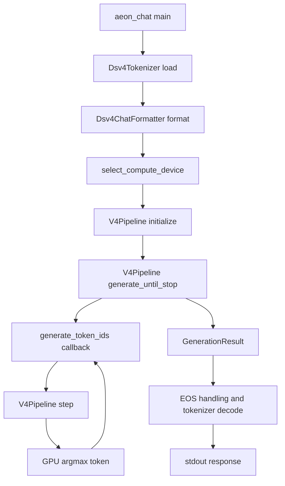

# Aeon Native Inference Review Dossier

**Snapshot date:** 2026-09-14
**Executable:** `build/bin/aeon_chat`
**Review scope:** first source package only

## 1. Scope

This dossier is a navigation guide for an external review of the supplied
native DeepSeek-V4 inference implementation. It records the model contract, the
text-in/text-out call path, the per-token forward-pass order, and the exact
files included in the first review package.

It deliberately contains no diagnosis, proposed fix, benchmark result,
generated output, test conclusion, or inferred root cause.

The first package is a source-review package, not a compile-complete checkout.
It contains the model-specific inference path and the selected model metadata.
Generic container parsing, tier-management implementation, diagnostics,
tests, conversion scripts, and binary weight containers are outside this
package and are not referenced here.

## 2. Supplied first-package files

### Text entry and build contract

- [CMakeLists.txt](../../CMakeLists.txt)
- [tools/aeon_chat.cpp](../../tools/aeon_chat.cpp)
- [src/platform/rdna3/device.hpp](../../src/platform/rdna3/device.hpp)
- [src/infrastructure/text/text_generation.hpp](../../src/infrastructure/text/text_generation.hpp)
- [src/infrastructure/text/text_generation.cpp](../../src/infrastructure/text/text_generation.cpp)
- [src/architecture/deepseek_v4/text/dsv4_tokenizer.hpp](../../src/architecture/deepseek_v4/text/dsv4_tokenizer.hpp)
- [src/architecture/deepseek_v4/text/dsv4_tokenizer.cpp](../../src/architecture/deepseek_v4/text/dsv4_tokenizer.cpp)
- [src/architecture/deepseek_v4/text/dsv4_chat_formatter.hpp](../../src/architecture/deepseek_v4/text/dsv4_chat_formatter.hpp)
- [src/architecture/deepseek_v4/text/dsv4_chat_formatter.cpp](../../src/architecture/deepseek_v4/text/dsv4_chat_formatter.cpp)

### V4 model contract and runtime orchestration

- [src/architecture/deepseek_v4/core/config.hpp](../../src/architecture/deepseek_v4/core/config.hpp)
- [src/architecture/deepseek_v4/core/v4_model_spec.hpp](../../src/architecture/deepseek_v4/core/v4_model_spec.hpp)
- [src/architecture/deepseek_v4/core/v4_model_contract.hpp](../../src/architecture/deepseek_v4/core/v4_model_contract.hpp)
- [src/architecture/deepseek_v4/core/v4_dense_weight_binding.hpp](../../src/architecture/deepseek_v4/core/v4_dense_weight_binding.hpp)
- [src/architecture/deepseek_v4/core/v4_model_resources.hpp](../../src/architecture/deepseek_v4/core/v4_model_resources.hpp)
- [src/architecture/deepseek_v4/core/v4_layer_state.hpp](../../src/architecture/deepseek_v4/core/v4_layer_state.hpp)
- [src/architecture/deepseek_v4/core/v4_layer.hpp](../../src/architecture/deepseek_v4/core/v4_layer.hpp)
- [src/architecture/deepseek_v4/core/v4_pipeline_scratch.hpp](../../src/architecture/deepseek_v4/core/v4_pipeline_scratch.hpp)
- [src/architecture/deepseek_v4/core/v4_expert_supply.hpp](../../src/architecture/deepseek_v4/core/v4_expert_supply.hpp)
- [src/architecture/deepseek_v4/core/v4_pipeline.hpp](../../src/architecture/deepseek_v4/core/v4_pipeline.hpp)

### Model-specific HIP and W4A16 kernels

- [src/architecture/deepseek_v4/kernels/v4_attention.hpp](../../src/architecture/deepseek_v4/kernels/v4_attention.hpp)
- [src/architecture/deepseek_v4/kernels/v4_pipeline_ops.hpp](../../src/architecture/deepseek_v4/kernels/v4_pipeline_ops.hpp)
- [src/architecture/deepseek_v4/kernels/hc_sinkhorn.hpp](../../src/architecture/deepseek_v4/kernels/hc_sinkhorn.hpp)
- [src/architecture/deepseek_v4/kernels/moe_router.hpp](../../src/architecture/deepseek_v4/kernels/moe_router.hpp)
- [src/backend/swizzled_w4a16/core/swizzled_expert_format.hpp](../../src/backend/swizzled_w4a16/core/swizzled_expert_format.hpp)
- [src/backend/swizzled_w4a16/core/vram_expert_pool.hpp](../../src/backend/swizzled_w4a16/core/vram_expert_pool.hpp)
- [src/backend/swizzled_w4a16/kernels/aeon_w4a16_swizzle.hpp](../../src/backend/swizzled_w4a16/kernels/aeon_w4a16_swizzle.hpp)
- [src/backend/swizzled_w4a16/kernels/aeon_w4a16_swizzled_gemv.hpp](../../src/backend/swizzled_w4a16/kernels/aeon_w4a16_swizzled_gemv.hpp)
- [src/backend/swizzled_w4a16/kernels/aeon_moe_fused_w13.hpp](../../src/backend/swizzled_w4a16/kernels/aeon_moe_fused_w13.hpp)
- [src/backend/swizzled_w4a16/kernels/aeon_moe_fused_w2.hpp](../../src/backend/swizzled_w4a16/kernels/aeon_moe_fused_w2.hpp)

### Supplied model metadata

- [models/DeepSeek-V4-Flash-0731-INT4-W4A16-Aeon/config.json](../../models/DeepSeek-V4-Flash-0731-INT4-W4A16-Aeon/config.json)
- [models/DeepSeek-V4-Flash-0731-INT4-W4A16-Aeon/model_manifest.json](../../models/DeepSeek-V4-Flash-0731-INT4-W4A16-Aeon/model_manifest.json)
- [models/DeepSeek-V4-Flash-0731-INT4-W4A16-Aeon/tokenizer.aeon](../../models/DeepSeek-V4-Flash-0731-INT4-W4A16-Aeon/tokenizer.aeon)

## 3. Actual text-in/text-out path

The current executable path is:



The corresponding symbols are:

1. `main()` in [tools/aeon_chat.cpp](../../tools/aeon_chat.cpp).
2. `Dsv4Tokenizer::load()`, `encode()`, and `decode()` in
   [dsv4_tokenizer.cpp](../../src/architecture/deepseek_v4/text/dsv4_tokenizer.cpp).
3. `Dsv4ChatFormatter::format()` in
   [dsv4_chat_formatter.cpp](../../src/architecture/deepseek_v4/text/dsv4_chat_formatter.cpp).
4. `select_compute_device()` in
   [device.hpp](../../src/platform/rdna3/device.hpp).
5. `V4Pipeline::initialize()`, `generate_until_stop()`, and `step()` in
   [v4_pipeline.hpp](../../src/architecture/deepseek_v4/core/v4_pipeline.hpp).
6. `generate_token_ids()` in
   [text_generation.cpp](../../src/infrastructure/text/text_generation.cpp).

`generate_until_stop()` resets generation state, invokes
`generate_token_ids()`, and supplies a callback that calls `step()`.
Prompt tokens are passed to `step()` with the prefill phase and positions
starting at zero. Generated tokens are passed to the same `step()` function
with the decode phase and increasing absolute positions. The returned token
is selected by greedy argmax inside `step()`.

The current CLI does not call `prefill_batched()`. That API is available in
`V4Pipeline` for the separately callable hybrid prompt path. Its implementation
is in `prefill_batched()` and `prefill_batched_chunk()` in
[v4_pipeline.hpp](../../src/architecture/deepseek_v4/core/v4_pipeline.hpp),
with batch storage in
[v4_pipeline_scratch.hpp](../../src/architecture/deepseek_v4/core/v4_pipeline_scratch.hpp).

## 4. Model contract

The supplied `config.json` describes `DeepseekV4ForCausalLM` with:

| Property | Value |
| --- | ---: |
| Vocabulary | `129280` |
| Hidden size | `4096` |
| Base decoder layers | `43` |
| Query heads | `64` |
| Key/value heads | `1` |
| Head dimension | `512` |
| Query low-rank dimension | `1024` |
| Output low-rank dimension | `1024` |
| Output groups | `8` |
| RoPE dimension | `64` |
| Sliding window | `128` |
| Main RoPE theta | `10000` |
| Compressed RoPE theta | `160000` |
| Maximum position embeddings | `1048576` |
| Original position limit | `65536` |
| RMS epsilon | `1e-6` |

The exact `compress_ratios` array in the supplied configuration is:

```text
[0, 0, 4, 128, 4, 128, 4, 128, 4, 128, 4, 128,
 4, 128, 4, 128, 4, 128, 4, 128, 4, 128, 4, 128,
 4, 128, 4, 128, 4, 128, 4, 128, 4, 128, 4, 128,
 4, 128, 4, 128, 4, 128, 4, 0, 0, 0]
```

`V4ModelSpec::resolve_layers()` maps this to:

| Ratio | Layer kind | Layers |
| ---: | --- | --- |
| `0` | `Sliding` | `0`, `1` |
| `4` | `CSA` | even layers `2` through `42` |
| `128` | `HCA` | odd layers `3` through `41` |

The additional configuration values used by the supplied forward path are:

| Property | Value |
| --- | ---: |
| CSA indexer heads | `64` |
| CSA indexer head dimension | `128` |
| CSA indexer top-k | `512` |
| HC streams | `4` |
| HC Sinkhorn iterations | `20` |
| Routed experts | `256` |
| Shared experts | `1` |
| Routed experts per token | `6` |
| Hash-routed layers | `0` through `2` |
| Routed scaling factor | `1.5` |
| SwiGLU limit | `10.0` |
| MoE intermediate size | `2048` |
| Compressed RoPE scaling | YaRN, factor `16`, beta fast `32`, beta slow `1` |

The model contract and required tensor shapes are represented by
`DeepSeekV4Config`, `V4ModelSpec`, `V4ModelContract`, and
`V4DenseWeightBinding` in the supplied V4 core files.

## 5. Native expert representation

The supplied model manifest selects the `swizzled_w4a16` backend and expert
format version `2`, with `4096`-byte sectors and `14155776` bytes per expert.
The supplied backend files define the payload layout and device access:

| Region | Logical shape | Offset |
| --- | --- | ---: |
| W1 packed | `[2048, 4096]` 4-bit values | `0` |
| W1 scales | `[2048, 128]` FP16 | `4194304` |
| W2 packed | `[4096, 2048]` 4-bit values | `4718592` |
| W2 scales | `[4096, 64]` FP16 | `8912896` |
| W3 packed | `[2048, 4096]` 4-bit values | `9437184` |
| W3 scales | `[2048, 128]` FP16 | `13631488` |

The supplied W4A16 implementation defines the nibble permutation, Wave32
layout, GEMV path, fused W1/W3 path, fused W2 path, and device payload views.
The V4 pipeline receives routed expert payloads through the supplied
`V4ExpertSupplyCoordinator` interface.

## 6. Initialization sequence

`V4Pipeline::initialize()` performs the following model-specific sequence:

1. Create HIP streams and store the runtime policy.
2. Read the supplied model metadata and resolve the selected expert backend.
3. Parse the supplied DeepSeek-V4 configuration.
4. Validate supported scalar values, compression schedule, layer classes, and
   required tensor names/shapes.
5. Build main and compressed RoPE tables in `V4ModelResources`.
6. Allocate reusable single-token and batch scratch buffers.
7. Create one `V4Layer` for each of the 43 layer specifications.
8. Bind each layer's attention, compressor, indexer, HC, normalization, router,
   and shared-expert tensors through `V4DenseWeightBinding`.
9. Allocate the local cache, compressed cache, compressor state, and CSA
   indexer state described by `V4LayerStateLayout`.
10. Initialize the model-level HC head, final normalization, LM-head, and
    embedding access used by the final output path.
11. Configure the supplied V4 expert-supply adapter and W4A16 device pool.

## 7. One `V4Pipeline::step()` execution

`step(token_id, pos, phase)` is the execution function used for both prompt and
decode tokens.

### Token setup

1. Obtain the token embedding and replicate it across the four HC streams.
2. Convert the replicated embedding to the float residual buffer.
3. Store the token ID for hash routing.

### Per-layer forward pass

For each layer from `0` through `42`:

1. **HC attention pre-processing:** project the four residual streams, perform
   Sinkhorn normalization, and combine the streams with
   `hc_project_kernel`, `hc_sinkhorn_normalize_kernel`, and
   `hc_pre_combine_kernel`.
2. **Attention normalization and MLA:** apply attention RMSNorm, Q low-rank
   projection, Q RMSNorm, Q expansion, per-head unit normalization, KV
   projection, and KV RMSNorm.
3. **Class-specific preparation:** for CSA/HCA, compute compressor KV and
   score projections; for CSA, also compute indexer query, indexer weights,
   and indexer compressor projections.
4. **Local state:** insert the current value and rotated key into the local
   ring and record the absolute position.
5. **Compressed state:** for CSA/HCA, update compressor partial state and
   materialize compressed entries when the layer ratio boundary is reached.
   CSA additionally updates indexer state and selects compressed candidates.
6. **Attention:** dispatch sliding attention for `Sliding`, or local plus
   compressed attention for `CSA` and `HCA`.
7. **Attention output:** apply inverse RoPE, grouped `wo_a`, and `wo_b`.
8. **HC attention post-processing:** combine the attention result with the
   residual streams.
9. **HC FFN pre-processing:** project the four streams, apply Sinkhorn,
   combine them, and apply FFN RMSNorm.
10. **Router:** project 256 router logits, apply hash routing on layers `0-2`
    or configured score/bias routing on later layers, and select six experts.
11. **Shared expert:** execute shared W1/W3, clamped SwiGLU, and shared W2.
12. **Routed experts:** request the six expert payloads through
    `V4ExpertSupplyCoordinator`, execute fused W1/W3/SwiGLU, and execute the
    configured W2 accumulation path.
13. **HC FFN post-processing:** combine the MoE result with the FFN residual
    streams and pass the resulting four streams to the next layer.

The relevant device implementations are in the supplied attention, pipeline,
HC, router, and swizzled W4A16 kernel files listed in Section 2.

### Final output

After layer `42`, `step()`:

1. Reduces the four HC streams with the model HC head.
2. Applies final RMSNorm.
3. Projects to `129280` logits with the untied LM head.
4. Performs device argmax.
5. Copies the selected token ID to the host.
6. Returns that token ID to the generation callback.

## 8. Persistent state and callable batch path

`V4Pipeline::reset_generation_state()` resets the pipeline position and every
layer's local, compressed, compressor, and CSA indexer state.

`V4LayerStateLayout` defines the state capacities. Sliding layers own local
key/value state and absolute positions. CSA layers additionally own ratio-4
compressed and indexer state. HCA layers additionally own ratio-128 compressed
state.

`V4Pipeline::prefill_batched()` is available in the supplied pipeline but is
not called by the current `aeon_chat` path. For multi-token requests, its batch
scratch buffers cover projections and FFN work while the causal state machine
advances token state in order. The current CLI path remains the call chain in
Section 3.

## 9. Review boundary

The reviewer should begin with `V4Pipeline::step()`, then follow the supplied
layer state, model resource, contract, attention, HC, router, and W4A16 files.
The supplied text files are needed to reproduce the current executable's input
formatting and token loop.

The first package does not include the implementation of generic artifact
loading, tiered storage, diagnostics, tests, profiling, conversion, or host
reference paths. Those areas are outside this focused review package.
